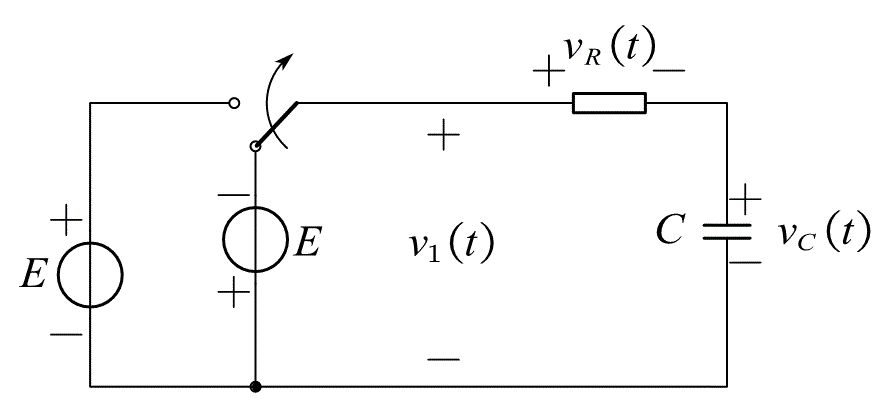
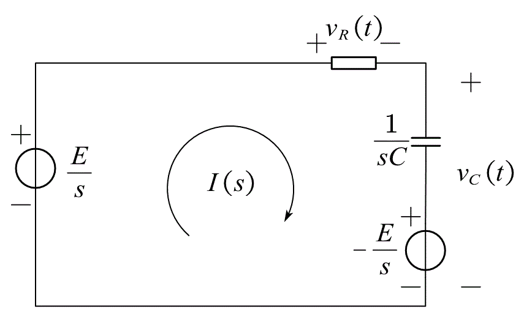

# 要点

**基本信号处理、连续时间系统的时域分析、傅里叶变换、拉普拉斯变换**

# 基本信号处理

## 1.信号的运算

> 移位、反皱、积分、微分、四则运算

## 2.阶跃信号

$$
u(t) = \begin{cases}
1 & t > 0 \\
0 & t < 0
\end{cases}
$$

## 3.冲激信号

$$
\begin{cases}
\delta(t) = 0 & t \neq 0 \\
\int_{-\infty}^{\infty} \delta(t) & dt = 1
\end{cases}
$$

抽样性质：

$$
\delta(t-t_0)f(t)=\delta(t-t_0)f(t_0)\\
\int_{-\infty}^{\infty}\delta(t-t_0)f(t)=f(t_0)
$$

求导一次即为冲激偶函数$\delta'(t)$,其抽样性质改变为

$$
\int_{-\infty}^{\infty}\delta'(t-t_0)f(t)=-f'(t_0)
$$

## 4.线性时不变系统
（1）叠加性与均匀性

$$
C_1e_1(t)+C_2e_2(t)->C_1r_1(t)+C_2r_2(t)
$$

（2）时不变特性

$$
Ce(t-t_0)->Cr(t-t_0)
$$

（3）微分特性

$$
\frac{de(t)}{dt}->\frac{dr(t)}{dt}
$$

（4）因果性：系统在$t_0$时刻的响应只与$t=0$和$t<t_0$时刻的输入有关。

# 连续时间系统的时域分析
## 1.用时域经典法求解微分方程
### （1）求齐次解$r_h(t)$
将微分方程化为特征方程，求特征根，再代入齐次解

例：

$$
\frac{d^3}{dt^3}r(t)+7\frac{d^2}{dt^2}r(t)+16\frac{d}{dr}r(t)+12r(t)=e(t)
$$

解：

&emsp;&emsp;系统的特征方程为

$$
\alpha^3+7\alpha^2+16\alpha+12=0 
$$

&emsp;&emsp;解得

$$
\alpha_1=-2,\alpha_2=-3
$$

&emsp;&emsp;因而系统对应的齐次解为

$$
r_h(t)=(A_1t+A_2)e^{-2t}+A_3e^{-3t}
$$

### （2）求特解$r_p(t)$

$$
\begin{array}{cc}
\hline\hline
\text{激励函数$e(t)$} & \text{响应函数$r(t)$的特解}  \\
\hline
E &  B\\
t^p & B_1t^p+B_2t^{p-1}+...+B_p t+B_{p+1} \\
e^{at} & Be^{qt} \\
\cos(\omega t) \text{ 或 } \sin(\omega t) & B_1\cos(\omega t)+B_2\sin(\omega t) \\
\hline\hline
\end{array}
$$

&emsp;&emsp;当特解与齐次解重复时，乘上$t$。
### (3) 借助初始条件求待定系数$A$

## 2. 起始点的跳变
当系统用微分方程表示时，系统从 $0_-$ 到 $0_+$ 的状态有没有跳变取决于激励 $e(t)$ 代入微分方程后，右端函数式是否包含 $\delta(t)$ 及其各阶导数项。

---
例题：
描述 LTIS 的微分方程为：

$$
\frac{d^2 }{dt^2}r(t) + 7\frac{d }{dt}r(t) + 10r(t) = \frac{d^2 }{dt^2}e(t) + 6\frac{d }{dt}e(t) + 4e(t)
$$

输入 $e(t)$ 如图：

已知初始条件：

$$
r(0_-) = \frac{4}{5}, \quad \frac{d r(0_-)}{dt} = 0
$$

使用**冲激函数匹配法**求：
* $r(0_+)$
* $\frac{d r(0_+)}{dt}$

解：

将 $e(t)$ 代入微分方程

$$
\frac{d^2 }{dt^2}r(t) + 7\frac{d }{dt}r(t) + 10r(t) = 2\delta'(t)+12\delta(t)+8\Delta u(t) \quad \quad  (0_-<t<0_+)
$$

方程右端的冲激函数项最高阶次是 $\delta'(t)$ 因而有

$$
\begin{cases}
\frac{d^2 }{dt^2}r(t)=a\delta'(t)+b\delta(t)+c\Delta u(t) \\
\frac{d }{dt}r(t)=a\delta(t)+b\Delta u(t)\\
r(t)=a\Delta u(t)
\end{cases}
$$

代入微分方程，得

$$
[a\delta'(t)+b\delta(t)+c\Delta u(t)] + 7[a\delta(t)+b\Delta u(t)] + 10[a\Delta u(t)] = 2\delta'(t)+12\delta(t)+8\Delta u(t) \quad \quad  (0_-<t<0_+)
$$

化简得

$$
a\delta'(t)+(b+7a)\delta(t)+(c+7b+10)\Delta u(t)=2\delta'(t)+12\delta(t)+8\Delta u(t) \quad \quad  (0_-<t<0_+) 
$$

$$
\begin{cases}
a=2 \\
b+7a=12\\
c+7b+10a=8
\end{cases}
$$

因而有

$$
\begin{cases}
r(0_+)-r(0_-)=a=2\\
\frac{d }{dt}r(0_+)-\frac{d }{dt}r(0_-)=b=-2\\
\frac{d^2 }{dt^2}r(0_+)-\frac{d^2 }{dt^2}r(0_-)=c=2
\end{cases}
$$

---

## 3.零输入响应与零状态响应
**零输入响应**：没有外加激励信号的作用，只由起始状态所产生的响应。以$r_{zi}(t)$表示。

**零状态响应**：不考虑起始时刻系统储能的作用，由外加激励信号所产生的响应。以$r_{zs}(t)$表示。

**自由响应**：固有响应，有系统本身特性决定，于外加激励形式无关。对应于齐次解。

**强迫响应**：形式取决于外加激励。对应于特解。

**完全响应**：完全响应 $r(t)$ =零输入响应 $r_{zi}(t)$ + 零状态响应 $r_{zs}(t)$=自由响应+强迫响应

* 零输入响应是激励信号为0时，由系统初始状态引起的完全响应。
* 零状态响应是系统无初始储能时，由外加激励信号引起的完全响应。
* 自由响应是微分方程的齐次解，由系统本身的特性决定，与外加激励无关。
* 强迫响应是微分方程的特解，由外加激励信号决定。
* 在LIT系统中，零输入响应与零状态响应分别具有线性与时移特性，当激励按比例变化时，零状态响应等比例变化，起始状态与零输入响应同理。时移也同理

---
例题：

已知一线性时不变系统，在相同起始状态下，当激励为 $e(t)$ 时，其完全响应为 $r_1(t) = [2e^{-3t}+\sin(2t)]u(t)$ ；当激励为 $2e(t)$ 时，其全响应为 $r_2(t) = [e^{-3t} + 2\sin(2t)]u(t)$ ，求

* 起始状态不变，当激励变为 $e(t-t_0)$ 时的全响应 $r_3(t)$ ，$t_0$ 为大于0的实常数
* 起始状态增大1倍，当激励为 $0.5e(t)$ 时的全响应 $r_4(t)$ 

解：

在相同起始状态下，激励按比例变化，则零状态响应等比例变化，设零输入响应和零状态响应分别为 $r_{zi}(t)$ 和 $r_{zs}(t)$，则其满足

$$
\begin{cases}
r_{zi}(t) + r_{zs}(t) \ \ = [2e^{-3t}+\sin(2t)]u(t) \\
r_{zi}(t) + 2r_{zs}(t) = [e^{-3t} + 2\sin(2t)]u(t)
\end{cases}
$$

解得
$$
\begin{cases}
r_{zi}(t) = 3e^{-3t}u(t) \\
r_{zi}(t) = [-e^{-3t} + \sin(2t)]u(t)
\end{cases}
$$

(1) 激励时移，则零状态响应等值时移，全响应为

$$
r_3(t) = r_{zi}(t)+r_{zs}(t-t_0)=3e^{-3t}u(t)+[-e^{-3(t-t_0)} - \sin(2(t-t_0))]u(t-t_0)
$$

(2) 起始状态增大1倍，则零输入响应增大一倍，激励减小一半，则零状态响应减小一半，全响应为

$$
r_3(t) = 2r_{zi}(t)+0.5r_{zs}(t)=[5.5e^{-3t}+0.5\sin(2t)]u(t)
$$

---

## 4.冲激响应与阶跃响应
**冲激响应**：系统在单位冲激信号 $\delta(t)$ 作用下产生的零状态响应，称为单位冲激响应，简称冲激响应，一般用 $h(t)$ 表示。

---
例题：若描述系统的微分方程为

$$
\frac{d^2}{dt^2}r(t)+4\frac{d}{dt}r(t)+3r(t)=\frac{d}{dt}e(t)+2e(t)
$$

求其冲激响应 $h(t)$

解：

特征方程为

$$
\alpha^2+4\alpha+3=0\\
(\alpha+3)(\alpha+1)=0
$$

解得：$\alpha_1=-3、\alpha_2=-1$ 

设 $h(t)=(A_1e^{-3t}+A_2e^{-1t})u(t)$

对 $h(t)$ 逐次求导可得

$$
\frac{d}{dt}h(t)=(A_1+A_2)\delta(t)+(-3A_1e^{-3t}-A_2e^{-t})u(t)\\
\frac{d^2}{dt^2}h(t)=(A_1+A_2)\delta'(t)+(-3A_1-A_2)\delta(t)+(9A_1e^{-3t}+A_2e^{-t})u(t)
$$

将 $r(t)=h(t)、e(t)=\delta(t)$ 代入给定的微分方程，可得

$$
(A_1+A_2)\delta'(t)+(A_1+3A_2)\delta(t)=\delta'(t)+2\delta(t)
$$

解得

$$
\begin{cases}
A_1=\frac{1}{2}\\
A_2=\frac{1}{2}
\end{cases}
$$

即

$$
h(t)=\frac{1}{2}(e^{-3t}+e^{-1t})u(t)
$$

---

**阶跃响应**：系统在单位阶跃信号 $u(t)$ 作用下的零状态响应，称为单位阶跃项，简称阶跃响应，一般用 $g(t)$ 表示。

阶跃响应是冲激响应的积分

$$
g(t) = \int_{-0}^t h(\tau) \, d\tau
$$

## 5.卷积

$$
f(t)=\int_{-\infty}^{\infty}f_1(\tau)f_2(t-\tau)d\tau
$$

则称，$f(t)$ 是 $f_1(t)$ 和 $f_2(t)$ 的卷积。记为 $f(t)=f_1(t)*f_2(t)$ .

由卷积公式和零状态响应性质可推导出

$$
r_{zs}(t)=\int_{-\infty}^{\infty}e(t)h(t-\tau)d\tau=e(t)*h(t)
$$

卷积的代数性质及其对应公式如下：

交换律： 

$$
f_1(t) * f_2(t) = f_2(t) * f_1(t) 
$$

结合律： 

$$
[f_1(t) * f_2(t)] * f_3(t) = f_1(t) * [f_2(t) * f_3(t)]
$$

分配律

$$
f_1(t) * [f_2(t) + f_3(t)] = f_1(t) * f_2(t) + f_1(t) * f_3(t)
$$

任意函数与冲激函数的卷积等于该函数本身

$$
f(t) * \delta(t) = f(t)
$$

时间平移性质

如果 $f_1(t)$ 与 $f_2(t)$ 卷积，其中 $f_2(t)$ 平移了 $t_0$，则结果也会平移

$$
f_1(t) * f_2(t - t_0) = [f_1(t) * f_2(t)](t - t_0)
$$

微分性质

$$
\frac{d}{dt}[f_1(t) * f_2(t)] = \frac{df_1(t)}{dt} * f_2(t) = f_1(t) * \frac{df_2(t)}{dt}
$$

积分性质

$$
\int_{-\infty}^{\infty}[f_1(t) * f_2(t)]dt = \int_{-\infty}^{\infty} f_1(t)dt \cdot \int_{-\infty}^{\infty} f_2(t)dt
$$

# 傅里叶变换

## 周期信号的傅里叶级数

### 1.三角函数形式的傅里叶级数 
$$
f(t)=a_0+\sum_{n=1}^\infty [a_n\cos(n\omega_1t)+b_n\sin(n\omega_1t)]  \tag  1
$$

其中，直流分量为

$$
a_0 =\frac{1}{T_1}\int_{t_0}^{t_0+T_1}f(t)dt
$$

余弦分量的幅度

$$
a_n=\frac{2}{T_1}\int_{t_0}^{t_0+T_1}f(t)\cos(n\omega_1t)dt
$$

正弦分量的幅度

$$
b_n=\frac{2}{T_1}\int_{t_0}^{t_0+T_1}f(t)\sin(n\omega_1t)dt
$$

>只有当函数满足绝对可积时，其才存在傅里叶级数

式（1）可进行变换，得到

$$
f(t)=a_0+\sum_{n=1}^\infty [c_n\cos(n\omega_1t+\varphi_n)]\\
f(t)=a_0+\sum_{n=1}^\infty [d_n\sin(n\omega_1t+\theta_n)]
$$

$$
\begin{cases}
a_0=c_0d_0\\
c_n=d_n=\sqrt{a_n^2+b_n^2}\\
a_n=c_n\sin(\varphi_n)=d_n\cos(\theta_n)\\
b_n=-c_n\sin(\varphi_n)=d_n\cos(\theta_n)\\
\tan\varphi_n=-\frac{b_n}{a_n}\\
\tan\theta_n=\frac{a_n}{b_n}\\
\end{cases}
$$

### 2.指数形式的傅里叶级数

$$
f(t)=\sum_{n=1}^\infty F(n\omega_1)e^{jn\omega_1t}\\
F(n\omega_1)=\frac{1}{T_1}\int_0^{T_1}f(t)e^{-jn\omega_1t}dt
$$

幅频特性

$$
c_n = |F(n\omega_1)| = \sqrt{a_n^2 + b_n^2}
$$

相频特性

$$
\varphi_n = \arctan(-\frac{b_n}{a_n})
$$ 

## 傅里叶变换

傅里叶变换的实质是，令周期趋于无穷大，则响应的傅里叶级数由离散谱转为连续谱，最终得到频谱密度函数，即傅里叶变换的目标函数

$$
F(\omega) = \lim_{T_{1\rightarrow \infty}} T_1F(n\omega_1)
$$

由此，求和符号转为积分符号，可得出频谱密度函数的表达式为

$$
F(\omega) = \int_{-\infty}^\infty f(t) e^{-j\omega t} \mathrm{d}t
$$

频谱密度函数一般为复信号，因此也可表示为

$$
F(\omega) = |F(\omega)| e^{j\varphi(\omega)} = |F(\omega)| e^{j\varphi(\omega)}
$$

其中，$|F(\omega)|$ 表示幅度频谱，$\varphi(\omega)$ 表示相位频谱。

由 $f(t)$ 到 $F(\omega)$ 的过程，即称为傅里叶变换，相应的，可导出傅里叶逆变换为

$$ 
f(t) = \frac{1}{2\pi} \int_{-\infty}^{\infty} F(\omega) e^{j\omega t} \mathrm{d}\omega  
$$

### 典型信号的傅里叶变换

| 信号 $f(t)$ | 傅里叶变换 $F(\omega)$ |
| --- | --- |
| $\operatorname{G}_\tau(t)$ | $\tau \operatorname{Sa}\left(\frac{\omega \tau}{2}\right)$ |
| $u(t)$ | $\frac{1}{j\omega} + \pi\delta(\omega)$ |
| $\delta(t)$ | $1$ |    
| $e^{-at}u(t)$ | $\frac{1}{j\omega + a}$ |
| $e^{-\alpha\|t\|}$ | $\frac{2\alpha}{\omega^2 + \alpha^2}$ |
| $1$ | $2\pi\delta(\omega)$ |
| $\operatorname{sgn}(t)$ | $\frac{2}{j\omega}$ |
| $\cos(\omega_0 t)$ | $\pi[\delta(\omega - \omega_0) + \delta(\omega + \omega_0)]$ |
| $\sin(\omega_0 t)$ | $\frac{\pi}{j}[\delta(\omega - \omega_0) - \delta(\omega + \omega_0)]$ |

### 傅里叶变换的性质

1. **线性**

$$
\mathcal{F}[a f_1(t) + b f_2(t)] = a F_1(\omega) + b F_2(\omega)
$$

2. **时移**

$$
\mathcal{F}[f(t - t_0)] =  F(\omega)e^{-j\omega t_0} 
$$

3. **频移**

$$
\mathcal{F}[e^{j\omega_0 t} f(t)] = F(\omega - \omega_0)
$$

4. **缩放**

$$
\mathcal{F}[f(at)] = \frac{1}{|a|} F\left(\frac{\omega}{a}\right)
$$

5. **卷积**

$$
\mathcal{F}[f_1(t) * f_2(t)] = F_1(\omega) F_2(\omega)
$$

6. **时域微分**

$$
\frac{d}{dt}f(t) \leftrightarrow j\omega F(\omega)
$$

7. **时域积分**

$$
\mathcal{F}\left[\int_{-\infty}^{t} f(\tau) \mathrm{d}\tau\right] = \frac{1}{j\omega} F(\omega) + \pi F(0)\delta(\omega)
$$

8. **频域微分**

$$
\mathcal{F}\left[\frac{d}{dt}f(t)\right] = j\omega F(\omega)
$$

9. **对称**

$$
\mathcal{F}[F(t)] = 2\pi f(-\omega)
$$

---
例题：

求 $\operatorname{Sa}(\omega_0t)$ 的傅里叶变换

解：

已知

$$
\operatorname{G}_\tau(t) \leftrightarrow \tau \operatorname{Sa}(\frac{\omega\tau}{2})
$$

由对称性可知

$$
\operatorname{Sa}(\frac{t\tau}{2}) \leftrightarrow \frac{2\pi}{\tau} \operatorname{G}_\tau(-\omega)
$$

则令 $\tau=2\omega_0$，再代入偶函数性质，则可得

$$
\operatorname{Sa}(\omega_0t) \leftrightarrow \frac{\pi}{\omega_0} \operatorname{G}_{2\omega_0}(\omega)
$$

---

### 周期信号的傅里叶变换
前文提到过，非周期信号没有傅里叶级数，但若视周期T为无穷，则非周期信号也可视为周期信号，则其有对应的傅里叶级数，也即频谱密度函数，是连续谱，因为其包含各个频率的分量。

基于这点，周期信号显然不可能包含各个频率的分量，因此无论其傅里叶级数还是傅里叶变换，都属于离散谱，只有在对应的频率分量上有非零值。

在此给出周期信号的傅里叶变换

$$
F[\omega] = 2\pi \sum_{n=-\infty}^\infty F_n\delta(\omega-n\omega_1)  \tag 2
$$

其中，$F_n$ 为傅里叶级数的系数，其满足

$$
F_n=\frac{1}{T_1}\int_{\frac{T_1}{2}}^{\frac{-T_1}{2}}f(t)e^{-jn\omega_1t}dt
$$

比较有限域的傅里叶变换公式不难发现, $F_n$ 也可写为

$$
F_n = \frac{1}{T_1} F_0(\omega)|_{\omega=n\omega1}  \tag 3
$$

据此可以得到一种很方便的求周期信号的傅里叶变换的方法

- **Step1**：截取周期信号的一小部分（包含一次完整的周期）使用傅里叶变换的性质求得 $F_0(\omega)$
- **Step2**：代入式（3），求得 $F_n$
- **Step3**：代入式（2），求得 $F(\omega)$

### 抽样信号的傅里叶变换

#### 时域抽样

当使用抽样脉冲序列对连续信号进行周期性抽样后，即变为抽样信号，接下来探讨抽样信号的傅里叶变换。

- 连续信号 $f(t)$ 的傅里叶变换为 $F(\omega)$
- 抽样脉冲序列 $f_p(t)$ 的傅里叶变换为 $F_p(\omega)$
- 抽样信号 $f_s(t)$ 的傅里叶变换为 $F_s(\omega)$

则有

$$
f_s(t) = f(t)f_p(t)
$$

$$
F_p(\omega) =2\pi \sum_{n=-\infty}^{\infty} P_n \delta(\omega - n\omega_p)
$$

根据频域卷积定理有

$$
F_s(\omega) =\frac{1}{2\pi}F(\omega) * F_p(\omega)
$$

即

$$
F_s(\omega) = \sum_{n=-\infty}^{\infty} P_n F(\omega - n\omega_s) 
$$

#### 频域抽样

频域抽样是指对连续信号的傅里叶变换进行周期性抽样，得到离散谱。

这里省略证明过程，给出抽样后的时域信号为

$$
f_s(t) = \frac{1}{\omega_1} \sum_{n=-\infty}^{\infty} f(t-nT_1)
$$

**抽样定理**：如果一个信号的最高频率为 $\omega_m$ ，则该信号可以通过抽样频率至少为 $2\omega_m$ 的抽样脉冲序列完全重建。换句话说，信号的采样频率必须至少是其最高频率的两倍，以确保采样后的信号能够无失真地还原原始信号。这一最低采样频率被称为奈奎斯特频率。

#  拉普拉斯变换

拉普拉斯讨论的系统一般均为因果系统，因此在本节积分下限都为0

拉普拉斯正变换

$$
F(s)=\int_{0}^{+\infty}f(t)e^{-st} \mathrm{d}t
$$

拉普拉斯逆变换

$$
f(t)=\frac{1}{2\pi j}\int_{-\infty}^{+\infty}F(s)e^{st} \mathrm{d}s
$$

> 拉普拉斯变换的实质是对傅里叶变换的一种扩展，其使用 $s=\sigma+j\omega$ 代替傅里叶变换的 $j\omega$，使得更容易满足狄里赫利条件，增加了积分变换的泛用性。

尽管拉氏变换更容易满足狄里赫利条件，对于一部分特殊信号，其仍可能无法满足，在此给出拉氏变换的收敛域定义

$$
F(s)=\int_{0}^{+\infty}f(t)e^{-st} \mathrm{d}t = \int_{0}^{+\infty}e^{\ln f(t)}e^{-st} \mathrm{d}t \\
=\int_{0}^{+\infty}e^{\ln f(t)-st} \mathrm{d}t =\int_{0}^{+\infty}e^{[(\ln f(t)-\sigma)-j\omega]t} \mathrm{d}t
$$

若存在最小的 $\sigma_0 \geq 0$ 使得对任意 $t \geq 0$，都有

$$
\ln f(t)-\sigma_0 \leq 0
$$

收敛，则称拉普拉斯变换在 $(\sigma_0,\infty)$  内收敛

## 常用拉氏变换对

| 信号 $f(t)$ | 拉氏变换 $F(s)$ |
| --- | --- |
| $u(t)$ | $\frac{1}{s}$ |
| $\delta(t)$ | $1$ |
| $e^{-at}u(t)$ | $\frac{1}{s+a}$ |
| $t^n$ | $\frac{n!}{s^{n+1}}$ |
| $t$ | $\frac{1}{s^2}$ |
| $\cos(\omega_0 t)$ | $\frac{s}{s^2+\omega_0^2}$ |
| $\sin(\omega_0 t)$ | $\frac{\omega_0}{s^2+\omega_0^2}$ |

## 拉氏变换的性质

1. **线性性质**

$$
\mathcal{L}[af(t) + bg(t)] = aF(s) + bG(s)
$$

2. **微分性质**

$$
\mathcal{L}[f'(t)] = sF(s) - f(0)
$$

3. **积分性质**

$$
\mathcal{L}\left[\int_{0}^{t}f(\tau)d\tau\right] = \frac{1}{s}F(s)
$$

4. **时移性质**

$$
\mathcal{L}[f(t - t_0)u(t - t_0)] = e^{-st_0}F(s)
$$

5. **频移性质**

$$
\mathcal{L}[e^{at}f(t)] = F(s - a)
$$

6. **尺度变换**

$$
\mathcal{L}[f(at)] = \frac{1}{a}F\left(\frac{s}{a}\right)
$$

7. **初值**

$$
\lim_{t \to 0_+} f(t) = f(0_+) = \lim_{s \to \infty} sF(s)
$$

8. **终值**

$$
\lim_{t \to \infty} f(t) = \lim_{s \to 0} sF(s)
$$

9. **卷积定理**

$$
\mathcal{L}[f(t) * g(t)] = F(s)G(s) \\
\mathcal{L}[f(t)g(t)] = \frac{1}{2\pi j} F(s)*G(s)
$$

--- 
例题：已知 $f(t)=tu(t-1)$，求其拉普拉斯变换

解：

$$
f(t)=tu(t-1) = (t-1)u(t-1) + u(t-1) \\
$$

则

$$
F(s) = \mathcal{L}[(t-1)u(t-1)] + \mathcal{L}[u(t-1)]
$$  

由时移性质可得
$$
F(s) = e^{-s} \mathcal{L}[t] + e^{-s} \mathcal{L}[1] \\
= e^{-s}\frac{1}{s^2} + e^{-s}\frac{1}{s} \\
= e^{-s}\left(\frac{1}{s^2} + \frac{1}{s}\right)
$$
---

## 拉普拉斯逆变换

在此仅介绍部分分式分解的拉普拉斯逆变换方法，直接以例题进行介绍。

---
例题1：已知 

$$
F(s)=\frac{2s+3}{s^2+4s+5}
$$

求其拉普拉斯逆变换

解：

容易观察到分母有一实根 $s_1=1$，则分离分母 $s-1$，可得

$$
F(s)=\frac{2s+3}{(s-1)(s+5)}=\frac{K_1}{s-1}+\frac{K_2}{s+5}
$$

接下来依次求解 $K_1$ 和 $K_2$。

将 $F(s)$ 乘以 $s-1$，并令 $s=1$，可得

$$
K_1=\frac{2+3}{(1+5)}=\frac{5}{6}
$$

将 $F(s)$ 乘以 $s+5$，并令 $s=-5$，可得

$$
K_2=\frac{2(-5)+3}{(-5-1)}=\frac{-7}{-6}=\frac{7}{6}
$$

因此

$$
F(s)=\frac{5/6}{s-1}+\frac{7/6}{s+5}
$$

直接使用常用拉氏变换对和频移性质可得

$$
f(t)=(\frac{5}{6}e^{t}+\frac{7}{6}e^{-5t})u(t)
$$

---

若 $F(s)$ 不为纯有理分式结构，则可仅讨论有理分式，后续采用拉氏变换性质进行求解

例题2：已知

$$
F(s)=F(s)=\frac{(2s+3)e^{-5s}}{s^2+4s+5}
$$

求其拉普拉斯逆变换

解：

令 $F(s)=G(s)e^{-5s}$

则有

$$
G(s)=\frac{2s+3}{s^2+4s+5}
$$  

与前文例题1相同，直接得

$$
g(t)=(\frac{5}{6}e^{t}+\frac{7}{6}e^{-5t})u(t)
$$

又由时移性质可得

$$
f(t)=g(t-5)u(t-5)
$$

因此
$$
f(t)=(\frac{5}{6}e^{t-5}+\frac{7}{6}e^{-5(t-5)})u(t-5)
$$

---

若有理分式的分母存在共轭复根，则可直接采用三角函数形式的拉普拉斯逆变换（实际上也可以采用部分分式分解的方法），下面介绍一种采用三角函数形式的拉普拉斯逆变换方法。

例题3：已知

$$
F(s)=\frac{s^2+3}{s^2+2s+5}
$$

求其拉普拉斯逆变换

解：

将原函数变形，即

$$
F(s)=\frac{s^2+2s+5-(2s+2)}{(s^2+2s+5)} = 1 - \frac{2s+2}{s^2+2s+5}\\
=1 - \frac{2(s+1)}{(s+1)^2+4} = 1 - 2\frac{s+1}{(s+1)^2+(2^2)}
$$

直接使用余弦函数的拉普拉斯逆变换和频移性质可得

$$
f(t)=\delta(t) - 2e^{-t}\cos(2t)u(t)
$$

---

## s域元件模型

| 元件 | 阻抗 |等效电压源|
| --- | --- |---|
| 电阻 $R$ | $R$ |0|
| 电感 $L$ | $sL$ | $-Li_L(0)$|
| 电容 $C$ | $\frac{1}{sC}$ | $\frac{1}{s}v_C(0)$|

---
例题：求解下图所示电路中的 $v_C(t)$

|例题所示电路|等效电路|
| --- | --- |
|||

解：

根据s域元件模型，可画出电路的s域等效电路，注意电容初始状态有 $-E$ 的电压

等效电路如上图 

可以写出

$$
\left(R+\frac{1}{sC}\right)I(s)=\frac{E}{s}+\frac{E}{s}
$$

解得

$$
I(s)=\frac{2E}{s(R+\frac{1}{sC})} 
$$

则

$$
\begin{align*}
V_C(s) &= \frac{1}{sC}I(s) - \frac{E}{s} \\
       &= \frac{2E}{s(sCR+1)} - \frac{E}{s} \\
       &= \frac{E \left( \frac{1}{RC} - s \right)}{s \left( \frac{1}{RC} + s \right)} \\
       &= E \left( \frac{1}{s} - \frac{2}{s + \frac{1}{RC}} \right)
\end{align*}

$$

由拉普拉斯逆变换可得

$$
v_C(t)=E\left(1-2e^{-\frac{t}{RC}}\right)u(t)
$$

---

* 系统函数的求解也可直接由s域元件模型进行求解，而系统的冲激响应即为系统函数的拉普拉斯逆变换。

