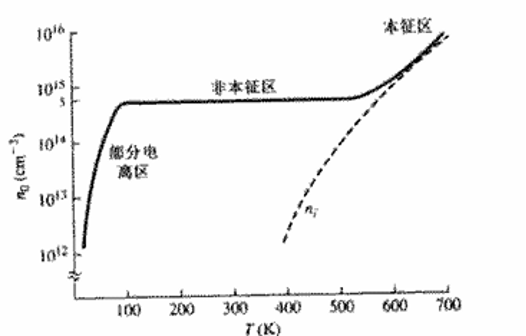
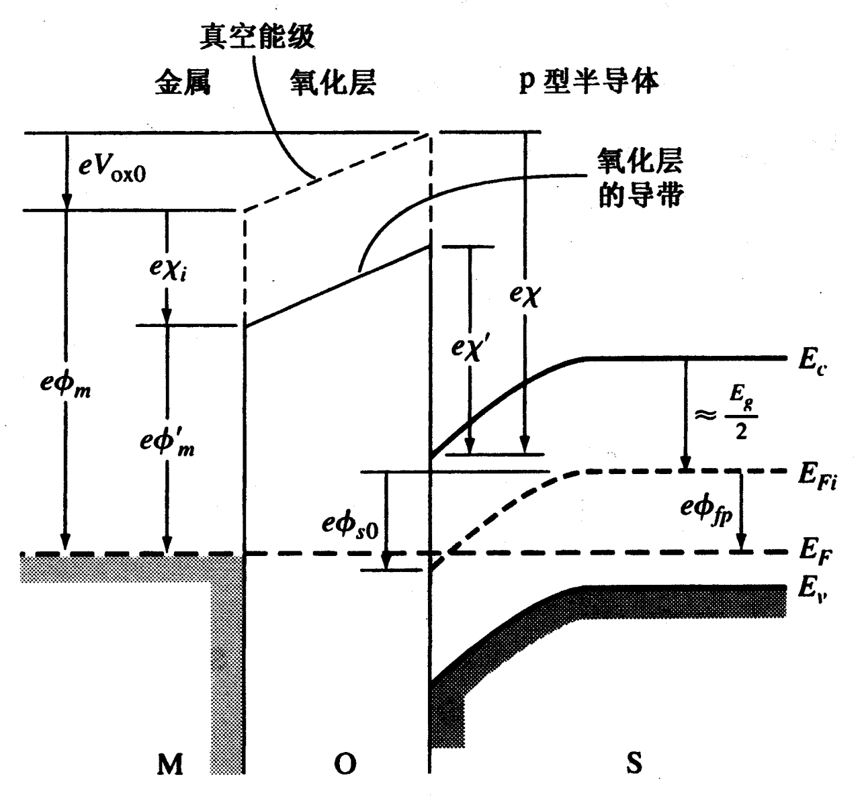

**要点**：晶体、导体、量子力学

# 半导体材料

## 晶体相关

- 单晶：组成晶体的原子按一定的方式**有规则的排列**而成，**几何周期性、各向异性、固定的熔点**
- 多晶：由大量的**微小单晶体**随机堆积而成的整块材料，如各种金属材料和电子陶瓷材料
- 非晶体（无定形）：无规则的外形和没有固定的熔点，内部结构也不存在长程有序

硅、锗是**金刚石**型晶格结构，能带结构是**间接**禁带类型
1. 简立方：8个拐角原子
2. 体立方：8个拐角原子+1个体心原子
3. 面心立方：8个拐角原子+6个面心原子
4. 金刚石：8个拐角原子+6个面心原子+4个中心原子

**米勒指数**：1.截距 2.取倒数 3.乘最小公分母
>原子体密度注意共享的原子

## 导体、半导体
1. **导体**：电阻率小，约为$10^{-8}\sim 10^{-6}$
1. **绝缘体**：电阻率大，约为$10^{8}\sim 10^{18}$
1. **导体**：电阻率适中，约为$10^{-5}\sim 10^{6}$

半导体、导体和绝缘体，能用能带理论解释，不存在能隙的是**导体**，能隙较小的是**半导体**，能隙较大的是**绝缘体**。

## 量子力学初步
### 基础量和公式

普朗克常数：$h = 6.625×10^{-34}J·s = 4.14×10^{15}eV·s$

电子质量：$9.11×10^{-31}kg$

电子伏特：$1eV = 1.6×10^{-19}J$

光子能量

$$
E = h\nu = \frac{hc}{\lambda}
$$

光电效应

$$
E_k=h\nu-W
$$

德布罗意波-动量

$$
p=\frac{h}{\lambda}=mc
$$

推导后的光子能量

$$
E = h\nu = \frac{hc}{\lambda}=\frac{p^2}{2m}
$$

### 不确定原理
两组测不准关系的物理量分别是**坐标**和**动量**不能同时测准，**能量**和**时间**不能同时测准

$$
\Delta x \cdot \Delta p_x \geq \frac{\hbar}{2} \\
\Delta E \cdot \Delta t \geq \frac{\hbar}{2}
$$

其中，$\hbar$为约化普朗克常数，$\hbar = \frac{h}{2\pi} = 1.054 × 10^{-34}J·s$

### 薛定谔方程

$$
-\frac{\hbar^2}{2m}\nabla^2\Psi(\mathbf{r},t) + V(\mathbf{r})\Psi(\mathbf{r},t) = j\hbar\frac{\partial}{\partial t}\Psi(\mathbf{r},t) 
$$

波函数的解为复数，其模的平方表示为：**某一时刻在空间某点出现的概率密度**，且满足概率的归一化条件

$$
\int_{-\infty}^{+\infty} |\Psi(\mathbf{r},t)|^2 d\mathbf{r} = 1
$$

#### 特定解

当没有任何外力作用于电子，即势函数$V(\mathbf{r})=0$时，薛定谔方程简化为

$$
-\frac{\hbar^2}{2m}\nabla^2\Psi(\mathbf{r},t) = j\hbar\frac{\partial}{\partial t}\Psi(\mathbf{r},t) 
$$

其解为平面波形式

$$
\Psi(\mathbf{r},t) = A\exp\left[\frac{j}{\hbar}(x\sqrt{2mE}-Et)\right]+B\exp\left[-\frac{j}{\hbar}(x\sqrt{2mE}+Et)\right]
$$

若仅考虑一个方向，则

$$
\Psi(x,t) = A\exp[j(kx-\omega t)]
$$

其中，$k$ 为波数，满足

$$
k = \frac{2\pi}{\lambda} = \frac{p}{\hbar}
$$

#### 无限深势阱

在无限深势阱中，粒子只能在有限的空间内运动，其波函数满足边界条件

$$ 
\Psi(0,t)=\Psi(L,t)=0
$$

在这种条件下，薛定谔方程的解可以分为**驻波**和**行波**两种，其中**驻波对应的束缚态粒子**局限在势阱内，使得能级呈离散分布，从而实现能量量子化；而**行波则对应自由粒子**，不受此类约束。

驻波解类似于黑体辐射中电磁波模式的量子化，两者都是由于系统内部的约束条件自然形成的，而非外部强制规定的结果。单一粒子的量子化在宏观上可体现为能级的分裂，说明这种离散化本质上源于系统边界条件和空间限制。

#### 矩形势垒

在矩形势垒问题中，薛定谔方程的解可以拆分为两部分：

- 反射波：描述粒子遇到势垒后反射回去的部分；
- 透射波：描述粒子穿过势垒、继续前进的部分，这部分解对应的现象就是量子隧穿效应。

量子隧穿效应说明，即便粒子的能量低于势垒高度，也有非零的概率出现在势垒另一侧

## 固体量子理论
###  能带理论

根据克龙尼克-潘纳模型，对周期势函数下的薛定谔方程求解可得到解呈现出能带特征，解出 $k$ 空间下的 $E$ 分布图为

其中实线为允带区域，允带之间的竖直空白为禁带区域。右图为简化的第一布里渊区。

1. **能带**：当大量原子靠近形成固体时，原子的离散能级会分裂成带状结构
2. **价带**：被电子占据的最高能带，包含参与化学键合的电子
3. **导体**：价带上方的能带，电子在此可自由移动导电
4. **禁带**：价带与导带间的能量间隙，电子不能存在的区域

导体价带与导带重叠、或价带未完全填满，没有禁带，电子可自由移动。

半导体禁带宽度较小，少量电子可获得足够能量跨域禁带。

绝缘体禁带宽度宽，几乎无电子可跨越禁带。

### 电子有效质量

在 $k$ 空间内，能量与动量满足

$$
E=\frac{p^2}{2m}=\frac{k^2 \hbar^2}{2m} \tag 1
$$

其中，电子的动量和波数满足$p=\hbar k$。

对式（1）$k$ 求二阶导可得

$$
\frac{d^2E}{dk^2} = \frac{\hbar ^2}{m} \\
$$

即

$$
\frac{1}{\hbar^2}\frac{d^2E}{dk^2} = \frac{1}{m}
$$

$$
m = \frac{\hbar^2}{\frac{d^2E}{dk^2}}
$$

>E对k的二阶导数(曲率)与粒子质量成反比，比例系数为约化普朗克常数的倒数

### 费米能级
费米能级代表的是**量子态被电子占据的几率是50%时对应的能级位置**

**费米-狄拉克分布（概率）函数**

$$
f_F(E)=\frac{1}{1+\text{exp}(\frac{E-E_F}{kT})} \tag 2
$$

当$E-E_F \gg kT$时，式（2）可简化为玻尔兹曼近似

$$
f_F(E) \approx \text{exp}(\frac{-(E-E_F)}{kT})
$$

费米分布和温度的关系如下图

能态密度函数（单位体积单位能量范围内允许的能态数），为

$$
g(E) = \frac{4\pi (2m)^{3/2}}{h^3} \sqrt{E}
$$

基于能态密度函数和费米-狄拉克分布函数，可求得载流子浓度

$$
n = \int g_c(E)f_F(E) dE
$$

## 平衡半导体
### 载流子分布
导带电子热平衡浓度为

$$
n_0=N_c\text{exp}[\frac{-(E_c-E_F)}{kT}]  \tag 3
$$

其中， $N_c$ 为导带有效状态密度

价带电子热平衡浓度为

$$
p_0=N_v\text{exp}[\frac{-(E_v-E_F)}{kT}]  \tag 4
$$

其中， $N_v$ 为价带有效状态密度

对于大多数半导体，$N_c、N_v$ 的数量级均约为 $10^{19}$ 。

### 本征载流子浓度

本征半导体中，导带中的电子浓度值等于价带中的空穴浓度值。分别表示为 $n_i$ 和 $p_i$ ，且 $n_i=p_i=n_0=p_0$

本征半导体的费米能级称为本征费米能级 $E_{Fi}$ ， 类比式（3）（4），并进行相乘，可得到

$$
n_i^2=N_cN_v\text{exp}[\frac{-(E_c-E_{Fi})}{kT}]\text{exp}[\frac{-(E_{Fi}-E_v)}{kT}]
$$

也即

$$
N_cN_v\text{exp}[\frac{-(E_c-E_v)}{kT}]=N_cN_v\text{exp}[\frac{-(E_g)}{kT}]
$$

其中， $E_g$ 为禁带宽度。

### 本征费米能级位置

本征费米能级位置满足

$$
E_{Fi}-E_{midgap}=\frac{3}{4}k\ln\left(\frac{m_p^*}{m_n^*}\right)
$$

其中，$E_{midgap}$ 为禁带中央，满足

$$
E_{midgap} = \frac{E_c + E_v}{2}
$$

如果电子和空穴的有效质量相等，则本征费米能级会精确位于禁带中央。

### 电离过程

- n型半导体掺施主杂质，其受到电离能后，施主电子激发到导带，过程如下图所示

- p型半导体掺受主杂质，其受到电离能后，从价带接受一个电子，在价带产生一个空穴，过程如下图所示

> 本征激发是指本征半导体中电子从价带跃迁到导带的过程，而杂质激发是指掺杂后杂质原子中的电子或空穴跃迁到导带或价带的过程。

### 非本征半导体
当本征半导体掺杂后，其费米能级会偏移本征费米能级，而一旦费米能级偏移了禁带中央，则导带中的电子浓度和价带中的空穴浓度就会发生变化。但其关系式仍满足式（3）（4）。

在此基础上，给出热平衡状态下电子浓度和空穴浓度的另一种表达式

$$
\begin{cases}
n_0 = n_i\text{exp}\left[\frac{E_F-E_{Fi}}{kT}\right] \\    \tag 5
\\
p_0 = n_i\text{exp}\left[\frac{-(E_F-E_{Fi})}{kT}\right]
\end{cases}
$$

显然，$n_0p_0=n_i^2$

1. 对于 N 型掺杂半导体：

    当施主完全电离且施主浓度 $N_D$ 远大于本征载流子浓度 $n_i$ 时，满足 $n_0 \approx N_D$
    电子为多数载流子，此时 $p_0 \approx \frac{n_i^2}{N_D}$

2. 对于 P 型掺杂半导体：

    当受主完全电离且受主浓度 $N_A$ 远大于本征载流子浓度 $n_i$ 时，满足 $p_0 \approx N_A$
    空穴为多数载流子，此时 $n_0 \approx \frac{n_i^2}{N_A}$

> $T=300k$ 时，$kT \approx 0.0259 eV$

### 电中性状态

当一个区域内同上掺杂施主杂质和受主杂质，其载流子浓度可以由电中性条件进行计算。

在电中性状态下，载流子浓度满足

$$
n_0  + N_D = p_0 + N_A
$$

基于 $n_0p_0=n_i^2$ 可计算得

$$
n_0 = \frac{N_d-N_a}{2} + \sqrt{\left(\frac{N_d-N_a}{2}\right)^2 + n_i^2} \\
p_0 = \frac{N_a-N_d}{2} + \sqrt{\left(\frac{N_a-N_d}{2}\right)^2 + n_i^2}
$$

以n型半导体为例，可以看到当 $N_a=0, N_d \gg n_i$ 时，解为 $n_0 \approx N_d$，这与前文的近似是相当的。

### 非本征费米能级位置

根据式（5），可以求得掺杂后费米能级位置

$$
E_F = E_{Fi} + kT\ln\left(\frac{n_0}{n_i}\right) \\
E_F = E_{Fi} - kT\ln\left(\frac{p_0}{n_i}\right)
$$

### 温度关系

对于本征半导体而言，温度升高，有更多价带中的电子获得足够的能量，从价带跃迁到导带，所以温度升高会使本征半导体有更多的可动载流子，从而电导率增加。

对于N型或者P型半导体，本来其载流子的浓度取决于掺杂的浓度，但是当温度越来越高的时候，本征激发的作用超过了掺杂带来的载流子浓度，所以掺杂半导体会越来越像本征半导体的行为。也就是，高温下掺杂半导体载流子的浓度受掺杂浓度影响不大了，主要受半导体材料的带隙宽度影响。

### 

### 名词解释
>本征半导体、杂质半导体、载流子、空穴、平衡状态，非平衡状态，大注入、小注入，速度饱和、金属功函数、半导体功函数

**本征半导体**：纯净的具有完整晶体结构且不含杂质的半导体。

**杂质半导体**：在本征半导体中掺入少量杂质元素形成的半导体。

**载流子**：在半导体中能够自由移动参与导电的带电粒子，包括电子和空穴。

**空穴**：半导体中价带中的电子获得能量跃迁到导带后留下的空位，其可视为带正电的载流子。

**平衡状态**：半导体中载流子的产生和复合达到动态平衡，没有外界作用时系统的状态。

**非平衡状态**：半导体受到外界因素（如光照、注入等）干扰，使载流子分布偏离平衡态的状态。

**大注入**：注入的非平衡载流子（过剩载流子）浓度接近或超过多数载流子（多子）浓度的情况。

**小注入**：注入的非平衡载流子（过剩载流子）浓度远小于多数载流子（多子）浓度的情况。

**速度饱和**：当电场强度增大到一定程度时，载流子的漂移速度不再随电场强度增加而增加，趋于饱和的现象。

**金属功函数**：一个起始能量为费米能级的电子，从金属内部逸出到真空中所需要的最小能量。

**半导体功函数**：半导体的费米能级与真空能级的能量差。

## 载流子输运

载流子两种基本输运机制分别是**扩散运动**和**漂移运动**。载流子在外加电场作用下的定向运动称为**漂移运动**，所形成的电流称为**漂移电流**。载流子由于**浓度梯度**的存在而发生**扩散运动**，引起**扩散电流**

- 漂移电流密度为

$$
J_{drf}=e(\mu _nn+\mu_pp)E
$$

其中，$\mu$ 为载流子迁移率，其关系式为

$$
\mu_p=\frac{e\tau_{cp}}{m_p^*} \\
\mu_n=\frac{e\tau_{cn}}{m_n^*}
$$

迁移率由两个散射机制决定，分别为电离杂质散射和晶格散射，满足

$$
\frac{1}{\mu}=\frac{1}{\mu_{I}}+\frac{1}{\mu_{L}}
$$

迁移率随温度和掺杂浓度的关系式为

$$
\mu_L \propto T^{3/2} \\
\mu_I \propto \frac{T^{3/2}}{N_I}
$$

- 扩散电流密度为

$$
J_{dif}=e(D_n\Delta n - D_p\Delta p)
$$

- 总电流密度为

$$
J=e(\mu _nn+\mu_pp)E + e(D_n\Delta n - D_p\Delta p)
$$

- 爱因斯坦关系式

$$
\frac{D_n}{\mu _n}=\frac{D_p}{\mu _p}=\frac{kT}{e}
$$

## 非平衡载流子浓度

在非平衡状态下，半导体的载流子浓度发生变化，以n型半导体为例

$$
n_n=n_0+\delta n\\
p_n=p_0+\delta p
$$

且有

$$
\delta n = \delta p
$$
为过剩载流子

- **小注入假设**：过剩载流子浓度远小于平衡态多子浓度，此时满足

$$
n_n \approx n_0 \approx N_d\\
p_n \approx \delta p
$$

- **大注入假设**：过剩载流子浓度接近或大于平衡态多子浓度，此时不满足上述近似

### 双极输运方程

在小注入假设条件下，我们可以推导出n型和p型半导体的双极输运方程。

#### n型半导体下的双极输运方程

$$
 D_p \frac{\partial^2 \delta p}{\partial x^2} - \mu_p E \frac{\partial \delta p}{\partial x} - \mu_p \delta p \frac{\partial E}{\partial x} + g' - \frac{\delta p}{\tau_{p0}} = \frac{\partial \delta p}{\partial t}
$$

#### p型半导体下的双极输运方程

$$
D_n \frac{\partial^2 \delta n}{\partial x^2} + \mu_n E \frac{\partial \delta n}{\partial x} + \mu_n \delta n \frac{\partial E}{\partial x} + g' - \frac{\delta n}{\tau_{p0}}=\frac{\partial \delta n}{\partial t} 
$$

# 半导体器件
## pn结和pn结二极管

内建电势差

$$
V_{bi}=V_t \ln(\frac{N_aN_d}{n_i^2})
$$

内建电势差值的实质为p、n区本征费米能级的差值乘上电子电荷e

空间电荷区宽度

n区宽度为

$$
x_n=\left\{\frac{2\varepsilon_s V_{bi}}{e} \cdot \frac{N_a}{N_d} \cdot \frac{1}{N_a+N_d}\right\}^{1/2}
$$

p区宽度为

$$
x_n=\left\{\frac{2\varepsilon_s V_{bi}}{e} \cdot \frac{N_d}{N_a} \cdot \frac{1}{N_a+N_d}\right\}^{1/2}
$$

空间电荷区总宽度为

$$
W = x_n + x_p = \left\{\frac{2\varepsilon_s V_{bi}}{e} \cdot \frac{N_a + N_d}{N_aN_d}\right\}^{1/2}
$$

### 反偏

在反偏情况下，实际上是内建电势差变大，因此前文公式使用 $V_{bi} + V_R$ 替代即可

空间电荷区总宽度为

$$
W = x_n + x_p = \left\{\frac{2\varepsilon_s (V_{bi} + V_R)}{e} \cdot \frac{N_a + N_d}{N_aN_d}\right\}^{1/2}
$$

在此给出反偏或零偏状态下pn结内最大电场强度（实际为冶金结x=0处）

$$
E_{max} = \frac{-2(V_{bi}+V_R)}{W}
$$

### 结电容

$$
C'=\left\{\frac{e\varepsilon_s N_aN_d}{2(V_{bi}+V_R)(N_a+N_d)}\right\}^{1/2}
$$

也即
$$
C'= \frac{\varepsilon_s}{W}
$$

### 单边突变结

当pn结一侧为重掺杂，一侧为轻掺杂时，称该pn结为单边突变结，其具有一些特性

以p+n结（p区重掺杂，n区轻掺杂）为例，此时 $N_a \gg N_d$

因此，

$$
x_p \approx 0, x_n \approx W = \left\{\frac{2\varepsilon_s (V_{bi} + V_R)}{eN_d} \right\}^{1/2}
$$

### 结击穿

#### 齐纳击穿 (Zener Breakdown)

**机理**：
- 发生在高掺杂、空间电荷区较窄的 PN 结中
- 在强电场作用下，价带电子直接穿隧到导带
- 电场强度通常需要达到 10^7 V/cm 以上
- 温度系数为负（温度升高，击穿电压降低）

**特点**：
- 击穿电压较低（一般小于 5-6V）
- 击穿过程快速可逆
- 不会造成器件损坏
- 通常用于稳压二极管

#### 雪崩击穿 (Avalanche Breakdown)

**机理**：
- 发生在低掺杂、空间电荷区较宽的 PN 结中
- 少数载流子在强电场加速后获得足够能量
- 加速电子碰撞晶格原子产生电子-空穴对
- 形成连锁反应，载流子数量呈雪崩式增长
- 温度系数为正（温度升高，击穿电压升高）

**特点**：
- 击穿电压较高（通常大于 6V）
- 过程中产生较大电流
- 如果没有限流措施，可能导致器件过热损坏
- 在雪崩二极管、雪崩晶体管等器件中应用

两种机制可能同时存在，低电压时齐纳机制占主导，高电压时雪崩机制占主导。

当刚好发生击穿时，pn结内部最大电场强度称为临界电场 $E_{crit}$ ，其满足

$$
V_B = \frac{\varepsilon E_{crit}^2}{2eN_B}
$$

其中， $V_B$ 为击穿电压， $N_B$ 为低掺杂区掺杂浓度

### 少数载流子分布

在pn结内部，可以求得双极输运方程的近似解为

$$
\partial p_n(x) = p_n(x) - p_{n0} = p_{n0} \cdot \left[\exp (\frac{eV_a}{kT} - 1 \right) ] \cdot \exp (\frac{x_n - x}{L_p}) \quad x ≥ x_n  \tag 6
$$

$$
\partial n_p(x) = n_p(x) - n_{p0} = n_{p0} \cdot \left[\exp (\frac{eV_a}{kT} - 1 \right) ] \cdot \exp (\frac{x_p + x}{L_p}) \quad x ≤ -x_p  \tag 7
$$

在此根据载流子浓度，定义准费米能级

$$
p = p_0 + \partial p = n_i \exp(\frac{E_{Fi} - E_{Fp}}{kT}) \\

n = n_0 + \partial p = n_i \exp(\frac{E_{Fn} - E_{Fi}}{kT})
$$

联立可解得

$$
np = n_i^2 \exp(\frac{E_{Fn} - E_{Fp}}{kT})
$$

此处的 $E_{Fn} - E_{Fp}$ 可类比前文关于 $V_{bi}$ 的解释，不难发现其实质上也是正偏电压 $V_a$ 造成的，其满足

$$
E_{Fn} - E_{Fp} = e \cdot V_a
$$

### pn结电流

pn结存在电中性假设，因此其不存在漂移电流，仅存在扩散电流，而扩散电流密度的公式已在前文给出，这里直接与式(6)(7)联立可得p区与n区少子扩散电流为

$$
J_p(x) = \frac{eD_pp_{n0}}{L_p} \cdot \left[\exp(\frac{eV_a}{kT}) - 1\right] \cdot \exp(\frac{x_n - x}{L_p}) \quad x \geq x_n  \tag 7
$$

$$
J_n(x) = \frac{eD_nn_{p0}}{L_n} \cdot \left[\exp(\frac{eV_a}{kT}) - 1\right] \cdot \exp(\frac{x_p + x}{L_n}) \quad x \leq -x_p  \tag 8
$$

因为pn结电流密度为空穴电流密度和电子电流密度之和，又因为n区结边界处的多子电流密度等价于p区结边界的少子空穴密度（反之亦然），因此总的电流密度可以表示为

$$
J_{total} = J_p(x_n) + J_n(x_p) = J_s \cdot \left[\exp(\frac{eV_a}{kT}) - 1\right]   \tag 9
$$

其中

$$
J_s = \left[\frac{eD_pp_{n0}}{L_p} + \frac{eD_nn_{p0}}{L_n}\right]
$$

为反向饱和电流密度

而又根据电流连续性方程，因此pn结内部任何一处电流密度都是恒定的为 $J_{total}$，故联立式(7)(8)(9)可得到pn结任意一处的多子电流密度为

$$
\begin{cases}
J_n(x) &= J_{total} - J_p(x) & & x \geq x_n \\
J_p(x) &= J_{total} - J_n(x) & & x \leq -x_p
\end{cases}
$$

### 产生-复合电流

前文的推导都忽略了pn结空间电荷区内的载流子产生-复合过程，但实际上pn结空间电荷区内的载流子浓度是非平衡状态，因此需要考虑产生-复合电流。

这里给出基于SRH复合理论的过剩电子与空穴的复合率公式

$$
R=\frac{C_nC_pN_t(np-n_i^2)}{C_n(n+n')+C_p(p+p')}
$$

其中， $np=n_i^2\exp(\frac{qV}{kT})$

不难发现，当

-  $V=0$,即pn结处于平衡状态时，$R=0$，无复合
-  $V<0$,即pn结处于反偏状态时，$R>0$，净产生
-  $V>0$,即pn结处于正偏状态时，$R<0$，净复合

接下来对反偏和正偏情况一次进行讨论

#### 反偏条件下的产生-复合电流

在反偏条件下，pn结空间电荷区发生净产生，且产生率为 $R_{gen}$，产生电流密度为

$$
J_{gen} = \frac{en_iW}{2\tau_0}
$$

总反偏电流密度为理想反向饱和电流密度 $J_s$ 和反向产生电流密度 $J_{gen}$ 的和

$$
J_{R} = J_s + J_{gen}
$$

其中，理想反向饱和电流密度与反偏电压无关，但反向产生电流密度与空间电荷区宽度，也即反偏电压有关，故在考虑产生-复合电流后，pn结的反向电流密度不再与反偏电压无关

#### 正偏条件下的产生-复合电流

在正偏条件下，pn结空间电荷区发生净复合，且复合率为 $R_{rec}$，复合电流密度为

$$
J_{rec} = \frac{en_iW}{2\tau_0}\exp(\frac{eV}{2kT})=J_{r0}\exp(\frac{eV}{2kT})
$$

同理，总的正偏电流密度为扩散电流密度 $J_D$ 和正向复合电流密度 $J_{rec}$ 的和

$$
J = J_D + J_{rec}
$$

其中，$J_D$ 由式（9）给出

在正偏情况下，$J$小时主要为复合电流，$J$大时主要为扩散电流

一般情况下，二极管的电流电压关系为

$$
I=I_s\left[\exp\left(\frac{eV_a}{nkT}\right)-1\right]
$$

其中，$n$ 为理想因子

- 正偏电压较大，$n \approx 1$
- 正偏电压较小，$n \approx 2$
- 过渡区内，$1<n<2$

### pn结的小信号模型

当pn结通入直流载波的小交流信号，其电压-电流关系可用小信号模型来阐述，即pn结本身可用等效电路进行替代

- 扩散电阻
$$
r_d=\frac{V_t}{I_{DQ}}
$$

- 扩散电容
$$
C_d=(\frac{1}{2V_t})(I_{po}\tau_{po}+I_{no}\tau_{no})
$$

其中，$I_{Po}$ 为空穴扩散电流的直流成分，$I_{no}$ 为电子扩散电流的直流成分
  

## 金属半导体和半导体异质结

### 肖特基势垒二极管

金属功函数：$\phi_m$

半导体功函数：$\phi_s = \chi + \phi_n$

电子亲和能：$\chi$

**肖特基势垒**：

主要是由于金属和半导体接触时由功函数差异引起的。当两者接触时，为了使系统达到热平衡，金属中的电子或半导体中的载流子会发生转移，导致界面处产生正负电荷区域和内建电场，从而形成势垒。这种势垒限制了载流子在界面处的运动。

肖特基势垒会导致界面处存在一定的电阻，影响器件的导电性能和开关速度。还会降低界面处的镜像力。当界面存在缺陷时，还会导致肖特基势垒高度偏离理想值。

肖特基势垒二极管的电流取决于多子的发射电流，开启电压较小。

| 接触前 | 接触后 |
| --- | --- |
|  |  |

**肖特基势垒**：$\phi_{B0}=\phi_m - \chi$

**内建电势差**：$V_{bi} = \phi_{B0} - \phi_n$

**空间电荷区宽度**：采用突变结近似

$$
W = \left\{\frac{2\varepsilon_s( V_{bi}+V_R)}{eN}\right\}^{1/2}
$$

### 欧姆接触

肖特基接触的一个关键特征是 $\phi_m > \phi_s$，即金属功函数大于半导体功函数。

而当 $\phi_m < \phi_s$ 时，形成的是欧姆接触。

下图以n型半导体为例，展示了欧姆接触的形成过程。

| 接触前 | 接触后 |
| --- | --- |
|||

通过在半导体表面重掺杂，可以使接触处的掺杂浓度大于金属的电子浓度，从而形成欧姆接触。

欧姆接触结服从欧姆定律，V-I特性曲线为线性关系。   

## 金属-氧化物-半导体场效应晶体管（MOSFET）

### MOS电容与反型过程

MOS电容的实质是外部栅压金属氧化物间接调控半导体的导电性。以p型衬底的MOS电容为例，当施加负栅压后，氧化物内部产生电场，吸引p型衬底的空穴在半导体界面堆积，直接根据式(5)可以看出，界面处的本征费米能级将上升、偏离费米能级

|p衬底MOS电容|负栅压后能带图|
|-|-|
|||

基于这点，不难看出施加正栅压后将吸引电子聚集在界面处，同样根据式(5),本征费米能级将下降靠近费米能级。接下来讨论当施加较大正栅压后界面处本征费米能级低于费米能级的情况。

|较大正栅压|能带图|
|-|-|
|||

当施加较大正栅压后，界面处堆积过多空穴，导致本征费米能级低于费米能级，即导带比价带更接近费米能级，此时界面处能带图呈现为n型半导体的能带图，即此时界面处已反型为n型半导体。

n型半导体的推导是同理的，这里省略。

### 反型阈值电压

以p型半导体为例，随着施加正栅压的增大，本征费米能级会逐渐下降，从靠近费米能级到远离费米能级，当界面处电子和体内空穴浓度相等时，此时的栅压称为阈值电压

即，界面处 $E_F-E_{Fi}$ 与体内 $E_{Fi}-E_F$ 相等。从图中可看出，即

$$
\phi_s=2\phi_{fp}
$$

其中，$\phi_{fp}$ 为体内势垒高度，定义为

$$
\phi_{fp}=V_t\ln\left(\frac{N_a}{n_i}\right)
$$

基于单边结的结论，可推出此时的空间电荷区宽度为

$$
x_{dT}=\left(\frac{2\varepsilon_s\phi_{s}}{eN_a}\right)^{1/2}=\left(\frac{4\varepsilon_s\phi_{fp}}{eN_a}\right)^{1/2}
$$

### 功函数差

到目前，我们已经探讨了当MOS电容半导体界面处电压对半导体界面载流子浓度的调控，但通常情况，我们只能直接施加到**金属-氧化物-半导体**中关于金属的电压，这个电压传递到半导体界面时的公式是需要推导的。

在此给出零栅压时p型MOS电容的能带图

|接触前|接触后|
|-|-|
|||

定义金属-半导体功函数差为

$$
\phi_{ms}=\left[\phi_m'-\left(\chi'+\frac{E_g}{2e}+\phi_{fp}\right)\right] = -(V_{oX0}+\phi_{s0})
$$

>公式的右侧为两个差值，分别为金属和半导体价带到氧化层费米能级的距离

金属与半导体功函数差的存在导致其在零栅压下接触也会产生能带的弯曲（实质是为了使费米能级相等，基于这点，也可以理解为功函数差的定义就是导带到费米能级距离的差）

### 平带电压

功函数差和栅压都会导致接触界面能带发生弯曲，接下来讨论当能带不发生弯曲时所需施加的栅压大小，即为平带电压。

|     平带时MOS电容能带图           |MOS电容电荷分布|
|-|-|
|||

关于功函数差，其还有一个定义式为

$$
V_{oX0}+\phi_{s0} = -\phi_{ms}
$$

当施加栅压时，金属与半导体串联，共同承担栅压。而栅压施加在金属上导致其偏离真空能级，即 $\Delta V_{ox}$，施加在半导体上导致其本征费米能级发生偏离，即 $\Delta \phi_{s0}$ ，基于这点，可得

$$
V_G = \Delta V_{ox} + \Delta \phi_{s0} = (V_{0x}-V_{ox0})+(\phi_s-\phi_{S0})\\
= V_{ox}+\phi_s+\phi_{ms}
$$

根据电中性原理有

$$
Q_m'+Q_{ss}'=0
$$

则

$$
V_{ox}=\frac{Q_m'}{C_{ox}}=\frac{-Q_{ss}'}{C_{ox}}
$$

则可解得当 $\phi_s=0$ 时的平带电压为

$$
V_{FB}=V_G|_{\phi_s=0}=\phi_{ms}-\frac{Q_{ss}'}{C_{ox}}
$$

### 反型阈值栅压

前文平带电压使用了电中性原理时，半导体界面处电荷为0，而当半导体界面阈值反型时，公式需进行调整，即

$$
Q_m'+Q_{ss}'=|Q_{SD}'|=eN_ax_{dT}
$$

同样，基于前文公式，可推的当  $\phi_s=2\phi_{fp}$ 时的反型阈值栅压为

$$
V_{TN} = \frac{Q_{SD}'}{C_{ox}}+V_{FB}+2\phi_{fp}
$$

### 总结

