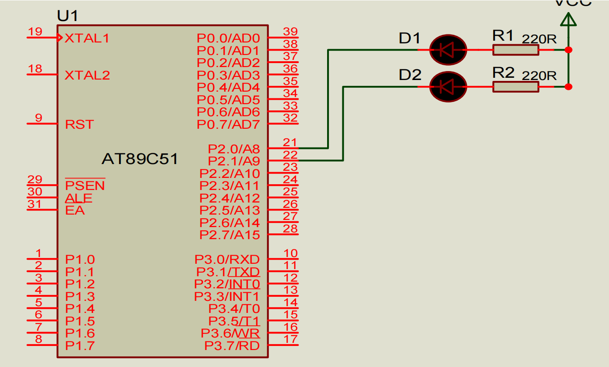
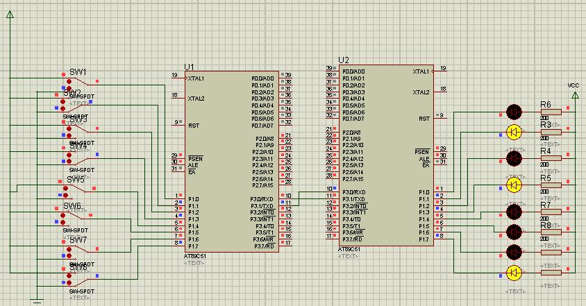

# 题目

## 51 单片机有哪几种寻址方式？试分别列举采用这些寻址方式进行寻址的汇编指令。（3-9）

共有7种寻址方式，分别为
- 立即寻址 
```assembly
MOV A, #30 ;将立即数30H传送至A中
 ```
- 直接寻址
```assembly
MOV 3AH, A ;将A中的内容传送至片内RAM 3AH单元中
 ```
- 寄存器寻址
```assembly
MOV A, R0 ;将寄存器R0中的内容传输至A中
INC A    ;寄存器A中的内容加1送回A中
 ```
- 寄存器间接寻址
```assembly
MOV A, @R0 ;将寄存器R0中存放的地址所指向的单元内容传送至A中
MOVX @DPTR, A ;将A中的内容传送至片外RAM中DPTR所指向的单元中
 ```
- 变址寻址
```assembly
MOVC A, @A+DPTR ;将DPTR和A寄存器内容相加所指向的单元内容传送至A中
 ```
- 相对寻址
```assembly
SJMP 08H ;相对当前PC值进行偏移量为08H的跳转
 ```
- 位寻址
```assembly
MOV 20H, C ;将进位标志C的内容传送至片内RAM 20H单元的第0位
MOV 20H, A ;将A中内容送至片内RAM 20H单元中的第0位
 ```

## 什么叫哈佛结构，什么叫冯诺依曼结构？单片机和 PC 机采用的分别是什么结构？（1-38）
哈佛结构是一种存储器并行体系结构，主要特点是将程序和数据存储在不同的存储空间中，即程序存储器和数据存储器是两个独立的存储器，每个存储器独立编址、独立访问。CPU首先到程序指令存储器中读取程序指令内容，解码后得到数据地址，再到相应的数据存储器中读取数据，并进行下一步的操作（通常是执行）。程序指令存储和数据存储分开，可以使指令和数据有不同的数据宽度。

冯诺依曼体系结构计算机处理的数据和指令一律用二进制数表示，指令和数据不加区别混合存储在同一个存储器中，顺序执行程序的每一条指令，计算机硬件由运算器、控制器、存储器和输入输出设备五大部分组成。

单片机采用哈佛结构，PC机采用冯诺依曼结构。

## 特殊功能寄存器 PSW 中的各位分别表示什么，有什么功能？试分析执行指令```MOV A, #7FH \\ ADD A, #47H```后，程序状态字 PSW 中 CY，AC，OV，P 的状态是什么？（2-33）

|PSW.7|PSW.6|PSW.5|PSW.4|PSW.3|PSW.2|PSW.1|PSW.0|
|-----|-----|-----|-----|-----|-----|-----|-----|
|CY   |AC   |F0   |RS1  |RS0  |OV   | --  |P    |

- **CY**：进位标志位。当发生无符号数加法运算的进位或减法运算的借位时，CY 置 1，否则置 0。
- **AC**：辅助进位标志位。低四位加法运算中发生进位时，AC 置 1，否则置 0。
- **F0**：用户自定义标志位，可由程序任意使用。
- **RS1** 和 **RS0**：寄存器组选择位，用于选择工作寄存器组。
    - RS1 RS0 = 00，选择寄存器组 0（R0-R7 地址为 00H-07H）
    - RS1 RS0 = 01，选择寄存器组 1（R0-R7 地址为 08H-0FH）
    - RS1 RS0 = 10，选择寄存器组 2（R0-R7 地址为 10H-17H）
    - RS1 RS0 = 11，选择寄存器组 3（R0-R7 地址为 18H-1FH）
- **OV**：溢出标志位。当有符号数加法运算结果超出范围时，OV 置 1，否则置 0。
- **PSW.1** --：保留位，未使用。
- **P**：奇偶标志位。当累加器 A 中 1 的个数为偶数时，P 置 0，为奇数时，P 置 1。

当执行指令
```assembly
MOV A, #7FH
```
后，A = 7FH（二进制 0111 1111），PSW 状态为 CY=0，AC=0，OV=0，P=1。
继续执行指令
```assembly
ADD A, #47H
```
后，A = C6H（二进制 1100 0110），PSW 状态为 CY=0，AC=1，OV=1，P=0。

## 特殊功能寄存器 SP、ACC、B、DPTR 各有什么功能？（2-31）

- **SP（堆栈指针寄存器）**：8位寄存器，用于指示当前堆栈的顶端位置。堆栈用于存储临时数据、返回地址等，SP 的初始值为 07H，随着数据的入栈和出栈操作，SP 的值会相应增加或减少。
- **ACC（累加器寄存器）**：8位寄存器，主要用于算术和逻辑运算。大多数算术和逻辑指令都以 ACC 作为操作数或结果寄存器。
- **B（乘除寄存器）**：8位寄存器，主要用于与ACC配合完成乘法和除法运算。
- **DPTR（数据指针寄存器）**：16位寄存器，由两个 8 位寄存器 DPH（高字节）和 DPL（低字节）组成。DPTR 主要用于访问外部RAM/ROM。

## 程序计数器 PC 的功能是什么？试述 PC 管理程序执行顺序的过程。（2-29）
程序计数器 PC（Program Counter）是一个 16 位寄存器，用于存储下一条将要执行的指令的地址。PC 的主要功能是管理程序的执行顺序，确保 CPU 能够按照正确的顺序执行指令。

程序执行过程中，PC 的工作过程如下：

当单片机上电或复位时，PC 被初始化为 0000H，指向存储器的起始地址。CPU 从 PC 指向的地址读取指令，并将其加载到指令寄存器中。在指令获取后，PC 自动加 1，指向下一条指令的地址。CPU 解码并执行当前指令。某些指令（如跳转、调用等）可能会修改 PC 的值，使其指向新的地址。上述过程不断重复，直到程序结束或遇到中断。

## 单片机有哪些中断源？试述中断响应的过程和中断优先级的实现过程。（5-11）
单片机的中断源主要有5个
1. $\overline{\text{INT0}}$: 外部中断 0，中断请求信号由P3.2输入
2. $\overline{\text{INT1}}$: 外部中断 1，中断请求信号由P3.3输入
3. $\text{T0}$: 定时器/计数器0溢出中断，对外部脉冲计数由P3.4输入
4. $\text{T1}$: 定时器/计数器1溢出中断，对外部脉冲计数由P3.5输入
5. 串行终端：包括串行接收终端RI和串行发送终端TI（P3.0，P3.1）

**中断响应的过程**：CPU查询到某中断标志为“1”，在满足中断响应条件下，响应中断

**中断响应条件包括**：1. 该中断已经“开中”；2. CPU此时没有响应同级或者更高级的中断；3. 当前正处于所执行指令的最后一个机器周期；4. 正在执行的指令不是RETI或者是访问IE、IP的指令，否则必须再执行另外一条指令后才能响应

**中断响应操作**：1. 保护断点地址；2. 撤除该中断源的中断请求标志；3. 关闭同级中断 4. 将响应中断的入口地址送入PC中

## 求带符号数+83、-34 的补码（设机器字长为 8 位）。（1-23）
+83 的补码为 0101 0011

-34 的补码为 1101 1110

## 单片机的定义是什么？试述单片机的发展历程以及其和 PC 机的主要区别。（1-36）

将中央处理器（CPU）、存储器和各种输入输出接口电路与总线制作在一块芯片的超大规模集成电路，即集成在一块芯片上的计算机

单片机的发展历程主要经历了以下几个阶段：
1. **早期阶段（1970年代）**：单片机的概念首次提出，最早的单片机如Intel 4004和Intel 8008问世，集成度较低，功能有限。
2. **发展阶段（1980年代）**：随着集成电路技术的发展，单片机的集成度和功能不断提升，出现了如Intel 8051、Zilog Z80等经典单片机，广泛应用于工业控制、家电等领域。
3. **成熟阶段（1990年代至今）**：单片机技术不断进步，出现了高性能、低功耗的单片机，如ARM Cortex-M系列，支持更多的外设和更复杂的应用，广泛应用于嵌入式系统、物联网等领域。

单片机和PC机的主要区别在于：
- **PC机**：PC系统全力实现海量高速数据处理，兼顾控制功能
- **单片机**：单片机系统全力满足测控对象的测控功能，兼顾数据处理能力

## C51 中有哪些存储器类型，分别对应单片机的哪些存储器区域？如何利用指针访问这些存储器区域中任意指定的存储器单元？编写一个 C51 程序，采用指针方式将 pdata 区 20H 地址赋值为 57H，xdata 区 2000H 地址赋值为 FFH。（4-21）

|存储器类型|描述|访问方式|
|-|-|-|
|data|直接寻址的片内RAM低128B，访问速度快|unsigned char data *ptr_data|
|bdata|片内RAM的可位寻址区（20H~2FH），允许字节和位混合访问|unsigned char bdata *ptr_bdata|
|idata|间接寻址访问的片外RAM，允许访问全部片内RAM|unsigned char idata *ptr_idata|
|pdata|用Ri间接访问的片外RAM的低256B|unsigned char pdata *ptr_pdata|
|xdata|用DPTR间接访问的片外RAM，允许访问全部64k片外RAM|unsigned char xdata *ptr_xdata|
|code|程序存储器ROM64k空间|unsigned char code *ptr_code|

```c
#include <reg51.h>

void main()
{
    unsigned char pdata *ptr_pdata;
    unsigned char xdata *ptr_xdata;

    ptr_pdata = (unsigned char pdata *)0x20; // pdata区20H地址
    *ptr_pdata = 0x57;                       // 赋值为57H

    ptr_xdata = (unsigned char xdata *)0x2000; // xdata区2000H地址
    *ptr_xdata = 0xFF;                         // 赋值为FFH

    while(1);
}

```

## 已知内部 RAM 中（20H）=10 H, 试写一个汇编程序，运用寄存器间接寻址的方法将（20H）中的内容复制到内部 RAM（51H）至（57H）单元中。（3-12，4-77）

```assembly
ORG 0000H
    MOV A, 20H       ; 将内部 RAM 20H 单元的内容（10H）送入累加器 A
    MOV R0, #07H     ; 设置循环计数器R0为7
    MOV R1, #51H     ; R1指向目标地址51H

LOOP:
    MOV @R1, A       ; 将A的值（20H）存入R1
    INC R1           ; R1指向下一个内部RAM地址
    DJNZ R0, LOOP    ; 循环7次
    SJMP $           ; 程序结束，进入死循环
```


## 用汇编语言编写查表程序求 0～20 之间整数的平方。已知该整数存在内 RAM 30H 中，查得平方数存内部 RAM 30H（高 8 位）和 31H（低 8 位）。已知平方表(双字节)首地址为 TAB。（3-78）

```assembly
SQUARE:
    MOV DPTR, #TAB      ; 将查表地址TAB送入数据指针DPTR
    MOV A, 30H          ; 将内RAM 30H中的整数送入累加器A
    ADD A, 30H          ; 数据×2→A（因为表中每项占2字节）
    MOV 30H, A          ; 暂存平方表数据序号
    
    MOVC A, @A+DPTR     ; 读平方数据高8位
    XCH A, 30H          ; 存平方数据高8位，取回数据序号
    
    INC A               ; 指向平方数据低8位
    MOVC A, @A+DPTR     ; 读平方数据低8位
    MOV 31H, A          ; 存平方数据低8位
    
    RET                 ; 返回主程序

TAB:  ; 平方表（双字节）
    DB 00H, 00H  ; 0^2 = 0
    DB 01H, 00H  ; 1^2 = 1
    DB 04H, 00H  ; 2^2 = 4
    DB 09H, 00H  ; 3^2 = 9
    DB 10H, 00H  ; 4^2 = 16
```

## MOV, MOVX, MOVC，ADDC, SET ,XRL, CLR, ANL, PUSH, DEC , JB, JNB, DJNZ 等汇编指令的详细用法，注意每条指令的所有可能用法。（3-15）

### 数据传输类指令

```assembly
;以累加器A为目的操作数的指令
MOV A, Rn         ; 将寄存器 Rn 的内容传送到累加器 A, n=0~7
MOV A, @Ri        ; 将寄存器 Ri 指向的内存单元内容传送到累加器 A, i=0,1
MOV A direct      ; 将直接地址的内存单元内容传送到累加器 A
MOV A, #data     ; 将立即数 data 传送到累加器 A

;以工作寄存器Rn为目的的字节传送指令
MOV Rn, A        ; 将累加器 A 的内容传送到寄存器 Rn, n=0~7
MOV Rn, direct   ; 将直接地址的内存单元内容传送到寄存器 Rn
MOV Rn, #data   ; 将立即数 data 传送到寄存器 Rn

;以直接地址内存单元为目的的字节传送指令
MOV direct, A    ; 将累加器 A 的内容传送到直接地址的内存单元
MOV direct, Rn   ; 将寄存器 Rn 的内容传送到直接地址的内存单元
MOV direct, @Ri  ; 将寄存器 Ri 指向的内存单元内容传送到直接地址的内存单元
MOV direct1, direct2 ; 将直接地址 direct2 的内容传送到直接地址 direct1
MOV direct, #data ; 将立即数 data 传送到直接地址的内存单元

;以寄存器间接地址为目的的字节传送指令
MOV @Ri, A       ; 将累加器 A 的内容传送到寄存器 Ri 指向的内存单元, i=0,1
MOV @Ri, direct  ; 将直接地址的内存单元内容传送到寄存器 Ri 指向的内存单元
MOV @Ri, #data  ; 将立即数 data 传送到寄存器 Ri 指向的内存单元

;16位数据传送指令
MOV DPTR, #data16 ; 将16位立即数 data16 传送到数据指针寄存器 DPTR
;也可以分两步传送
MOV DPH, #data8  ; 将8位立即数 data8 传送到数据指针寄存器高字节 DPH
MOV DPL, #data8  ; 将8位立即数 data8 传送到数据指针寄存器低字节 DPL

;片外数据传送指令
MOVX A, @DPTR    ; 将数据指针 DPTR 指向的片外内存单元内容传送到累加器 A
MOVX A, @Ri     ; 将寄存器 Ri 指向的片外内存单元内容传送到累加器 A, i=0,1
MOVX @DPTR, A   ; 将累加器 A 的内容传送到数据指针 DPTR 指向的片外内存单元
MOVX @Ri, A     ; 将累加器 A 的内容传送到寄存器 Ri 指向的片外内存单元, i=0,1

;读取程序存储器指令
MOVC A, @A+DPTR ; 将累加器 A 和数据指针 DPTR 内容相加所指向的程序存储器单元内容传送到累加器 A
MOVC A, @A+PC   ; 将累加器 A 和程序计数器 PC 内容相加所指向的程序存储器单元内容传送到累加器 A

```

### 算术运算类指令

```assembly
;带进位加法指令
ADDC A, Rn      ; 将寄存器 Rn 的内容和进位标志 CY 加到累加器 A 中, n=0~7
ADDC A, Ri      ; 将寄存器 Ri 指向的内存单元内容和进位标志 CY 加到累加器 A 中, i=0,1
ADDC A, direct  ; 将直接地址的内存单元内容和进位标志 CY 加到累加器 A 中
ADDC A, #data   ; 将立即数 data 和进位标志 CY 加到累加器 A 中

;递增指令
INC A          ; 将累加器 A 的内容加 1，结果存回累加器 A
INC Rn         ; 将寄存器 Rn 的内容加 1，结果存回寄存器 Rn, n=0~7
INC direct     ; 将直接地址的内存单元内容加 1，结果存回该内存单元
INC @Ri        ; 将寄存器 Ri 指向的内存单元内容加 1，结果存回该内存单元, i=0,1

;递减指令
DEC A          ; 将累加器 A 的内容减 1，结果存回累加器 A
DEC Rn         ; 将寄存器 Rn 的内容减 1，结果存回寄存器 Rn, n=0~7
DEC direct     ; 将直接地址的内存单元内容减 1，结果存回该内存单元
DEC @Ri        ; 将寄存器 Ri 指向的内存单元内容减 1，结果存回该内存单元, i=0,1
```

### 逻辑运算类指令

```assembly
;置位指令
SETB C        ; 将进位标志 CY 置位为 1
SETB bit      ; 将位寻址的位 bit 置位为 1

;清零指令
CLRB C        ; 将进位标志 CY 清零为 0
CLR bit      ; 将位寻址的位 bit 清零为 0

;与运算指令
ANL A, Rn     ; 将寄存器 Rn 的内容与累加器 A 进行按位与运算，结果存回累加器 A, n=0~7
ANL A, direct ; 将直接地址的内存单元内容与累加器 A 进行按位与运算，结果存回累加器 A
ANL A, #data  ; 将立即数 data 与累加器 A 进行按位与运算，结果存回累加器 A
ANL direct, A ; 将累加器 A 的内容与直接地址的内存单元内容进行按位与运算，结果存回直接地址的内存单元 direct
ANL direct1, direct2 ; 将直接地址 direct2 的内容与直接地址 direct1 的内容进行按位与运算，结果存回 direct1

;异或运算指令
XRL A, Rn     ; 将寄存器 Rn 的内容与累加器 A 进行按位异或运算，结果存回累加器 A, n=0~7
XRL A, direct ; 将直接地址的内存单元内容与累加器 A 进行按位异或运算，结果存回累加器 A
XRL A, #data  ; 将立即数 data 与累加器 A 进行按位异或运算，结果存回累加器 A
XRL direct, A ; 将累加器 A 的内容与直接地址的内存单元内容进行按位异或运算，结果存回直接地址的内存单元 direct
XRL direct1, direct2 ; 将直接地址 direct2 的内容与直接地址 direct1 的内容进行按位异或运算，结果存回 direct1

```

### 堆栈操作类指令

```assembly
;入栈指令
PUSH direct   ; 将直接地址的内存单元内容入栈

;出栈指令
POP direct    ; 将栈顶内容出栈到直接地址的内存单元

```

### 条件跳转类指令

```assembly
;位测试跳转指令
JB bit, label  ; 如果位寻址的位 bit 为 1，则跳转到标签 label 处继续执行
JB bit, address ; 如果位寻址的位 bit 为 1，则跳转到指定地址 address 处继续执行
JNB bit, label ; 如果位寻址的位 bit 为 0，则跳转到标签 label 处继续执行
JNB bit, address ; 如果位寻址的位 bit 为 0，则跳转到指定地址 address 处继续执行

;循环跳转指令
DJNZ Rn, label ; 将寄存器 Rn 的内容减 1，如果结果不为 0，则跳转到标签 label 处继续执行, n=0~7
DJNZ Rn, address ; 将寄存器 Rn 的内容减 1，如果结果不为 0，则跳转到指定地址 address 处继续执行, n=0~7
DJNZ direct, label ; 将直接地址的内存单元内容减 1，如果结果不为 0，则跳转到标签 label 处继续执行
DJNZ direct, address ; 将直接地址的内存单元内容减 1，如果结果不为 0，则跳转到指定地址 address 处继续执行

;无条件跳转指令
SJMP label     ; 无条件跳转到标签 label 处继续执行
SJMP address   ; 无条件跳转到指定地址 address 处继续执行
```

## 51 单片机有哪几种周期？设晶振 fosc=6MHz，使用汇编语言采用循环方式编写一个100ms 的准确延时程序。（3-67）

51 单片机有三种周期：时钟周期、机器周期和指令周期。
- **时钟周期**：单片机晶振频率的倒数，即时钟周期 T = 1/fosc。
- **机器周期**：单片机执行一条机器指令所需的基本时间单位。对于 8051 单片机，一个机器周期通常由 12 个时钟周期组成。
- **指令周期**：执行一条指令所需的时间，通常以机器周期为单位。不同指令的指令周期可能不同。


```assembly
; 时钟周期 T = 1/6MHz = 0.167μs
; 机器周期 = 12 × 时钟周期 = 2μs
; 需要延时 100ms = 100000μs = 50000个机器周期

DY100ms:
    MOV R6, #50         ; 置外循环次数（50 × 1000 = 50000）
    MOV R7, #200        ; 置内循环次数（200机周期 × 250 = 50000机周期）

DLP1:
    MOV R5, #250        ; 最内层循环次数
    
DLP2:
    DJNZ R5, DLP2       ; 2机周期（内层循环）
    DJNZ R7, DLP1       ; 2机周期 × 200 = 400机周期
    DJNZ R6, DY100ms    ; 2机周期 × 50 = 100机周期
    RET                 ; 2机周期

; 说明：
; MOV指令 = 1机周期
; DJNZ指令 = 2机周期（跳转时）或 2机周期（不跳转时）
; RET指令 = 2机周期
; 总延时 ≈ [(2机周期 × 250) + 1 + 2] × 200 + 1 + 2] × 50 + 1 + 2 ≈ 100000机周期 = 100ms
```
## 设 80C51 单片机的 P1 口作为输出口，每根线上接 1 只发光二极管，通过限流电阻接地。试使用汇编语言编程实现：每个灯闪烁点亮 10 次，再转移到下一个灯闪烁点亮 10 次，闪烁周期为 500ms，循环不止。（3-68）

## 设 80C51 单片机的 P1 口作为输出口，每根线上接 1 只发光二极管，通过限流电阻接地。P3.2 上接有一个开关 K，开关 K 按下时 P3.2 为低电平，开关 K 未按下时 P3.2 为高电平。请用外中断 0 的中断方式控制这 8 只 LED 的亮暗，要求每按一次开关 K，LED 由亮变暗或由暗变亮，请用 C51 编程实现。（5-25）

## 使用汇编语言编程实现编程实现乘法运算 90H*20H，乘法结果放在寄存器 R3、R2、R1中，其中高位放在 R3。（3-71）

## 单片机的结构组成是怎样的？所包含功能部件各自有什么功能?8051 单片机外部 40 条引脚的功能分别是什么？（2-3）

## 用汇编语言和 C 语言分别编写程序，在单片机内部 RAM 的 30H-50H 单元中，查找所有值为 00H 的内存单元，并将相应单元的值设置为 77H，同时统计值为 00H 的内存单元的个数，并将结果存放在外部 RAM 的 0051H 单元中。（4-77）

## 已知单片机晶振为 10MHz，试求其时钟周期，机器周期，指令周期分别是多少？DJNZ指令及 MOV 指令的执行时间分别是多少？（2-61,3-67）

## 用 C51 中的循环语句实现计算并输出 1~100 的累加和。（4-71）

## 设 51 单片机的晶振 fosc=6MHz，使用汇编语言编写程序，从 P1.2 输出一个方波，要求方波周期为 80ms，占空比为 10%。试分别运用片内定时器资源的中断方式和查询方式实现。（5-42）

## 使用汇编语言编程实现乘法运算，其中被乘数存于片外 RAM 中的 1279H 单元，乘数存于片内 RAM 72H 单元，结果保存在片内 RAM 60H 开始的三个连续单元中（高位在前）。使用汇编语言编程实现除法运算，被除数存于内部 RAM 的 32H 单元，除数存于工作寄存器R2 中，将运算结果的商保存于内部 RAM 的 51H 单元，余数保存至内部 RAM 的 52H 单元。

## 单片机的存储器是如何分布的？每部分存储器的地址空间范围是多少，各有什么特点？（2-21）

## C51 编译器能识别的存储器类型有哪几种？各自含义是什么，如何定义？（4-21）

## 在 C51 中，如何对 51 单片机内部的特殊功能寄存器进行访问？试在 C51 中定义 5 个变量，分别用于访问特殊功能寄存器 PSW、DPTR、TMOD、P0、T0。（4-23）

## 用定时器 T1 中断控制两个 LED 以不同周期闪烁，其中 D1 隔 100ms 闪烁，D2 隔 200ms闪烁，fOSC=12MHZ。使用 C51 编程实现。（5-50）



## 要求甲机 P1 口连接的八个开关控制乙机 P1 口连接的八个发光二极管的亮暗 ，请编程实现。（5-77）

