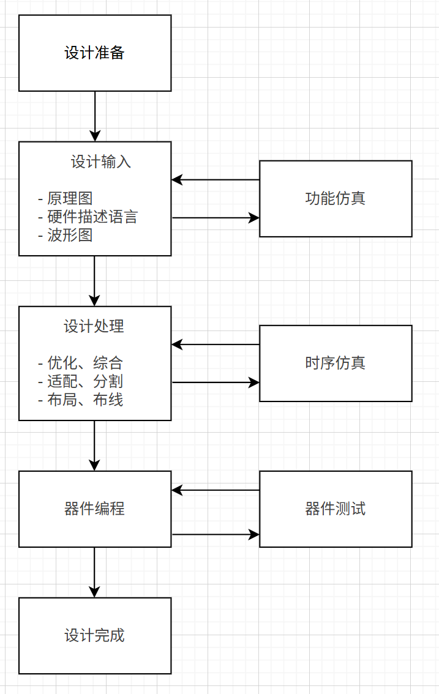
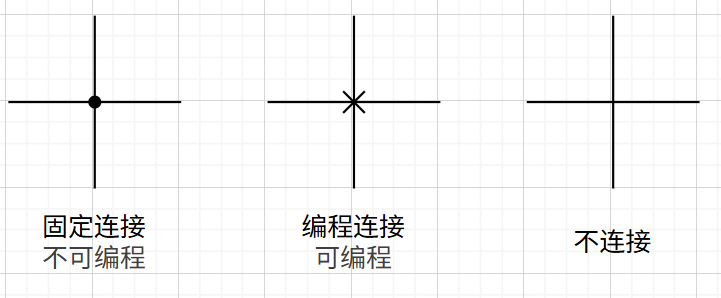
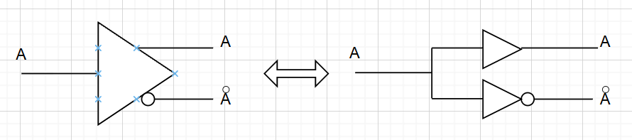
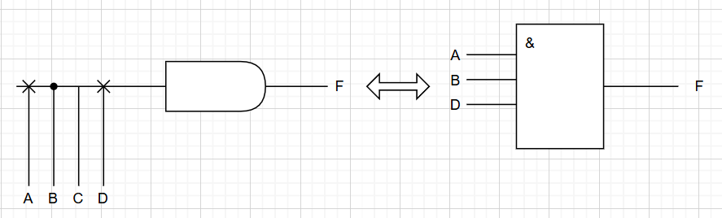
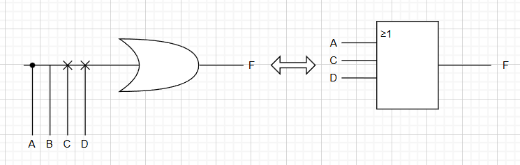
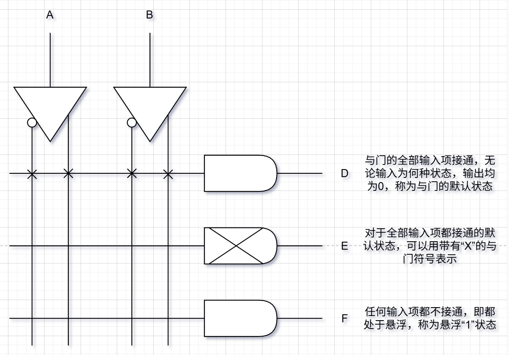
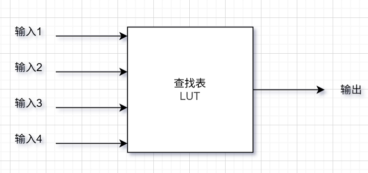
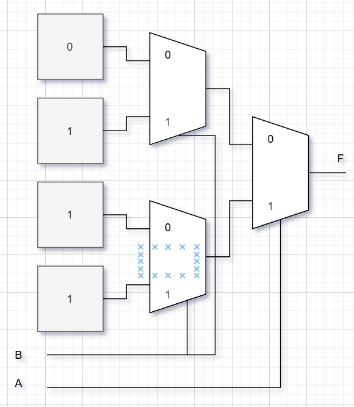
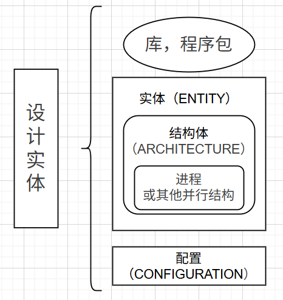

# EDA技术概述

## **EDA含义**
EDA技术就是依靠功能强大的电子计算机，在EDA软件工具平台上，对以硬件描述语言HDL为系统逻辑描述手段完成的设计文件，自动地完成逻辑编译、化简、分割、综合、优化、仿真、直至下载到可编程逻辑器件CPLD/FPGA或专用集成电路ASIC芯片中，实现既定的电子电路设计功能。

## **可编程逻辑器件含义**
是一种半定制集成电路，在其内部集成了大量的门和触发器等基本逻辑电路，用户通过编程来改变PLD内部电路的逻辑关系或连线，就可以得到需要的设计电路。

## **硬件描述语言含义及其载体**
硬件描述语言是一种用于描述数字系统逻辑功能、时序和结构的专用语言。其载体既包括编写的源代码文件和EDA工具环境，也包含最终承载设计的可编程逻辑器件和专用芯片

## **EDA设计方法和传统设计方法的差异**

- **设计思想不同**：传统方法自顶向上，从具体器件和逻辑电路除法，逐步组合成更复杂的系统，难以保证整体最优，设计效率低，EDA设计方法自顶向下，从系统功能出发，逐层细化和模块化设计，更符合逻辑思维，利于系统级优化
- **定位不同**：传统方法以电路板为核心，主要依赖通用逻辑器件的堆叠。EDA方法以芯片为核心，依托可编程逻辑器件进行系统实现
- **描述方式不同**：传统方法采用电路图或原理图，偏向直观但抽象能力差。EDA方法采用硬件描述语言，即能描述逻辑功能，又能进行行为级、寄存器传输级和结构级建模，抽象层次更高
- **设计手段不同**：传统方法依靠人工手工设计，仿真和调试主要在后期执行，EDA方法依靠EDA工具一体化环境，能在设计初期就进行功能仿真和验证，并实现自动化布局布线，提高效率

## **EDA设计的含义和设计流程**
EDA设计就是以计算机为工作平台，以EDA软件设计和验证工具为开发环境，以硬件描述语言为设计语言，以可编程器件为实验载体，以ASIC、SOC芯片为目标器件，以电子系统设计为应用方向的电子产品自动化设计过程。


## **常用硬件描述语言**

- **VHDL**：功能强大， 描述能力全面，既能进行系统级、算法级的抽象描述，也能进行门机、寄存器的结构描述；语法严谨，可读性强，适合多人协同和大规模设计；可移植性好，作为IEEE工业标准，适用于不同EDA平台和工艺环境
- **Verilog HDL**：语法简洁，类似于C语言，易学易用，逻辑表达直观；支持行为级、寄存器传输级、门级等多层次描述；工业应用最广，工具支持度高，适合逻辑设计与仿真验证
- **AHDL**：模块化设计语言，语法简单，学习门槛低；与Quartus等Altera开发软件紧密结合，生成效率高，但兼容性差，仅限于Altera/Intel FPGA器件，通用性不足

## **EDA设计中的自顶向下思想**
先在顶层进行系统的总体规划和功能划分，将复杂系统逐步分解为功能子模块，再进一步细化到寄存器级、门级等层次。在高层可以用行为级HDL描述系统功能，在底层则细化为具体的逻辑电路结构

# 可编程逻辑器件

## 可编程逻辑器件的分类

### 按集成度划分
- **低密度PLD**：PROM、PLA、PAL、GAL
- **中密度PLD**：EPLD、CPLD、FPGA

### 按编程方式分类
- **一次性编程的熔丝或反熔丝器件**：PROM、PAL、CPLD
- **紫外线擦除、电可编程元件**：基于EPROM、UVCMOS工艺
- **电擦除、电可编程器件**：基于EEPROM、Flash工艺
- **查找表、SRAM工艺**：FPGA

### 按结构分类
- **阵列型PLD**：由“与-或”阵列结构组成，如PROM、PLA、PAL、GAL、EPLD、CPLD
- **现场可编程门阵列FPGA**：由许多可编程逻辑单元组成，FPGA


## PLD连线表示法


## PLD的逻辑符号表示方法，基本结构

### PLD缓冲器
PLD的输入缓冲器和输出缓冲器都采用互补结构


### PLD与门


### PLD或门


### PLD与或阵列


### PLD基本结构
与阵列和或阵列是PLD的主体，主要用来实现组合逻辑函数。输入电路由缓冲器组成，它使输入信号具有足够的驱动能力，并产生互补输入信号。输出电路可以提供不同的输出方式，如直接输出的组合方式或通过寄存器输出的时序方式。此外，输出端口上往往带有三态门，通过三态门来控制数据直接输出或反馈到输入端


## PROM、PLA、PAL、GAL的阵列结构特点
||与|或|输出方式|
|--|--|--|--|
|PROM|固定|可编程|TS、OC|
|PLA|可编程|可编程|TS、OC|
|PAL|可编程|固定|TS、OC、寄存器|
|GAL|可编程|固定|可编程|

## FPGA的基本结构
FPGA是一种超大规模可编程逻辑器件，其内部由大量的可配置逻辑块，可编程互联网络以及I/O接口单元组成。其编程原理主要采用**查找表**来实现逻辑函数功能，其本质上就是一个RAM；其编程单元为SRAM，断电后信息会丢失，因此FPGA为易失性器件。SRAM较易制造，且其可重复编程，使用的次数几乎无限。相较于CPLD，它们虽然结构相似，但FPGA具有**更高的集成度，更强的逻辑功能和更大的灵活性**

FPGA一般由3种可编程电路和一个用于存放编程数据的静态随机存储器SRAM组成
- 可编程逻辑块CLB
- 输入/输出块IOB
- 可编程互连资源IR

## 查找表概念理解和应用
查找表本质上是一个RAM。其将所要实现的逻辑函数的所有结果存入到RAM中，并根据输入变量值找出对应的结果输出

- 上图为一个4输入的LUT，该LUT相当于一个4位地址容量为$2^4$的SRAM
- 一个N输入的LUT，需要$2^N$位的SRAM来存储信息

### 查找表的工作原理
- 用户给出想要实现的一个逻辑函数（电路），由与门、或门或其它组合逻辑门构成
- FPGA开发软件计算出该逻辑函数的所有输入-输出结果（类似于真值表），并把结果写入到SRAM中
- 向FPGA器件输入信号进行逻辑运算等同于输入一个地址进行查表，找出地址对应的内容，然后输出

---
例题：用查找表LUT实现二输入或门

|输入1|输入2|输出|
|--|--|--|
|0|0|0|
|0|1|1|
|1|0|1|
|1|1|1|


---

## 在系统可编程技术（ISP）
指对器件、电路板或整个电子系统的逻辑功能可随时进行修改或重构的能力；支持ISP技术的可编程逻辑器件称为在系统可编程器件

# VHDL

## VHDL设计实体的基本结构
一个完整的VHDL程序（设计实体），是指能被VHDL综合其接受，并能作为一个独立的设计单元，实现某一电路功能的模块。

**综合**：依靠EDA工具软件，自动完成从软件程序到硬件电路设计的整个过程

设计的VHDL程序
1. 满足综合其要求
2. 能够在PLD或ASI中得到硬件实现



### 库、程序包
- **库（LIBRARY）**：存放于先设计好的程序包额数据的集合体，多个程序包形成库。常用的库为IEEE标准库。
- **程序包（USE）**：为方便VHDL编程，IEEE将预定义的数据类型，元件调用说明及子程序收集在一起形成程序包，供VHDL设计实体共享和调用

```VHDL
library IEEE;
use IEEE.STD_LOGIC_1164.ALL;
```

### 实体
实体作为一个完整的，独立的语言模块；相当于电路中的一个器件或电路原理图上的一个元件符号

由**实体声明部分**和**结构体**组成

- **实体声明部分**：指定了设计单元的输入/输出端口或引脚，是对外的一个通信界面，是外界可以看到的部分
- **结构体**：描述设计实体的逻辑结构和逻辑功能，由VHDL语句构成，是外界看不到的部分（一个实体可以拥有多个结构体）

```VHDL
entity full_adder_2bit is       --声明2位全加器实体
    general(m : TIME := 1ns)    --类属表（可选）
    port (
        x    : in  STD_LOGIC_VECTOR(1 downto 0);
        y    : in  STD_LOGIC_VECTOR(1 downto 0);
        sum  : out STD_LOGIC_VECTOR(1 downto 0);
        co   : out STD_LOGIC;
        cfg  : out STD_LOGIC_VECTOR(3 downto 0)
    );
end entity full_adder_2bit;
```
- **GENERIC**：用来定义实体的类属参数，可以在实例化时进行参数化配置
- **PORT**：用来定义实体的输入/输出端口

### 结构体
用来描述设计实体的内部结构和实体端口之间的逻辑关系，在电路上相当于器件的内部电路结构

由**信号声明部分**和**功能描述语句部分**组成

- **信号声明部分**：用于结构体内部使用的信号名称及信号类型的声明
- **功能描述部分**：用来描述实体的逻辑行为

```VHDL
architecture rtl of full_adder_2bit is    --描述2位全加器结构体
    signal result : STD_LOGIC_VECTOR(2 downto 0);   --声明内部信号
begin
    -- 2位加法，产生3位结果（包括进位）
    result <= ('0' & x) + ('0' & y);
    
    sum <= result(1 downto 0);
    co  <= result(2);
    cfg <= "0001";
    
end architecture rtl;
```

### 配置
把**特定的结构体**关联一个确定的实体，为大型系统的设计提供管理和工程组织

- **默认配置**：如果没有指定配置，综合工具会默认选择第一个结构体作为实体的实现
- **显式配置**：通过配置语句，明确指定某个结构体作为实体的实现方式

```VHDL
configuration full_adder_2bit_cfg of full_adder_2bit is    --配置2位全加器
    for rtl
    end for;
end configuration full_adder_2bit_cfg;
```

## VHDL文字规则

### 数字型文字
包括整数文字、实数文字、以数值基数表示的文字和物理量文字
- **整数文字**：由数字和下划线组成，如
```VHDL
1234, 0, -5678, 1_000_000
```
- **实数文字**：由数字、小数点、指数符号和下划线组成，如
```VHDL
3.14159, -0.001, 2.5E3, 1.0_0E-2
```
- **以数值基数表示的文字**：由基数前缀、数字字符和下划线组成，如
```VHDL
2#1010#, 16#1A3F#, 8#765#
```

- **物理量文字**：由数字、小数点、指数符号、下划线和单位符号组成，如
```VHDL
5ns, 12.5MHz, 3.3V
```

### 字符型文字
包括字符和字符串

- **字符**：是以单括号括起来的数字、字母和符号，如
```VHDL
'A', 'z', '5', '#'
```

- **字符串**：包括文字字符串和数值字符串
```VHDL
"Hello, VHDL!",B"101010",O"765",X"1A3F"
```

### 关键词
VHDL预先定义的单次，它们在程序中有不同的使用目的
```VHDL
entity, architecture, begin, end, signal, port, in, out, is, if, then, else, case, when, process, wait, loop, for, while, function, procedure
```

### 标识符
是用户给常量、变量、信号、端口、子程序或参数定义的名字
> **命名规则**：以字母开头，后跟若干字母、数字或单个下划线构成，但最后不能为下划线

```VHDL
h_adder, mux21, exalple -- 合法标识符
2adder, _mux21, ful__adder, adder_ -- 非法标识符
```

### 下标名
用于指示数组型变量或信号的某一元素
````VHDL
data_array(m), address(3)
````

### 段名
多个下标名的组合
```VHDL
data_array(7 downto 0)； --downto 表示从高到低
memory_array(0 to 15)； -- to 表示从低到高
```

## VHDL数据对象
### 变量
是一个局部量，只能在进程（process），函数（function）或过程（procedure）中声明和使用。

```VHDL
VARIABLE <变量名> : <数据类型> [:= 初始值];
VARUABLE x, y : INTEGER;
VARIABLE a, b : BIT_VECTOR(0 TO 7);

x := 10;
y := x + 5;
a := "10101010";
b := a AND "11001100";
b(3 TO 6) := ('1', '0', '1', '0');
```


