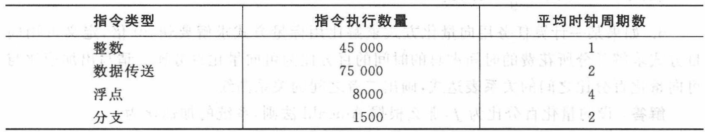
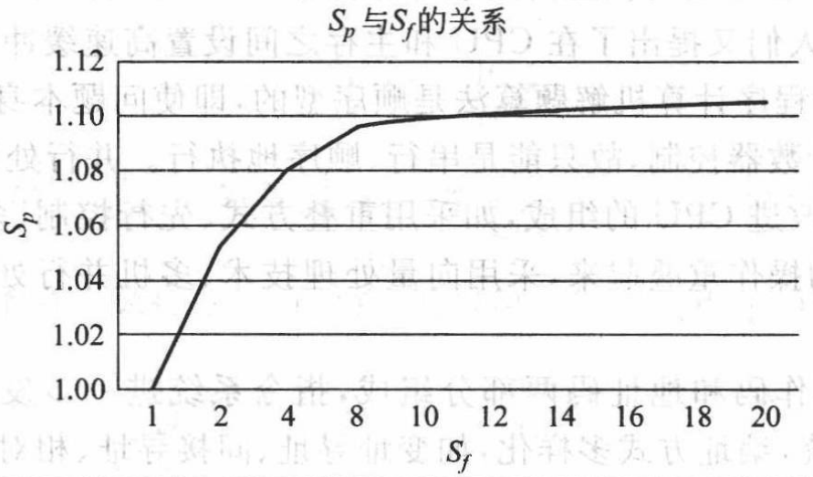
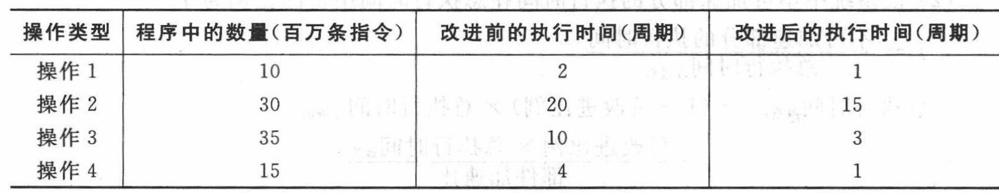
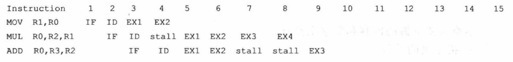
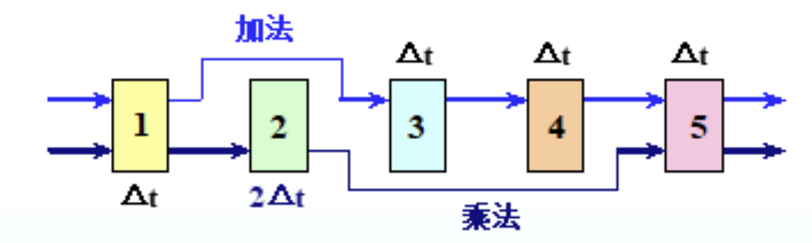
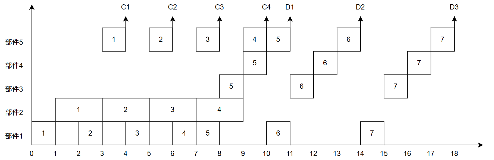
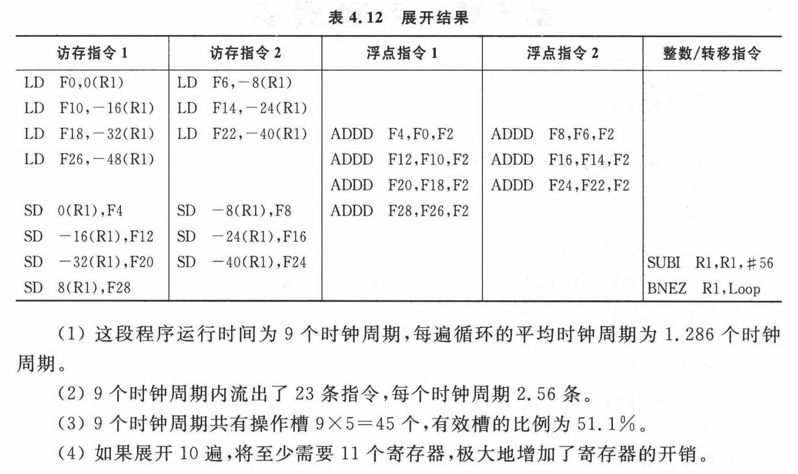

# 作业
## 计算机体系结构的基本概念

### 术语解释

- **体系结构**：程序员所看到的计算机的属性，即概念性结构与功能特性
- **时间重叠**：在并行性中引入时间因素，即多个处理过程在时间上相互错开，轮流重叠地使用统一套硬件设备的各个部分，以加快硬件周转而赢得速度。时间重叠原则上不要钱重复的硬件设备
- **资源重复**：在并行性中引入空间因素，是根据“以数量取胜”的原则，通过重复设置资源，尤其是硬件资源，大幅度地提高计算机系统的性能
- **资源共享**：是一种软件方法，它使多个任务按一定的时间顺序轮流使用同一套硬件设备
- **系统加速比**：系统改进前与改进后总执行时间之比
- **Amdahl定律**：加快某部件执行速度所获得的系统性能加速比，受限于该部件在系统中的所占的重要性
- **程序的局部性原理**：程序在执行时所访问的地址不是随机的，而是相对簇聚，这种簇聚包括指令和数据两部分
- **CPI**：每条指令平均需要的时钟周期数

### 假设有一个计算机系统分为4级，每一级指令都比它下面一级指令在功能上强M倍，即一条r+1级指令能够完成M条r指令的功能，但一条r+1级指令需要N条r级指令解释。对于一段在第一级执行时间为K的程序，在第二、三、四级上的一段等效程序需要多少执行时间？

设第一级有$I_1$条指令，每条指令执行时间$T_1=\frac{K}{I_1}$

对于第二级，$I_2=\frac{I_1}{M},T_2=NT_1$，则$K_2=I_2T_2=\frac{N}{M}K$

第三级与第二级的相对关系和第二级与第一级的相对关系相同，因此$K_3=\frac{N}{M}K_2=(\frac{N}{M})^2K$

第四级同理，$K_4=(\frac{N}{M})^3K$

### 传统的存储程序计算机的主要特征是什么？存在的主要问题是什么？目前的计算机系统是如何改进的？
存储程序计算机在体系结构上的主要特征如下
1. 机器以运算器为中心
2. 采用存储程序原理
3. 存储器是按地址访问的、线性编址的空间。
4. 控制流由指令流产生。
5. 指令由操作码和地址码组成。
6. 数据以二进制编码表示，采用二进制运算。

存在的主要问题和改进如下
1. 存储程序计算机以运算器为中心、所有部件的操作都由控制器集中控制，这一特点带来了慢速输入/输出造作占用快速运算器的矛盾。**各种分布式的I/O处理或输入输出方式，如程序控制、DMA、I/O处理机等**
2. 指令和数据放在同一存储器中，自我修改程序是难以编制、调试和使用的。不利于指令执行的重叠和流水。**通过存储管理硬件的支持，由操作系统控制在程序执行过程中不可修改程序**
3. 访问存储器次数较多影响计算机系统性。**按内容访问的相连存储器CAM，大量使用通用寄存器、在CPU和主存之间设置高速缓冲存储器Cache**
4. 受程序计数器控制，程序执行只能串行、顺序执行。**改进CPU的组成，如采用重叠方式、先行控制、多操作部件甚至流水方式把若干条指令的操作重叠起来；采用向量处理计数、多机并行处理，总之通过并行处理技术进一步提升计算机系统速度**

### 对于一台400MHz计算机执行标准测试程序，程序中指令类型、执行数量和平均时钟周期如下表所示，求改计算机的有效CPI、MIPS和程序执行时间



总指令条数$N=45000+75000+8000+1500=129500$

则
$$
CPI = \frac{(45000*1+75000*2+8000*4+1500*2)}{N}=1.776
$$
$$
MIPS = \frac{400*10^6}{CPI*10^6}=225.225 
$$
$$
程序执行时间 = \frac{CPI*N}{400*10^6}=0.575\mathrm{ms}
$$

### 假设在某程序的执行过程中，浮点操作时间占整个执行时间的10%，现希望对浮点操作加速；1.设对浮点操作的加速比为$S_f$,画出程序总加速比$S_p$和$S_f$的关系曲线；2.请问程序的最大加速比可达多少

根据Amdahl法制

$$
系统加速比=\frac{总执行时间_{改进前}}{总执行时间_{改进后}}=\frac{1}{(1-可改进比例)+\frac{可改进比例}{部件加速比}}
$$

$$
S_p=\frac{1}{(1-0.1)+\frac{0.1}{S_f}}=\frac{1}{0.9+\frac{0.1}{S_f}}
$$



当$S_f\to \infty$时，$S_p\to \frac{1}{0.9}=\frac{10}{9}\approx 1.11$，即程序的最大加速比约为1.11倍。

### 计算机系统中有3个部件可以改进，这3个部件的部件加速比分别为30，20，10.（1）如果部件1和部件2的可改进比例均为30%，那么当部件3的可改进比例为多少时，系统加速比才可以达到10？；（2）如果3个部件的可改进比例分别为30%，30%和20%，3个部件同时改进，那么系统中不可加速部分的执行时间在总执行时间中占的比例是多少？；（3）如果相对每个测试程序3个部件的可改进比例分别是20%、20%和70%，要达到最好改进效果，仅对一个部件改进时，要选择哪个部件？如果允许改进两个部件，又该如何选择？

（1）设部件3的可改进比例为$x$，则根据Amdahl定律

$$
10 = \frac{1}{(1-0.3-0.3-x)+\frac{0.3}{30}+\frac{0.3}{20}+\frac{x}{10}}  \\
x = 0.472;
$$

（2）

$$
不可加速部分的执行时间=(1-可改进比例)×总执行时间_{改进前}
$$

$$
系统加速比=\frac{1}{(1-0.8)+\frac{0.3}{30}+\frac{0.3}{20}+\frac{0.2}{10}}=4.08
$$

即
$$
\frac{总执行使时间_{改进前}}{总执行时间_{改进后}}=4.08
$$

则不可加速部分的执行时间在总执行时间中占的比例为
$$
0.2×4.08=0.816
$$

（3）
单独计算三个加速比，有
$$
系统加速比_1=\frac{1}{(1-0.2)+\frac{0.2}{30}}=1.24 \\
系统加速比_2=\frac{1}{(1-0.2)+\frac{0.2}{20}}=1.23 \\
系统加速比_3=\frac{1}{(1-0.7)+\frac{0.7}{10}}=2.7 \\
$$


计算两组加速比，有
$$
系统加速比_{1,2}=\frac{1}{(1-0.4)+\frac{0.2}{30}+\frac{0.2}{20}}=1.62 \\
系统加速比_{1,3}=\frac{1}{(1-0.9)+\frac{0.2}{30}+\frac{0.7}{10}}=5.56 \\
系统加速比_{2,3}=\frac{1}{(1-0.9)+\frac{0.2}{20}+\frac{0.7}{10}}=5.55 \\
$$


## 假设某应用程序中有四类操作，通过改进，各操作获得不同的性能提高，具体如下图所示。（1）改进后，各类操作的加速比分别是多少？（2）各类操作单独改进后，程序获得的加速比分别是多少？（3）四类操作均改进后，整个程序的加速比是多少

（1）

操作1的加速比=2/1=2

操作2的加速比=20/15=1.3

操作3的加速比=10/3=3.3

操作4的加速比=4/1=4

（2）

操作1改进后，程序获得的加速比=$\frac{总执行时间_{改进前}}{总执行时间_{改进后}}=\frac{10*2+30*20+35*10+15*4}{10*1+30*20+35*10+15*4}=1.01$

...

## 指令系统

### 计算机指令系统设计所涉及的内容有哪些？
指令系统的设计包括指令的功能设计和指令格式的设计。指令系统的功能设计确定哪些功能由硬件实现，哪些功能由软件实现；指令格式的设计就是确定指令字的编码方式；指令系统的基本要求是完整性、规整性、正交性、高效率和兼容性

### 通常有哪几种指令格式？简述其适用范围
指令格式有两种：等长扩展码和固定长度编码格式

等长扩展码是在早期的计算机上，为了便于分级译码，一版都采用等长扩展码，节省存储器空间；固定长度编码为了保证操作码的译码速度、减少译码的复杂度，现在许多计算机都采用了固定长度的操作码，特别是RISC结构的计算机，这是以程序的存储空间为代价来换取硬件实现上的好处

### 根据CPU性能公式，简述RISC指令系统计算机和CISC指令系统计算机的性能特点

CISC指令系统计算机特点是指令数量多、功能多样，除了包含基本指令外，往往还提供了很多功能很强的指令。根据CPU性能公式，只有对于频繁使用的子程序或指令串，用较强功能的指令取而代之才合适。CISC指令系统据统计，只有20%的指令使用频率比较高，占运行时间的80%，而其余80%的指令只在20%的运行时间内才会用到，而且使用频度高的指令也是最简单的指令，CISC指令系统有可能降低系统的性能和效率

RISC指令系统指令条数少，指令功能简单。确定指令系统时，只选取使用频度很高的指令，在此基础上补充一些最有用的指令，克服上述CISC的缺点

### 某机的指令字长为16位，设有但地址指令和两地址指令。若每个地址字段均为6位，且两地址指令有A条，问单地址指令最多可以有多少条？

双地址最多可以有$2^4$条，但仅有A条，因此剩下$2^4-A$种情况也可以用于单地址，则还剩下6位操作码，单地址最多可以有$2^6×(2^4-A)$条

### 某处理机的指令系统要求有三地址指令4条、单地址指令255条、零地址指令16条。设指令字长位12位，每个地址码长度为3位。问能否用扩展编码为其操作码编码？如果要求单地址指令为254条，能否对其操作码扩展编码？说明理由

前3位总条数为$2^3$条，为三地址编码使用4条，还剩4条

则前9位（包含前3位和后续6位）总条数为$4×2^6=256$条，使用255条，还剩1条

则前12位（包含前9位和后续3位）总条数为$1×2^3=8$条，不足以用于16条零地址指令编码

但若单地址指令为254条，则前12位总条数为$2×2^3=16$条，足以用于16条零地址指令编码

### 一台模型机共有7条指令，各指令的使用频度分别为35%（I1）、25%（I2）、20%（I3）、10%（I4）、5%（I5）、3%（I6）、2%（I7），有8个通用寄存器和2个变址寄存器。若要求设计8位长的寄存器-寄存器型指令3条，16位长的寄存器-存储器型变址寻址指令4条，变址范围为-127~+127，请设计指令格式，并给出指令各字段的长度和操作码编码

对于3条8位长寄存器-寄存器型指令，一组寄存器地址为3位，两组寄存器，则地址码为6位，操作码为2位

对于4条16位长寄存器-存储器型变址寻址指令，变址范围为256，即8位，变址寄存器占1位，寄存器组占1位，则操作码剩4位

对于操作码编码，应该按照使用频率从低到高，即
- I1的操作码位00
- I2的操作码为01
- I3的操作码为10（剩下的11作为长操作码扩展位）
- I4的操作码为1100
- I5的操作码为1100
- I6的操作码为1110
- I7的操作码为1111

### 某处理机的指令字长为16位，有二地址指令、单地址指令和零地址指令三类，每个地址字段的长度均为6位。（1）如果二地址指令有15条，单地址指令和零地址指令的条数基本相等，那么单地址指令和零地址指令各有多少条？为三类指令分配操作码。（2）如果指令系统要求这三类指令条数的比例为1：9：9，那么三类指令各有多少条？为三类指令分配操作码

（1）

二地址最多能有$2^4=16$条，现有15条，还剩1条用于扩展长操作码指令

则前10位（包含前4位二地址操作码和后续6位），单地址指令最多有$2^6$条，设有A条单地址指令，则还剩下$2^6-A$条用于零地址指令

则前16位（包含前10位单地址操作码和后续6位），零地址指令最多有$(2^6-A)×2^6=A$

解得A=63

- 二地址指令：15条，操作码0000~1110
- 单地址指令：63条，操作码1111 000000~1111 111110
- 零地址指令：64条，操作码1111 111111 000000~1111 111111 111111

（2）
设二地址x条，则单地址9x条，零地址9x条

有
$$
[(2^4-x)×2^6-9x]×2^6=9x  \\
$$

解得x=14

则

- 二地址指令：14条，操作码0000~1101
- 单地址指令：126条，操作码1110 000000~1111 111101
- 零地址指令：128条，操作码1111 111110 000000~1111 111111 111111


## 流水线技术

### 术语解释
- **流水线技术**：将一个重复的时序过程，分解为若干个子过程，而每一个子过程都可有效地放在其专用功能段上与其他子过程同时执行
- **通过时间**：流水线第一个任务流出结果所需的时间
- **排空时间**：最好一个任务输入后到完成的时间
- **定向技术**：在某条指令产生一个计算结果之前，其他指令并不真正需要该计算结果，如果能够将该计算结果从其产生的地方直接送到其他指令需要它的地方，那么就可以避免因为数据相关引起的暂停
- **静态流水线**：同一时间内，流水线的各段只能按同一种功能的连接方式工作
- **动态流水线**：同一时间内，当某些段正在实现某种运算时，另一些段却在实现另一种运算
- **吞吐率**：衡量流水线速度的重要指标。它是指在单位时间内流水线所完成的任务数或输出结果的数量
- **流水线加速比**：是指等功能的非流水线的完成时间与流水线的完成时间之比
- **流水线效率**：是指流水线的设备利用率
- **数据相关**：当指令在流水线种重叠执行时，流水线有可能改变指令读/写操作的顺序，使得读/写操作顺序不同于它们非流水实现时的顺序，将导致数据相关
- **控制相关**：当流水线遇到分支指令和其他能够改变PC值的指令时就会发生控制相关
- **结构相关**：某些指令组合在流水线中重叠执行时，产生资源冲突，则称该流水线有结构相关

### 简述流水线技术的特点
1. 流水过程由多个相联系的子过程组成
2. 每个子过程由专用的功能段实现
3. 各个功能段所需时间尽量相等
4. 流水线有“通过时间”。在此之后流水过程才进入稳定工作状态，一拍流出一个结果
5. 流水技术适合于大量重复的时序过程，只有输入端连续提供任务，流水线效率才可充分发挥

### 简述通过软件（编译器）来减少分支延迟的3种方法。这些方法的特点是什么？
1. 冻结或排空流水线的方法

在流水线中，处理分支最简单的方法是冻结或排空流水线，保持或清除流水线在分支指令之后读入的任何指令，直到知道分支指令的目标地址以及分支转移是否成功为止。这种方法有点在于其对硬件和软件的要求都十分简单。

2. 预测分支失败的方法

如果流水线采用预测分支失败的方法处理分支指令，那么当流水线译码到一条分支指令时，流水线继续取指令，并允许该分支指令后的指令继续在流水线中流动。当流水线确定分支转移成功与否以及分支的目标地址之后，如果分支转移成功，流水线必须将在分支指令之后取出的所有指令转化为空操作，并在分支的目标地址处重新取出有效的指令；如果分支转移失败，那么可以将分支指令看作是一条普通指令，流水线正常流动，无需将在分支指令之后取出的所有指令转化为空操作

3. 预测分支成功的方法

一旦流水线译码到一条指令是分支指令，且完成了分支目标地址的计算，就假设分支转移成功，并开始在分支目标地址处取指令执行

4. 延迟分支方法

从逻辑上延长分支指令的执行时间，所有顺序后继指令都处于分支延迟槽中，无论分支成功与否，流水线都会执行这些指令

### 在一条单流水线多操作部件的处理机上执行下面的程序，取指令、指令译码各需要一个时钟周期，MOVE、ADD和MUL操作各需要2个、3个和4个时钟周期。每个操作都在第一个时钟周期从通用寄存器中读操作数，在最后一个时钟周期把运算结果写到通用寄存器中。画出指令执行的流水线时空图，并计算执行完3条指令共使用了多少个时钟周期

```assembly
K:      MOVE R1, R0
K+1:    MUL R0, R2, R1
K+2:    ADD R0, R3, R2
```



从上图的流水线时空图可看到，计算执行完3条指令共使用了9个时钟周期


### 有一条动态多功能流水线由5段组成，加法采用1、3、4、5段，乘法采用1、2、5段，第二段时间为2$\Delta t$，其余各段时间均为$\Delta t$，而且流水线的输出可以直接返回输入端或暂存于相应的流水寄存器中。若在该流水线上计算$\sum_{i=1}^4A_i×B_i$，试计算器吞吐率、加速比和效率



原式可转换为

$$
C_1=A_1×B_1 \\
C_2=A_2×B_2 \\
C_3=A_3×B_3 \\
C_4=A_4×B_4 \\
D_1=C_1+C_2 \\
D_2=C_3+C_4 \\
D_3=D_1+D_2 \\
$$

则可画出时空图


吞吐率=完成任务数/总时间=$TP=\frac{7}{18\Delta t}$

加速比=$S=\frac{4×4+4×3}{18}=$

效率=$E=\frac{4×4+4×3}{18×5}$


## 指令级并行

### 术语解释
- **指令级并行**：当指令之间不存在相关时，它们在流水线中是可以重叠起来并行执行的。这种指令序列中存在的潜在并行性称为指令级并行
- **循环展开**：是展开循环体若干次，将循环机并行转化为指令级并行的技术
- **数据相关**：对于指令i和指令j，如果指令j使用指令i产生的结果，或者指令j与指令k数据相关，指令k与指令i数据相关，则指令j与指令i数据相关
- **名相关**：指令使用的寄存器或存储器称为名，如果两条指令使用相同的名，但是它们之间并没有数据流，则称之为名相关
- **反相关**：指令i先执行，指令j写的名是指令i读的名。反相关就是先读后写相关
- **控制相关**：控制相关是指由分支指令引起的相关
- **动态调度**：它通过硬件重新安排指令的执行顺序，来调整相关指令实际执行时的关系，减少处理器空转
- **Tomasulo算法**：只要操作数有效，就将其取到保留站，避免指令流出时才到寄存器中取数据，这就使得即将执行的指令从相应的保留站中取得操作数，而不是从寄存器中。指令的执行结果也是直接送到等待数据的其他保留站中去。
- **前瞻执行**：在处理器还未判断指令是否能执行之前就提前执行，以克服控制相关。这种前瞻执行过程带有明显的猜测的性质，在大多数指令前瞻正确的前提下， 前瞻就可以有效地加快分支处理的速度
- **再定序缓冲**：指令前瞻执行时再指令确认阶段需要一套额外的硬件缓冲来保存那些执行完毕但未经确认的指令及其结果。这种硬件的缓冲称为再定序缓冲
- **超标量**：处理器流出指令时，每个时钟周期流出的指令数不定
- **超长指令字**：处理器流出指令时，每个时钟周期流出的指令数是固定的

### 列举出下面循环中的所有相关，包括输出相关、反相关、真相关和循环相关
```c
for (i = 2; i < 100; i = i + 1)
{
    a[i] = b[i] + a[i];    //s1
    c[i+1] = a[i] + d[i];  //s2
    a[i-1] = 2 * b[i];     //s3
    b[i+1] = 2 * b[i];     //s4
}
```

**输出相关**：无；**反相关**：无；**真相关**：S1&S2

展开循环两次有

```c
    a[i] = b[i] + a[i];         //s1
    c[i+1] = a[i] + d[i];       //s2
    a[i-1] = 2 * b[i];          //s3
    b[i+1] = 2 * b[i];          //s4
    a[i+1] = b[i+1] + a[i+1];   //s1'
    c[i+2] = a[i+1] + d[i+1];   //s2'
    a[i] = 2 * b[i+1];          //s3'
    b[i+2] = 2 * b[i+1];        //s4'
```

由于循环展开引入的相关有

**输出相关**：S1&S3'；**反相关**：S1&S3'、S2&S3'；**真相关**：S4&S4'、S4&S1'、S4&S3'、

### 假设有一个长流水线，仅仅对条件转移指令使用分支目标缓冲。假设分支预测错误的开销为4个时钟周期，缓冲不命中的开销为3个时钟周期。假设：命中率为90%，预测精度为90%，分支频率为15%，没有分支的基本CPI为1。（1）求程序执行的CPI；（2）相对于采用固定的2个时钟周期延迟的分支处理，那种方法程序执行速度更快？

（1）

程序执行的CPI=没有分支的基本CPI+分支带来的额外开销

分支带来的额外开销=在分支指令中，缓冲命中但预测错误+缓冲没有命中=15%×（90%×10%×4+10%×3）=0.099

则程序执行的CPI=1+0.099=1.099

（2）

采用固定的2个时钟周期延迟的分支处理，程序执行的CPI=1+15%×2=1.3

显然1.099<1.3，因此采用分支目标缓冲的方法程序执行速度更快

### 假设分支目标缓冲的命中率为90%，程序中无条件转移指令的比例为5%，没有无条件转移指令的程序CPI值为1。假设分支目标缓冲中包含分支目标指令，允许无条件转移指令进入分支目标缓冲，则程序的CPI值为多少？原来的CPI=1.1

设每条无条件转移指令的开销为X，则有

1+5%x=1.1

解得X=2

当分支目标缓冲命中时，无条件转移的延迟为0，因此

程序CPI=1+5%x×(1-90%)=1+5%×2×10%=1.01


### 下面一段MIPS的汇编程序称之为SAXPY，是计算高斯消元法中的关键一步，用于完成Y=aX+Y的运算。其浮点指令延迟如下表所示，整数指令均为1个时钟周期完成，浮点和整数部件均为流水，整数操作之间以及其他所有浮点操作之间的延迟为0，转移指令的延迟为0。（1）对于标准的MIPS单流水线，SAXPY循环计算一个Y值需要多少时间？其中有多少空转周期？；（2）对于标准的MIPS单流水线，将SAXPY循环顺序展开4次，不进行任何指令调度，计算一个Y值平均需要多少时间？加速比是多少？其加速是如何获得的？；（3）对于标准的MIPS单流水线，将SAXPY循环顺序展开4次，进行优化和调度指令，使SAXPY循环处理时间达到最优，计算一个Y值平均需要多少时间？加速比是多少？

```assembly
FOO:    LD      F2, 0(R1)
        MULTD   F4, F2, F0
        LD      F6, 0(R2)
        ADDD    F6, F4, F6
        SD      0(R2), F6
        ADDI    R1, R1, #8
        ADDI    R2, R2, #8
        SGTI    R3, R1, DONE
        BEQZ    R3, FOO
```

（1）

```assembly
FOO:    LD      F2, 0(R1)         ;1
        stall
        MULTD   F4, F2, F0        ;2
        LD      F6, 0(R2)         ;3
        stall
        stall
        ADDD    F6, F4, F6        ;4
        stall
        stall
        SD      0(R2), F6         ;5
        ADDI    R1, R1, #8        ;6
        ADDI    R2, R2, #8        ;7
        SGTI    R3, R1, DONE      ;8
        BEQZ    R3, FOO           ;9
```

共有14个时钟周期完成，其中有5个空转周期


（2）

循环顺序展开4次，不进行任何指令调度，则指令1~5及其间的stall都是必要的，指令6~9只需只需一次，因此，共有10*4+4=44个时钟周期完成，平均每个Y值需要44/4=11个时钟周期完成，加速比为14/11=1.27。加速主要是来自减少控制开销，即减少对R1、R2的整数操作以及比较、分支指令而来的。

（3）

循环顺序展开4次，优化和调度指令，计算过程如下

```assembly
FOO:    LD      F2, 0(R1)          ;1
        LD      F8, 8(R1)          ;2
        LD      F14, 16(R1)        ;3
        LD      F20, 24(R1)        ;4
        MULTD   F4, F2, F0         ;5
        MULTD   F10, F8, F0        ;6
        MULTD   F16, F14, F0       ;7
        MULTD   F22, F20, F0       ;8
        LD      F6, 0(R2)          ;9
        LD      F12, 8(R2)         ;10
        LD      F18, 16(R2)        ;11
        LD      F24, 24(R2)        ;12
        ADDD    F6, F4, F6         ;13
        ADDD    F12, F10, F12      ;14
        ADDD    F18, F16, F18      ;15
        ADDD    F24, F22, F24      ;16
        SD      0(R2), F6          ;17
        SD      8(R2), F12         ;18
        SD      16(R2), F18        ;19
        SD      24(R2), F24        ;20
        ADDI    R1, R1, #32        ;21
        ADDI    R2, R2, #32        ;22
        SGTI    R3, R1, DONE       ;23
        BEQZ    R3, FOO            ;24
```

通过4次展开，完全消去了stall，处理时间达到了最优，共用了24个时钟周期，则计算一个Y值平均需要24/4=6个时钟周期完成，加速比为14/6=2.33


### 假设超长指令字每个时钟周期可同时流出两条访存指令、两条浮点指令和一条整数指令或分支指令。给出在此处理器上数组元素循环加一个标量的展开后的代码序列。如果展开7遍循环。（1）每遍循环的平均时钟周期；（2）每个时钟周期流出指令数；（3）操作操（功能部件）的使用效率；（4）如果展开10遍，会出现哪些问题？




# 存储层次

### 术语解释
- **Victim Cache**：一种降低失效率的方法。victim cache是位于cache和存储器之间的又一级Cache，容量小，采用全相联策略。用于存放由于失效而被丢弃的那些块。每当失效发生时，在访问下一级存储器之前，先检查victim cache中是否含有所需块
- **写缓冲**：一种降低写失效开销的方法。在cache和下一级存储器间设置一个写缓冲区，如果写缓冲有空项，则数据和地址将写入其中。从处理器的角度来看，此次写操作已经结束；当写缓冲把数据写回存储器时，处理器可以进行其他操作
- **写合并**：一种降低写失效开销的方法。在往缓冲器写入地址和数据时，如果写缓冲器中存在被修改过的块，就检查其地址，看看本次写入数据的地址是否和缓冲器内某个有效块的地址匹配。如果匹配，就将新数据与该块合并。这种方法使得存储器的效率更高，因为被合并的连续多字的写比多个单字要快
- **非阻塞Cache**：一种降低cache失效开销的方法，cache在等待预取数据返回时，还能继续提供指令和数据
- **请求字处理**：一种降低cache失效开销的方法，当CPU所请求的字到达后，不等整个块都调入cache，就可把该字发送给cpu并使处理器继续运行
- **路预测**：一种降低命中时间的方法。每一组cache中保存了一些预测位，表示下一次cache访问本组应该命中的cache块，在本组cache的tag读出进行比较的过程中，这个预测信息可以使多路选择器提前选择预计希望访问的块，并且在cache数据读取的同时，根据这个预测信息选择一个tag进行比较，这些动作很容易在一个周期完成，如果后续访问就是预测的块，可以降低该块的命中时间
- **“虚索引——实标记”cache**：虚拟空间和物理空间均按页分块，虚地址可分为虚页号和页内偏移两部分，实地址分为实页号和页内偏移两部分。使用页内偏移作为访问Cache的索引，而cache保存的标识仍是物理地址，则在进行虚实地址转换的同时，可并行地根据页内偏移进行表示和数据的读取。在完成地址变换之后，再把得到的物理地址与标识进行比较，从而加速cache访问过程
- **虚拟cache**：使用虚地址映射cache并访问的cache称为虚拟cache
- **多体交叉存储器**：把多个存储模块组织为多个体，每个存储体的宽度通常都是一个字，这些体并行工作，可以一次读或写多个字。采用这种技术的存储器称为多提交叉存储器
- **存储器冲突**：当两个请求同时要访问同一个存储体时即发生了存储体冲突
- **DDR**：即Double Data Rate，在DRAM时钟的上沿和下沿都进行数据传输，从而可把数据传输率提高一倍
- **页式虚存**：将空间大小划分为大小相同的块的虚存分块方式称为页式虚存
- **TLB**：即快表，TLB是一个专门用于地址转换的高速缓冲部件，用于存放近期经常使用的页表项，其内容是页表部分内容的一个副本。这样，进行地址变换时，一般直接查TLB即可

### 简述Cache——主存层次和主存——辅存层次的区别
||Cache-主存|主存-辅存|
|---|---|---|
|目的|为了弥补主存速度的不足|为了弥补主存容量的不足|
|存储管理实现|全部由专用硬件实现|主要由软件实现|
|访问速度的比值|一比几|一比几百|
|典型的块（页）大小|几十字节|几百到几千字节|
|CPU对第二级的访问方式|可直接访问|均通过第一级|
|失效时CPU是否且切换|不切换|切换到其他进程|

### 通过编译器对程序优化来改进Cache性能的方法有哪几种？简述其基本思想
1. 数组合并

这种技术通过提高空间局部性来减少失效次数。有些程序同时用相同的索引来访问若干数组的同一维。这些访问可能会相互干扰，导致冲突失效。将这些相互独立的数组合并称为一个复合数组，使得一个Cache块中能包含全部所需的元素，可消除这样的干扰

2. 内外循环交换

有些程序中含有嵌套循环，程序没有按照数据的存储顺序进行访问而可能导致较多的失效。在这种情况下，只要简单地交换循环的嵌套关系就能使程序按数据存储顺序进行访问，即：使一个Cache块被替换之前，最大限度地利用块中的数据，从而提高了数据的空间局部性，减少了失效次数。这种优化技术在不改变执行的指令数的前提下，提高了执行性能

3. 循环融合

有些程序含有几部分独立的程序段，它们用相同的循环访问同样的数组，对相同的数据作不同的运算。通过将它们融合为单一的一个循环，能使读入Cache的数据在被替换出去之前，得到反复的使用。这种优化的目标是通过改进时间局部性来减少失效次数

4. 分块

程序对多个数组访问时，经常出现有些数组按行访问，而有些按列访问的情况。因为每一次循环中既有按行访问也有按列访问，所以无论数组是按行优先还是按列优先存储，这种正交的访问意味着前面的变换方法，如内外循环交换等，对此无能为力。分块算法不是对数组的整行或整列进行访问，而是把大数组的访问分解成对子矩阵或块的访问，其目的仍然是使一个Cache块在被替换之前，对它的访问次数达到最大，从而提高数据访问的时间和空间局部性


### 请求字处理技术可被用于L1 Cache中以使CPU尽早地得到所需数据，从而改进性能。现考虑把该技术用于L2 Cache中。假设1MB的L2 Cache块大小为64B，与存储器接口数据宽度为16B。该Cache每写入16B需16周期，且取回的数据可直接旁路到L2 Cache的读端口。假设忽略L1 Cache失效请求的传输时间和数据送回L1 Cache的时间。（1）采用和不采用请求字处理技术两种情况下，L2 Cache的失效开销有何不同？（2）讨论请求字处理技术对于L1 Cache和L2 Cache哪个更重要？哪些因素将影响该技术所带来的性能好处？

（1）

不采用请求字处理技术，L2 Cache的失效开销 = 100（第一个16B写入）+3 × 16（剩余3个16B写入）+ 4（CPU再从cache中读）=152

采用请求字处理技术，L2 Cache的失效开销 = 100

（2）

由于存储器速度远低于L2 Cache速度，因此请求字处理技术对于L2 Cache更重要

影响请求字处理技术的因素主要包括以下两点
- Cache块大小。Cache块越大，请求字处理技术带来的性能好处越大
- 下一级存储器的访问延迟。延迟越大，将请求字提前交给Cache能够获得的收益就越多


### 假设对指令Cache的访问占全部访问的75%，而对数据Cache的访问占全部访问的25%。Cache的命中时间为1个时钟周期，失效开销为50个时钟周期，在混合Cache中一次load或store操作访问Cache的命中时间都要增加一个时钟周期，32KB的指令Cache的失效率为0.39%，32KB的数据Cache的失效率为4.82%，64KB的混合Cache的失效率为1.35%。又假设采用写直达策略，且有一个写缓冲器，并且忽略写缓冲器引起的等待。试问指令Cache和数据Cache容量均为32KB的分离Cache和容量为64KB的混合Cache相比，哪种Cache的失效率更低？两种情况下平均访存时间各是多少？

分离Cache的总体失效率=0.75×0.39%+0.25×4.82%=1.498%，因此混合Cache的失效率更低

分离Cache的平均访存时间=1+1.498%×50=1.7499个时钟周期

混合Cache的平均访存时间=1+1.35%×50+1×25%=1.925个时钟周期

虽然分离Cache具有较高的总体失效率，但具有较小的平均访问时间。


### 假设一台计算机具有：95%的访存在Cache中命中；块大小为两个字，且失效时整个块被调入；CPU发出访存请求的速率为10^9字/s；25%的访存为写访问；存储器的最大流量为10^9字/s；主存每次只能读或写一个字；在任何时候，Cache中有30%的块被修改过；写失效时，Cache采用写分配法。现给计算机增添一台外设，为此想限制的主存的频度已经使用了多少，试对写直达和写回法分别计算主存频带的平均使用比例

写直达法：

若为读操作且命中，该情况概率为95%×75%=71.25%，访问主存0次

若为读操作且失效，该情况概率为5%×75%=3.75%，访问主存2次（一个块有两个字）

若为写操作且命中，该情况概率为95%×25%=23.75%，访问主存1次（写直达）

若为写操作且失效，该情况概率为5%×25%=1.25%，访问主存3次（写分配，读入一个块，再写一个字）

则一次访存请求的平均访问主存次数=0.7125×0+0.0375×2+0.2375×1+0.0125×3=0.35次

则带宽比例=0.35次×10^9字/s/10^9字/s=35%


写回法：

如果命中，则无论读写均无需访问主存

如果访问失效，如果该块没有被修改过，则从主存中调一个块，该情况概率为5%*(1-30%)=3.5%，访问主存2次

如果访问失效，如果该块被修改过，则先将该块写回主存，再从主存中调入一个块，该情况概率为5%*30%=1.5%，访问主存4次

则一次访存请求的平均访问主存次数=0.035×2+0.015×4=0.13次

则带宽比例=0.13次×10^9字/s/10^9字/s=13%
