# 要点

**计算机的基本组成、总线分类、总线判优控制、存储器、CPU与存储器的连接、存储器的校验、汉明码、程序中断、屏蔽字、加减运算、溢出判断、定点表示、寻址、指令周期**

---

# 计算机的基本组成

> I/O设备、控制器、运算器、存储器

I/O设备：略

控制器：程序计数器PC、指令寄存器IR、控制单元CU

运算器：累加器ACC、乘商寄存器MQ、操作数寄存器X

存储器：地址寄存器MAR、数据寄存器MDR

---

# 总线

## 总线分类

> 片内总线、系统总线（数据总线、地址总线、控制总线）、通信总线

## 总线判优控制

1. **链式查询**：只需要很少几根线就可以按一定优先次序实现总线控制，并且很容易扩充设备，但对电路故障敏感，且优先级别低的设备难以获取请求。
2. **定时器计数查询**：对电路故障不如链式查询方式敏感，但增加了控制线（设备地址）数，控制也比较复杂。
3. **独立请求方式**：响应速度快，优先次序控制灵活（通过程序改变），但控制线数量多，总线控制更复杂。

---

# 存储器

## 主存储器

### 1.主存的基本组成

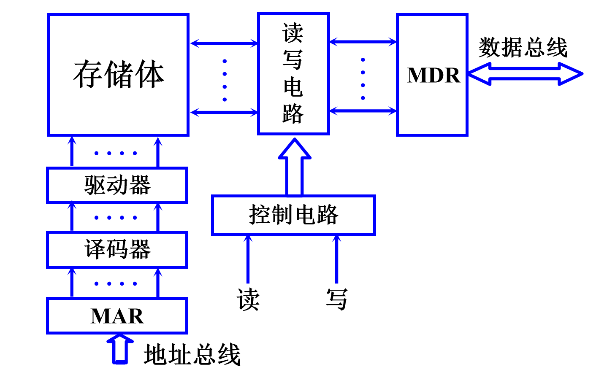

### 2.主存与CPU的联系

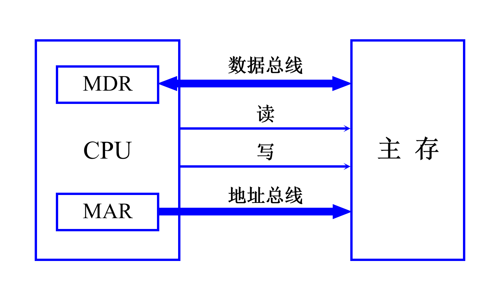

当要从存储器读出某一信息字时，首先由CPU将该字的地址送到MAR，经地址总线送至主存、然后发出读命令。主存接到读命令后，将该信息送至MDR。

若要向主存存入一个信息字时，首先CPU将该字所在的主存单元的地址经MAR送到地址总线，并将信息字送入MDR，然后向主存发出写命令，主存接到写命令后，便将数据线上的信息写入对应地址线指出的主存单元中。

### 3.主存中存储单元地址的分配

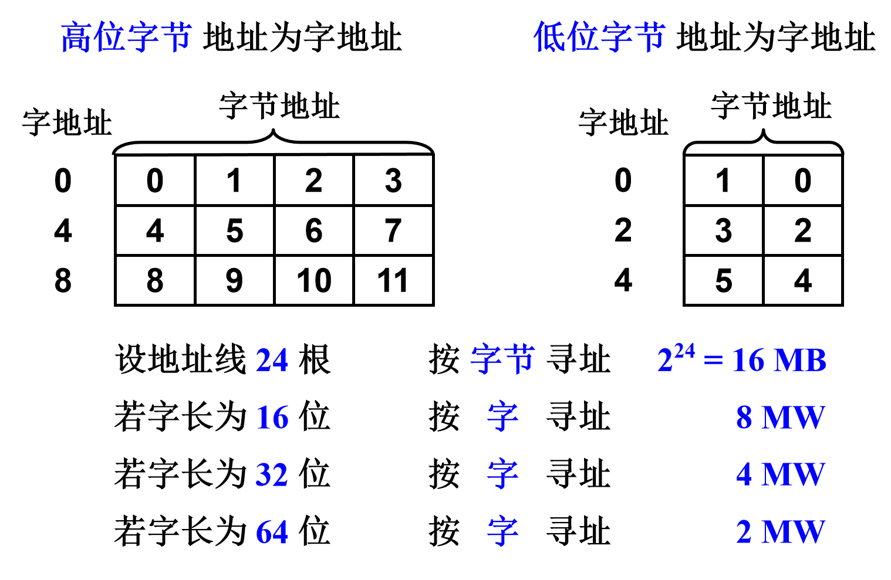

### 4.主存的技术指标

（1）**存储容量**：主存存放二进制代码的总数量

（2）**存储速度**：存取时间（存储器的访问时间），存取周期（连续两次独立的存储器操作所需的最小时间间隔）

（3）**存储器的带宽**：位/秒

## 存储器与CPU的连接

### 1.位扩展（增加存储字长）

使用不同的存储芯片并行连接不同的**数据**线

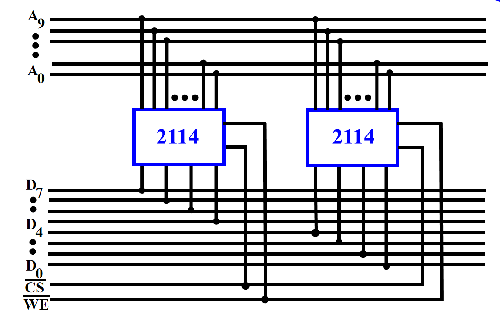

### 2.子扩展（增加存储字的数量）

使用不同的存储芯片并行连接不同的**地址**线

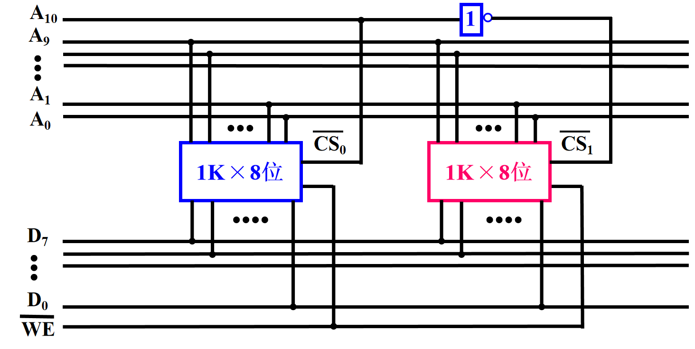

> **注意**：读/写线的连接、片选线的连接

---

例题：

设CPU有16根地址线，8根数据线，并用 $\overline{MREQ}$ (低电平有效)作访存控制信号，$R/\overline{W}$ 作读写命令信号(高电平为读，低电平为写)。现有下列存储芯片：ROM(2K×8位，8k×8位，32k×8位，共三种)，RAM(1K×4位，2K×8位，8K×8位，16K×1位，4K×4位，共五种)及74138译码器和其他门电路(门电路自定)。存储芯片地址空间分配位：0~8191 为系统程序区；8192~32767 为用户程序区

- (1) 写出地址空间的二进制表示
- (2) 指出选用的存储芯片类型及数量
- (3) 画出CPU与存储器的连接图

解：

(1)

CPU有16根地址线，可表示的地址范围为 $2^{16} = 65536$ (0~65535)

0~8191 为系统程序区，即 $2^{13} = 8192$
| A15 | A14 | A13 | A12 | A11 | A10 | A9 | A8 | A7 | A6 | A5 | A4 | A3 | A2 | A1 | A0 | 
|-----|-----|-----|-----|-----|-----|----|----|----|----|----|----|----|----|----|----|
|  0  |  0  |  0  |  0  |  0  |  0  |  0 |  0 |  0 |  0 |  0 |  0 |  0 |  0 |  0 |  0 | 
|  .  |  .  |  .  |  .  |  .  |  .  |  . |  . |  . |  . |  . |  . |  . |  . |  . |  . | 
|  .  |  .  |  .  |  .  |  .  |  .  |  . |  . |  . |  . |  . |  . |  . |  . |  . |  . | 
|  0  |  0  |  0  |  1  |  1  |  1  |  1 |  1 |  1 |  1 |  1 |  1 |  1 |  1 |  1 |  1 | 

8192~32767 为用户程序区，即 $2^{15} = 32768$
| A15 | A14 | A13 | A12 | A11 | A10 | A9 | A8 | A7 | A6 | A5 | A4 | A3 | A2 | A1 | A0 | 
|-----|-----|-----|-----|-----|-----|----|----|----|----|----|----|----|----|----|----|
|  0  |  0  |  1  |  0  |  0  |  0  |  0 |  0 |  0 |  0 |  0 |  0 |  0 |  0 |  0 |  0 | 
|  .  |  .  |  .  |  .  |  .  |  .  |  . |  . |  . |  . |  . |  . |  . |  . |  . |  . | 
|  .  |  .  |  .  |  .  |  .  |  .  |  . |  . |  . |  . |  . |  . |  . |  . |  . |  . | 
|  0  |  1  |  1  |  1  |  1  |  1  |  1 |  1 |  1 |  1 |  1 |  1 |  1 |  1 |  1 |  1 | 

(2)

系统程序区大小为8KB，因此选择1片8K×8位ROM芯片

用户程序区大小为24KB，因此选择3片8K×8位RAM芯片

(3)

使用A15、A14、A13进行片选，000译码为Y0，连接一片ROM；001~011译码为Y1、Y2、Y3，连接三片RAM

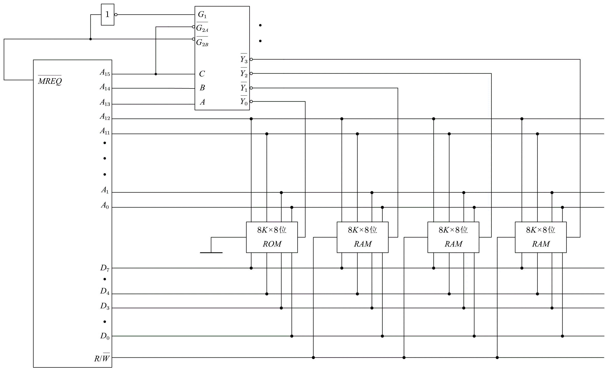

---

## 存储器的校验
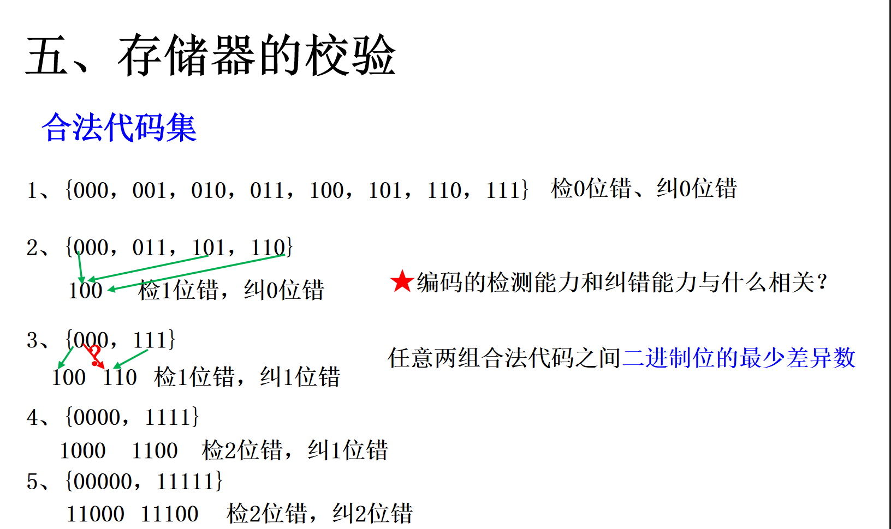

>**编码的最小距离**：任意两组合法代码之间**二进制为数的最少差异**

编码的纠错、检错能力与编码的最小距离有关

$$
L-1=D+C(D \geq C)
$$

其中，L为编码的最小距离，D为检测错误的为数，C为纠正错误的位数

### 汉明码

1.对于 $n$ 位数据，需要 $k$ 位校验位，满足

$$
2^k \geq n+k+1 \tag{1}
$$

2.检测位的位置满足

$$
2^i (i=0,1,2,3,\dots) \quad 1,2,4,8,\dots
$$

3.检测位的取值与该位所在的检测小组中承担的奇偶校验任务有关，第 $i$ 个检验位负责检验所有二进制位置中第 $i$ 为1的位

**各检测位 $C_i$ 所承担的检测小组为**

$C_1$ 检测的 $g_1$ 小组包含第1，3，5，7，9，11,...位置的二进制编码为X…XXX1

$C_2$ 检测的 $g_2$ 小组包含第2，3，6，7，10，11,...位置的二进制编码为X…XX1X

$C_4$ 检测的 $g_3$ 小组包含第4，5，6，7，12，13,...位置的二进制编码为X…X1XX

$C_8$ 检测的 $g_4$ 小组包含第8，9，10，11，12，13，14,15，24,...位置的二进制编码为X…1XXX

**偶校验**：
每个校验位确保它所负责检验的所有位中"1"的个数为偶数
当某一位发生错误时，对应的校验位计算结果将变为奇数

**奇校验**：
每个校验位确保它所负责检验的所有位中"1"的个数为奇数
当某一位发生错误时，对应的校验位计算结果将变为偶数

**配置示例**：求0101按偶检验配置的汉明码

解：

$n=4$ ，根据公式 (1) 可知，取 $k=3$

$$
\begin{array}{c|c|c|c|c|c|c|c}
\hline
\text{二进制序号} & \text{1} & \text{2} & \text{3} & \text{4} & \text{5} & \text{6} & \text{7} \\
\hline
C_i & C_1 & C_2 & C_3 & C_4 & C_5 & C_6 & C_7 \\
\hline
\text{值} & \mathbf{0} & \mathbf{1} & 0 & \mathbf{0} & 1 & 0 & 1 \\
\hline
\end{array}
$$

$$
C_1=C_3\oplus C_5\oplus C_7=0\\
C_2=C_3\oplus C_6\oplus C_7=1\\
C_4=C_5\oplus C_6\oplus C_7=0\\
$$

**纠错示例**：已知接收到的汉明码为0100111。（按配偶原则配置）试问要求传送的信息。

解：

$$
\begin{array}{c|c|c|c|c|c|c|c}
\hline
\text{二进制序号} & \text{1} & \text{2} & \text{3} & \text{4} & \text{5} & \text{6} & \text{7} \\
\hline
C_i & C_1 & C_2 & C_3 & C_4 & C_5 & C_6 & C_7 \\
\hline
\text{值} & 0 & 1 & 0 & 1 & 1 & 1 & 1 \\
\hline
\end{array}
$$

$$
P_1=C_1\oplus C_3\oplus C_5\oplus C_7 =0\\
P_2=C_2\oplus C_3\oplus C_6\oplus C_7 =1\\
P_4=C_4\oplus C_5\oplus C_6\oplus C_7 =1\\
$$

$P_4P_2P_1=110$,故第六位出错，纠正为0100101,求传送的信息即为0100101。

## 高速缓存存储器

为避免CPU空等待的现象（I/O设备向主存请求的级别高于CPU），同时为解决CPU和主存（DRAM）的速度差异，利用**程序访问的局部性原理**，提出了Cache高速缓存存储器。

Cache由SRAM制成。

### Cache的工作原理
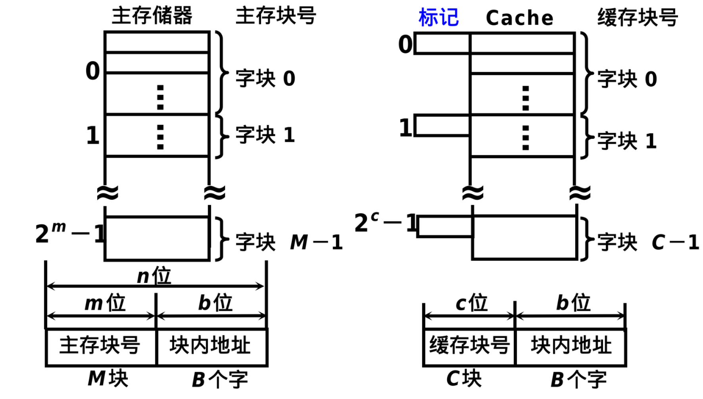
将主存和Cache都分为若干个块，每块大小均相同，都为 $B$ 个字

当CPU欲访问主存某字时
1. 若所需要的字已在Cache中，即可直接访问Cache（Cache命中）
2. 若不在，此时需将该字所在的主存整个字块一次性调入Cache中（Cache不命中）

由于缓存的块数 $C$ 远小于主存的块数 $M$，因此，一个缓存块不能唯一地、永久地对应一个主存块，故每个缓存块需设一个标记，用来表示当前存放的是哪一个主存块，该标记的内容相当于主存的编号。

### Cache命中率
Cache的容量与块长是影响Cache效率的重要因素，通常用“命中率”来衡量Cache的效率。**命中率是指CPU要访问的信息已在Cache中的比率**。

在一个程序执行期间，设 $N_c$ 为访问Cache的命中次数，$N_m$ 为访问主存的总次数，则命中率为

$$
h=\frac{N_c}{N_c+N_m}
$$

设 $t_c$ 为命中时的Cache访问时间，$t_m$ 为未命中时的主存访问时间，$1-h$ 表示未命中率，则Cache-主存系统的平均访问时间 $t_a$ 为

$$
t_a=ht_c+(1-h)t_m
$$

用 $e$ 表示访问效率，则有

$$
e=\frac{t_c}{t_a} \times 100\%=\frac{t_c}{ht_c+(1-h)t_m} \times 100\%
$$

### Cache的基本结构
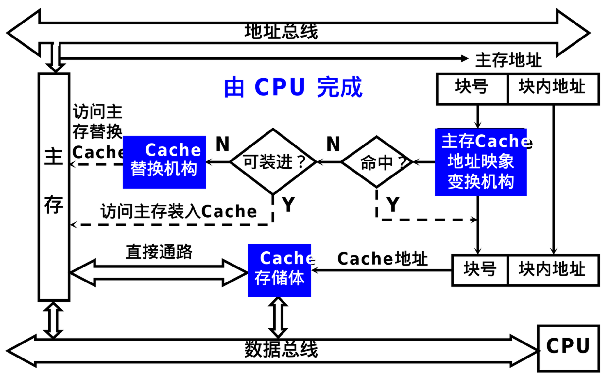

### Cache-主存地址映射
**由主存地址映射到Cache地址称为地址映射**，主要分为三种映射方式，直接映射、全相连组映射和组相连映射
1. **直接映射**：标记+Cache行号+块内地址
2. **全相连组映射**：标记+块内地址
3. **组相连映射**：标记+组号+块内地址
---

**例题1**：

假设主存容量为512KB，Cache容量为4KB，每个字块为16个字，每个字32位。

（1）Cache地址有多少位？可容纳多少块？

（2）主存地址有多少位？可容纳多少块？

（3）在直接映射方式下，主存的第几块映射到Cache中的第5块（设起始字块为第1块）？

（4）画出直接映射方式下主存地址字段中各段的位数。

解：

&emsp;&emsp;(1) Cache容量位4KB，则地址为12位。每个字为4B，则Cache中有4KB/4B=1k个字，每个字块16个字，则Cache有1K/16=64块

&emsp;&emsp;(2) 主存容量为512KB，则地址为19位。同理，主存中有512KB/4B=128K个字，主存有128k/16=8k块

&emsp;&emsp;(3) 由于Cache仅有64块，因此在直接映射下，主存的第5、5+64、5+64*2、...、5+8k-64块能映射到Cache的第5块中。

&emsp;&emsp;(4) 在直接映射下，主存地址字段分为：主存字块标记、Cache字块地址、字块内地址。字块内地址需6位，Cache字块地址需6位，则主存字块标记需19-6-6=7位

| 主存字块标记       | Cache字块地址 | 字块内地址        |
|-------------------|---------------|-----------------|
| 7位               | 6位           | 6位              |
---

**例题2**：

假设主存容量为512K×16位， Cache容量为4096×16位，块长为4个16位的字，访存地址为字地址。

（1）在直接映射下，设计主存的地址格式。

（2）全相联映射下，设计主存的地址格式。 

（3）组相联映射下，设计主存的地址格式。

解：

&emsp;&emsp;(1) 直接映射下，主存地址分为：主存字块标记、Cache字块标记、字块内标记。字块内标记为2位，Cache字块标记为10位，则主存字块标记为19-10-2=7位
| 主存字块标记       | Cache字块地址 | 字块内地址        |
|-------------------|---------------|-----------------|
| 7位               | 10位           | 2位              |

&emsp;&emsp;(2) 全相联映射下，主存地址分为：主存字块标记、字块内标记。字块内标记为2位，则主存字块标记为19-2=17位
| 主存字块标记       |字块内地址        |
|-------------------|-----------------|
| 17位               | 2位            |

&emsp;&emsp;(3) 组相连映射下，主存地址分为：主存字块地址，组号标记，字块内标记。若一组有两块，则Cache共分为1k/2=2^9组，则组标记为9位，主存字块地址为：19-9-2=8位
| 主存字块标记       | 组标记        | 字块内地址        |
|-------------------|---------------|-----------------|
| 8位               | 9位           | 2位              |

# 输入输出系统

## 程序中断

### I/O中断的产生
在I/O设备准备的同时，CPU不做无谓的等待，而继续执行现有程序，只要当I/O设备准备就绪向CPU提出请求后，再暂时中断CPU先行程序转入I/O服务程序，这便产生了I/O中断。

### 程序中断方式的接口电路
每台外部设备都配备有**中断请求触发器（INTR）**和**中断屏蔽触发器（MASK）**，当INTR为1时，表示该台设备向CPU提出中断请求。而CPU在任何瞬间都只能接受一个中断源的请求，因此设置有MASK，当CPU处理高优先级中断源请求时，其余中断源的MASK都为1，表示被屏蔽。

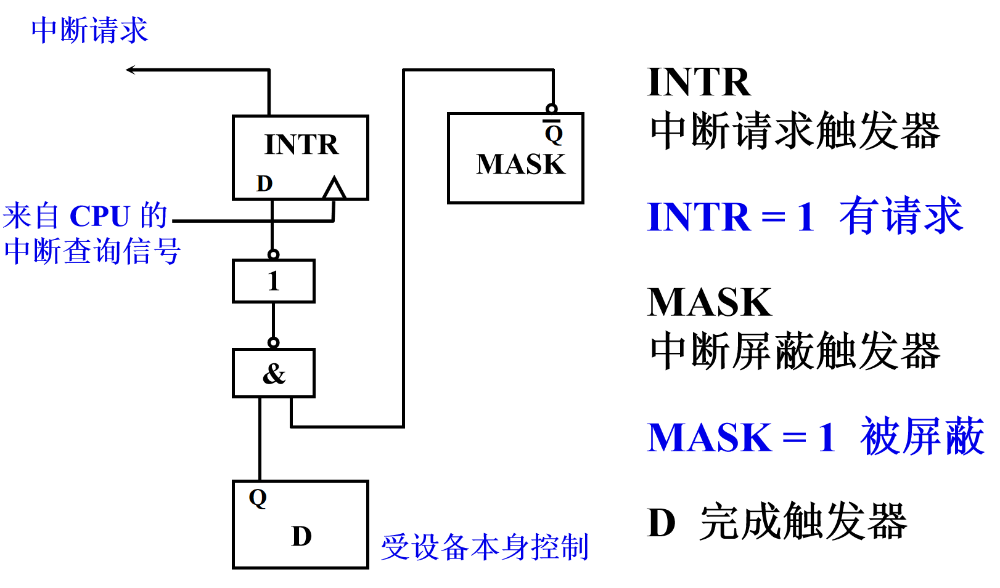

### 中断服务程序的流程
1. 保护现场：在中断发生时，CPU需要保存当前程序的运行状态，包括程序计数器（PC）的值、通用寄存器的内容以及状态寄存器的内容。保护现场的目的是确保中断处理完成后，能够准确恢复到被中断的程序继续执行。
2. 中断程序执行：CPU根据中断向量表或中断请求信号，跳转到对应的中断服务程序。
中断服务程序完成特定的任务，例如处理I/O设备请求、完成数据传输等。
3. 恢复现场：在中断服务程序执行完毕后，CPU需要恢复之前保存的程序状态，包括寄存器和程序计数器的值。这一步确保被中断的程序能够无缝继续执行。
4. 中断返回：CPU执行中断返回指令（如 IRET），从中断服务程序返回到被中断的程序，继续执行原来的任务。

### 单重中断和多重中断
1. **单重中断**：不允许中断现行的中断服务程序
2. **多重中断**：允许级别更高的中断源中断现行的中断服务程序

## DMA方式
1. DMA和程序中断两种方式的数据通路

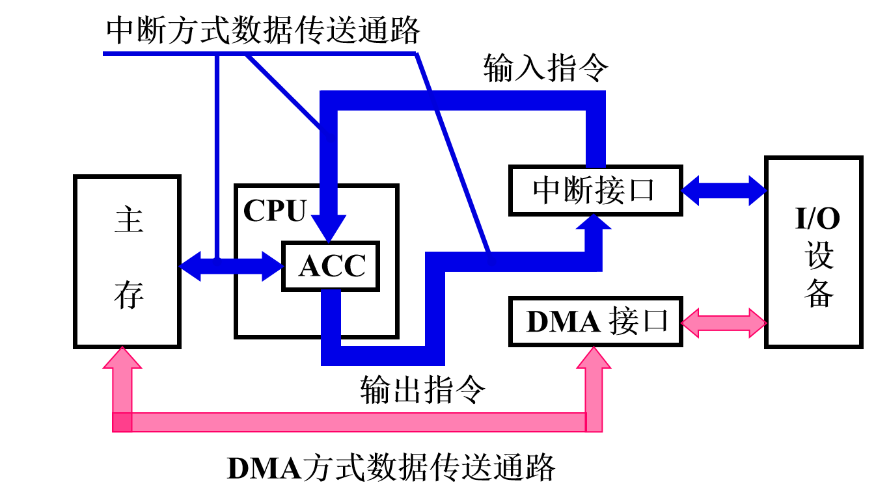

1. DMA和主存交换数据的三种方式

(1) 停止CPU访问主存

(2) 周期挪用：一同访问，但DMA优先级更高

(3) DMA和CPU交替访问

# 运算方法

三种机器数：原码、反码、补码

1. 最高位皆为符号位，书写上用“,”（整数）或“.”（小数）将数值部分和符号位隔开
2. 对于正数，原码=补码=反码
3. 对于负数，除符号位，每位取反——>反码，反码+1——>补码

$[y]_\text{补}$连同符号位在内，按位取反后+1，得$[-y]_\text{补}$

## 数的浮点表示

$$
N=S \times r^j
$$

其中，$S$ 为尾数，$j$ 为阶码，$r$为基数

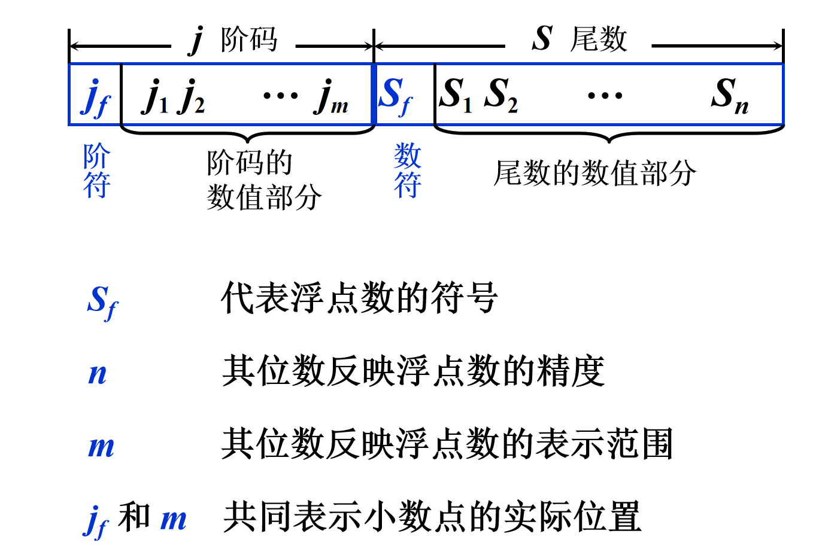

### 浮点数的规格化规则

尾数 $S$ 的最高位必须是非零数字（对于二进制数，最高位通常为1）。

尾数的绝对值满足 $$r^-1 \leq |S| < 1$。

### 浮点数的表示范围
---
例：设 m = 4，n = 10，r=2 尾数规格化后的浮点数表示范围

解：

&emsp;&emsp; 最大正数  $2^{+1111} \times 0.1111111111 = 2^{15} \times (1-2^{-10})$ 

&emsp;&emsp; 最小正数  $2^{-1111} \times 0.1000000000 = 2^{-15}\times (2^{-1})$ 

&emsp;&emsp; 最大负数  $2^{-1111} \times -0.1000000000 = -2^{-15} \times (2^{-1})$ 

&emsp;&emsp; 最小负数  $2^{+1111} \times -0.1111111111 = -2^{15} \times (1-2^{-10})$ 

## 定点运算

### 算术移位
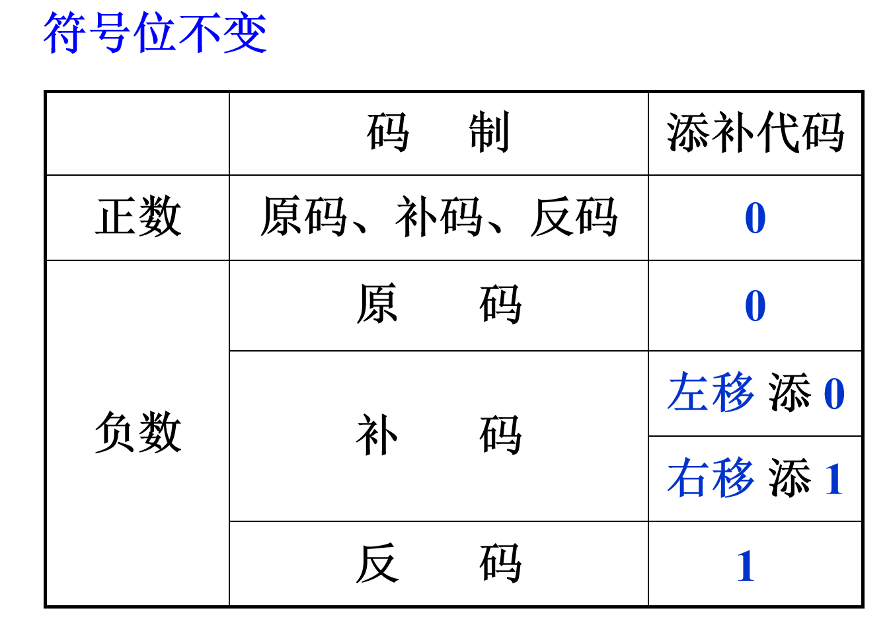

### 补码加减法运算
1. 加法

$$
[A]_\text{补}+[B]_\text{补}=[A+B]_\text{补}
$$

1. 减法

$$
[A]_\text{补}-[B]_\text{补}=[A]_\text{补}+[-B]_\text{补}
$$

加减法运算，连同符号位一起运算，产生的进位丢弃。

### 溢出判断

#### 一位符号位判溢出
若参加操作的两个数（减法时即为被减数和“求补”以后的减数）符号相同，其结果的符号与原操作数的符号不同，即为溢出。

硬件实现为

$$
符号位的进位\oplus最高有效位的进位=1
$$

则为溢出

#### 两位符号位判溢出
若结果的双符号位相同，则未溢出

若结果的双符号位不同，则溢出

最高符号位代表其真正的符号

---

例题：

补码加减运算，1位符号位，4位数值位，已知 $A=-\frac{11}{16}$ ，$B=\frac{7}{16}$ ，求 $[A-B]_补$ 

要求：首先给出参与运算的两个操作数的补码表示，再给出加法的计算过程（建议用双符号位），最后判断结果溢出

解：

$A_原=1.1011$ ，则 $A_补=1.0101$ ; $B_原=0.0111$ ，则 $B_补=0.0111$

$[A-B]_补 = [A]_补 + [-B]_补 = 1.0101 + 1.1001$

采用双符号位，即为

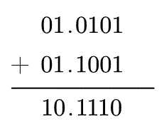

双符号位不同，结果溢出

---

# 指令系统

## 寻址方式

### 指令寻址

1. 顺序寻址 (PC)+1->PC
2. 跳跃 由转移指令JMP给出

### 数据寻址
| **操作码**       | **寻址特征**        | **形式地址 A**        |
|-------------------|---------------------|-----------------------|

1. 立即寻址：形式地址A就是操作数本身，不进行任何访存，A的位数限制了操作数的范围
2. 直接寻址：形式地址A是操作数的真实地址EA，即 $EA=A$，进行一次访存，A的位数限制了操作数的寻址范围，且必须修改A才能修改操作数的地址
3. 隐含寻址：操作数地址隐含在操作码中，如对ACC等的操作
4. 间接寻址：有效地址由形式地址间接提供，$EA=(A)$。进行两次访存，可扩大寻址范围，便于编制程序。
5. 基址寻址： $EA=(BR)+A$ ， $BR$ 为基址寄存器。
6. 变址寻址： $EA=(IX)+A$ ， $IX$ 由用户给定
7. 相对寻址： $EA=(PC)+A$ 

---
例题：

某指令格式如图所示

| OP    | X  | D  |
|-------|----|----|
| 15-10 | 9-8| 7-0|

X为寻址特征位，且X=0时，不变址；X=1时，用变址寄存器X1进行变址；X=2时，用基址寄存器X2进行变址；X=3时，相对寻址PC。

设(X1)=985CH, (X2)=60A1H, (PC)=2743H，确定下列指令的有效地址EA

(1) 6F7DH         
(2) 2907H  
(3) 4C53H  
(4) 16E8H  
(5) 3B9AH

解：  
(1) 6F7DH展开为 6,11|11|,7,D，其中，X=11=3，故为相对寻址，EA=(PC)+007DH=27C0H

(2) 2907H展开为 2,10|01|,0,7，其中，X=01=1，故为变址寄存器X1变址寻址，EA=(X1)+0007H=9863H

(3) 4C53H展开为 4,11|00|,5,3，其中，X=00=0，故为不变址，EA=0053H

(4) 16E8H展开为 1,01|10|,E,8，其中，X=10=2，故为基址寄存器X2变址寻址，EA=(X2)+00E8H=6189H

(5) 3B9AH展开为 3,10|10|,9,A，其中，X=10=2，故为基址寄存器X2变址寻址，EA=(X2)+009AH=613BH

---

# CPU的结构和功能及控制单元CU的设计

## 指令周期

一条完整的指令周期可分为

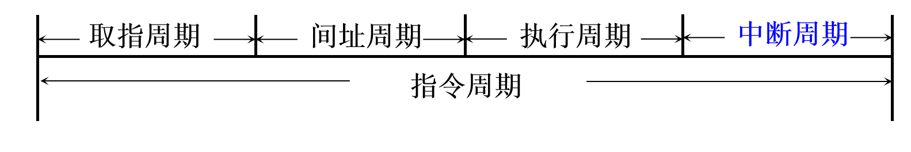

>部分指令可能没有间址周期或中断周期，从而缩减为**取值周期->执行周期**

### 访存分析

在CPU完整的指令周期中，访存操作可在四个周期内存在

## 指令周期的数据流

为方便后续理解，在此直接基于组合逻辑设计进行指令的给出（包含节拍安排，省去了对后续微指令地址的形成）

### 取指周期

- T0：PC → MAR, 1 → R
- T1：M(MAR) → MDR, (PC)+1 → PC
- T2：MDR → IR, OP(IR) → 微地址形成部件

### 间址周期

- T0：Ad(IR) → MAR, 1 → R
- T1：M(MAR) → MDR
- T2：MDR → Ad(IR), OP(IR) → 微地址形成部件

### 执行周期

1. 清除累加器指令CLA

- T0 → AC

2. 累加器取反指令COM
   
- T0：$\overline{\text{AC}} → \text{AC}$
  
3. 算术右移一位指令SHH
   
- T0：L(AC) → R(AC), $\text{AC}_0 → \text{AC}_0$

4. 循环左移一位指令CSL

- T0：R(AC) → L(AC), $\text{AC}_0 → \text{AC}_n$

5. 停机指令STP

- T0：0 → G

6. 加法指令ADD X

- T0：Ad(IR) → MAR, 1 → R
- T1：M(MAR) → MDR
- T2：(AC)+(MDR) → AC

7. 存数指令STA X

- T0：Ad(IR) → MAR,1 → W
- T1：AC → MDR
- T2：MDR → M(MAR)

8. 取数指令LDA X

- T0：Ad(IR) → MAR, 1 → R
- T1：M(MAR) → MDR
- T2：MDR → AC

9.  无条件转移指令JMP X

- T0：Ad(IR) → PC

### 中断周期

- T0：0 → MAR, 1 → W
- T1：PC → MDR
- T2：MDR → M(MAR),向量地址 → PC

## 指令流水

1. **超标量技术**：在每个时钟周期内同时并发多条指令
2. **超流水技术**：缩短原来流水线的处理器时钟周期
3. **超长指令字技术**：把多条能并行操作的指令组合成一条具有多个操作码字段的指令

## 中断屏蔽技术和

中断屏蔽技术是计算机系统中用于控制中断请求处理顺序的一种机制。通过给不同的中断源分配不同的屏蔽字，可以修改中断源的优先级，当高优先级中断源中断时，屏蔽字使得系统会自动屏蔽低优先级的中断源。

同时，通过设定屏蔽字，还可以使得原本按照中断响应设置的中断处理优先级可变。

| 中断源    | 原屏蔽字  | 新屏蔽字  |
|-------|----|----|
| A | 1 1 1 1| 1 1 1 1|
| B | 0 1 1 1| 0 1 0 0|
| C | 0 0 1 1| 0 1 1 0|
| D | 0 0 0 1| 0 1 1 1|

>按新屏蔽字进行分析，当C触发中断时，屏蔽字为0110，1有效标志该中断源被屏蔽，即B、C被屏蔽，B的优先级比C低，但A、D的优先级比C高

基于上述分析，原屏蔽字的响应优先级为A → B → C → D ，新屏蔽字的处理优先级为A → D → C → B

假设A、B、C、D同时请求中断，则它们的处理图见下图

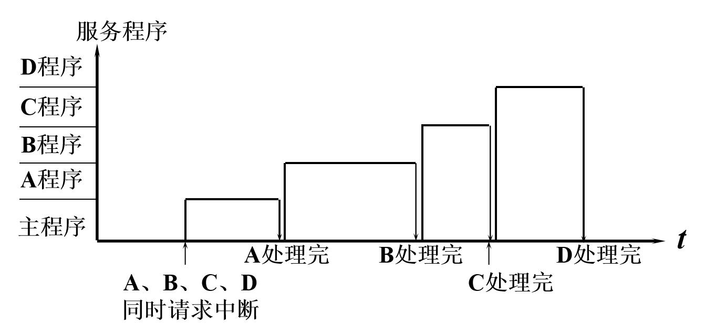

---
例题：

某机有五个中断源，按中断响应的优先顺序由高到低为L0，L1，L2，L3，L4，现要求处理优先顺序修改为L3、L2、L0、L4、L1，写出个中断源的屏蔽字（0表示未屏蔽，1表示屏蔽），并画出处理流程

解：

| 中断源 | 屏 |  |蔽 | |字 |
|--------|---|--|---|--|--|
| L0 | 1 | 1 | 0 | 0 | 1 |
| L1 | 0 | 1 | 0 | 0 | 0 |
| L2 | 1 | 1 | 1 | 0 | 1 |
| L3 | 1 | 1 | 1 | 1 | 1 |
| L4 | 0 | 1 | 0 | 1 | 0 |

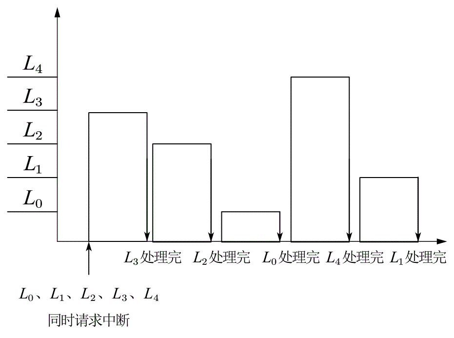
---

## 微程序设计

一条微指令不仅包含操作控制字段（控制微操作的执行），还包括顺序控制字段（下一微指令的下地址）

微指令操作控制字段的编码一般使用直接编码，即二进制每一位对应一个微程序，顺序控制字段则是简单的二进制按权编码

对于微程序控制方式，只需要在原本的每个节拍中间穿插单独的

- T:Ad(CMDR) → CMAR 

来获取下一微指令的地址即可，注意取值周期最后一条微指令改为

- T:OP(IR) → 微地址形成部件 → CMAR

例如，若采用微程序控制方式，则取数LDA X指令变为
- T0：Ad(IR) → MAR, 1 → R
- **T1：Ad(CMDR) → CMAR** 
- T2：M(MAR) → MDR
- **T3：Ad(CMDR) → CMAR** 
- T4：MDR → AC
- **T5：Ad(CMDR) → CMAR**

---

例题：对于主机，其有ACC、X、MQ、IR、PC、MDR、MAR等寄存器

- (1) 若存储器容量为32K×16位，则这些寄存器的位数是多少
- (2) 写出组合逻辑控制器完成STA X（X为主存地址）指令发出的全部微操作及节拍安排（假设节拍数为3）
- (3) 若采用微程序控制方式，还需要增加哪些微操作

解：

(1) 32K=2^15。在这些寄存器中，ACC、X、MQ、IR、MDR为数据寄存器，因此其位数为16位。PC、MAR为地址寄存器，因此其位数为15位

(2) 

- T0：Ad(IR) → MAR, 1 → W
- T1：AC → MDR
- T2：MDR → M(MAR)

(3) 若采用微程序控制方式，则还需要增加Ad(CMDR) → CMAR的指令，因此完整节拍安排为
- T0：Ad(IR) → MAR, 1 → W
- T1：Ad(CMDR) → CMAR
- T2：AC → MDR
- T3：Ad(CMDR) → CMAR
- T4：MDR → M(MAR)
- T5：Ad(CMDR) → CMAR

---
