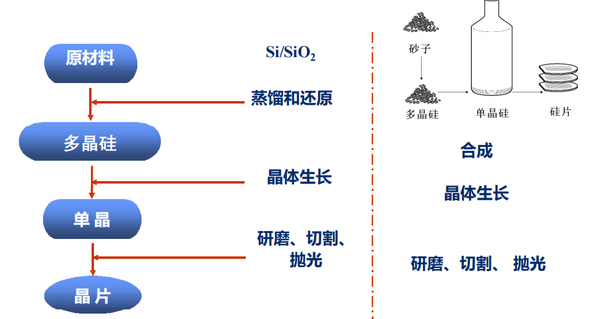
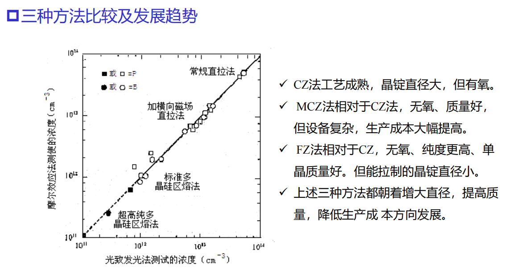

# 绪论

**课程内容**：硅片制备（晶柱、晶圆），薄膜制备（沉积）、光刻、刻蚀、掺杂（离子注入）等

---
习题：

1. 现代主流工艺采用了硅基，为什么？

   - 现代主流工艺采用硅基，是因为硅具有优良的综合性能，一是资源丰富，成本低廉

2. 为什么说平面工艺技术是现代工艺发展的主推动力

    - 

---

# 硅衬底

> 元素半导体（硅、锗）、化合物半导体（砷化镓、磷化铟、氮化镓、碳化硅）和绝缘体等均可作为衬底材料。目前主流材料为单晶硅基片。（多晶硅导电，单晶硅不导电）

## 单晶硅的优势
**可获得性**、 **工艺优势**、**制备成本低**

多晶、非晶有大量缺陷，导致器件性能差，即输出电流低、结漏电流大、重复性差等问题。而单晶硅晶格完整，电子运动更顺畅，器件性能最好。

晶片的制备需要由原材料（硅，二氧化硅等）经过蒸馏和还原制备多晶硅，然后通过晶体生长出单晶硅，再经过研磨、切割、抛光等工序制备晶片。

## 多晶硅的制备
> 制备流程：冶炼、酸洗、精馏、还原
>  石英砂 ——> 粗硅 ——> 提纯 ——> 多晶硅

### 冶炼
$$
\mathrm{SiO_2} + 2\mathrm{C} \rightarrow \mathrm{Si(粗)} + 2\mathrm{CO} \uparrow
$$

粗硅中主要含有Fe、Al、Ca、B、P等杂质，硅纯度约为98%-99%

### 酸洗（化学提纯）

去除粗硅中的铁、铝等金属杂质

$
\mathrm{Si} + 3\mathrm{HCl} \xrightarrow{280-300℃} \mathrm{SiHCl_3} + \mathrm{H_2} \uparrow
$

### 精馏（物理提纯）
利用各氯化物的沸点不同进行分离提纯。

### 还原

目的是将酸洗后的含硅化合物还原成多晶硅。

$
\mathrm{SiHCl_3} + 2\mathrm{H_2} \xrightarrow{900℃} \mathrm{Si(多晶)} + 3\mathrm{HCl} \uparrow
$

## 单晶硅的生长
> 生长流程：多晶硅 ——> 熔体硅 ——> 单晶硅

**方法**： **有坩埚**：直拉法（CZ法）、磁控直拉法（MCZ法）；**无坩埚**：悬浮区熔法（FZ法）

### 直拉法（CZ法）

1. 工艺流程： 准备 ——> 开炉 ——> 生长 ——> 停炉
2. 生长：引晶 ——> 缩颈 ——> 放肩 ——> 等颈生长 ——> 收尾

**原理**：将多晶硅原料加热融化，籽晶与熔体接触并缓慢提拉旋转，使熔体的硅在籽晶上沿特定晶向凝固，逐步生长成单晶硅锭。

**优点**：工艺成熟，设备可靠，晶体直径可观，生长速度较快。

**缺点**：晶体直接与坩埚接触，同时处于有氧环境，易引入含氧杂质和金属杂质。

> 控制生长速率、直径的主要因素：提拉器的升速与转速、坩埚内熔体温度

### 磁控直拉法（MCZ法）

**原理**：在CZ生长过程中施加外部磁场，抑制熔体对流，使氧浓度更均匀并减少杂志进行晶体。

**优点**：氧含量显著降低，杂志分布更均匀。

**缺点**：设备复杂，成本较高。

### 悬浮区熔法（FZ法）
**原理**：在无坩埚条件下，用高频感应线圈加热悬浮于多晶硅棒上的小熔区，溶区沿棒移动，在籽晶引导下生长多晶

**优点**：无坩埚污染，氧含量极低，纯度最高

**缺点**：难以生长大直径晶体，生长速度慢

### 晶体掺杂

1. **液相掺杂**：将杂质放入坩埚的多晶中，由熔体掺入杂质。其中，直接掺杂适用于重掺杂，母合金掺杂适用于轻中掺杂。**影响因素**：坩埚污染、杂志分凝、杂志蒸发等
2. **气相掺杂**：在单晶炉内通入的惰性气体中加入一定量的含掺杂元素的气体，在杂质气氛下P、B等溶入熔体，然后掺入单晶体中。**难以制备轻掺杂硅锭**
3. **中子辐照掺杂**：利用核反应进行掺杂。无杂质分凝、杂质蒸发等现象，掺杂均匀性好。

### 硅片加工流程

切断 ——> 外径滚磨 ——> 定晶向（平边或V型槽处理） ——> 切片 ——> 倒角 ——> 研磨 ——> 腐蚀 ——> 抛光 ——> 清洗 ——> 检验 ——> 包装

## 缺陷的种类

**理想晶体**：格点严格按照空间点阵排列

**缺陷**：实际晶体中与理想点阵结构发生偏差的区域

**缺陷类型**：宏观缺陷与微观缺陷

**缺陷几何形态**：点缺陷、线缺陷、面缺陷、体缺陷

## 晶体电学测量

1. 导电类型测量：热探针法
2. 电阻率测量：四探针法
3. 载流子浓度与迁移率测量：霍尔效应法

## 硅衬底圆片的参数
导电特性参数、物理结构参数、晶体结构参数（晶向、晶格常数）、电学与材料常数

# 氧化

### 二氧化硅薄膜的作用
- 掺杂掩蔽膜
- 芯片的钝化与保护膜
- 电隔离膜
- 元器件的组成部分

## 硅的热氧化

设备为**氧化炉**，分为卧式氧化炉和立式氧化炉。

根据**氧化剂的不同**，热氧化可分为

| 氧化方法|原理|优点|缺点|
|---|---|---|---|
|干氧氧化|高温下，干燥纯净的氧气与硅反应生成二氧化硅|结构致密、干燥、均匀性和重复性好、岩壁能力强，与光刻胶粘附力好，也是一种理想的钝化膜||
|水汽氧化|高温下，高纯水产生的蒸汽与硅反应生成二氧化硅|生长速度较快（水在二氧化硅中的扩散系数和溶解度比氧要大）| |
|湿氧氧化||||