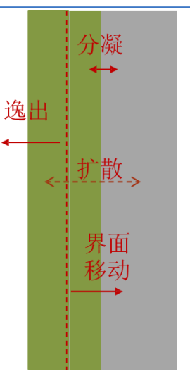
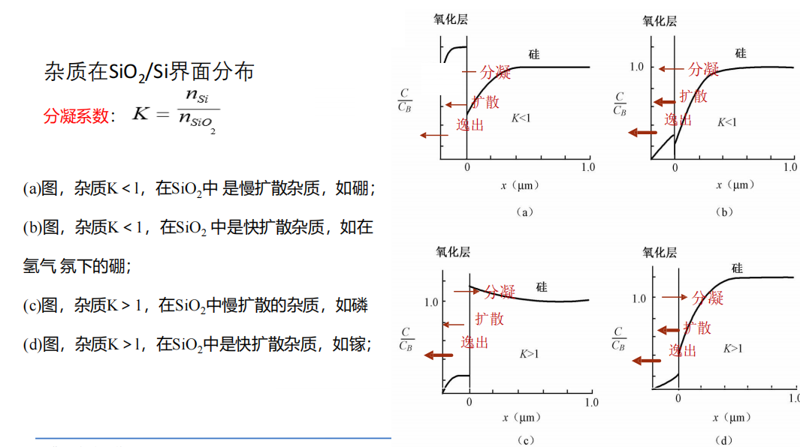
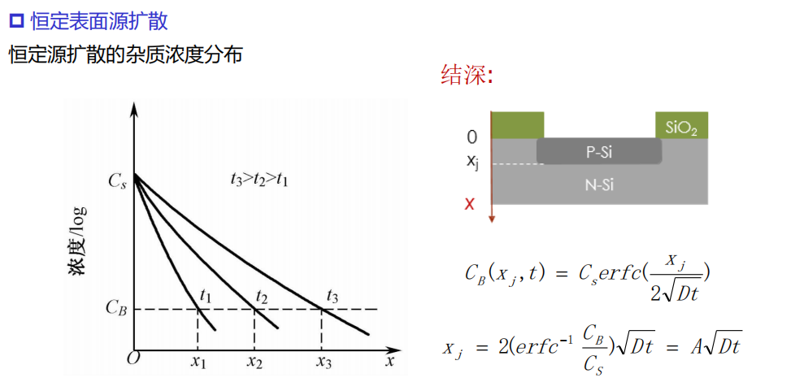
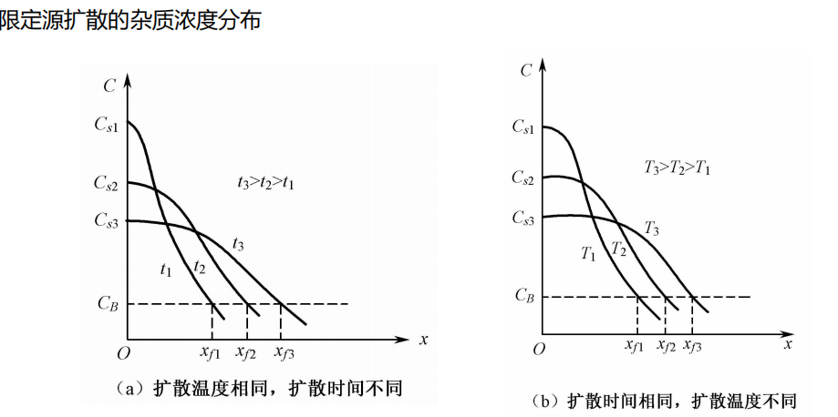
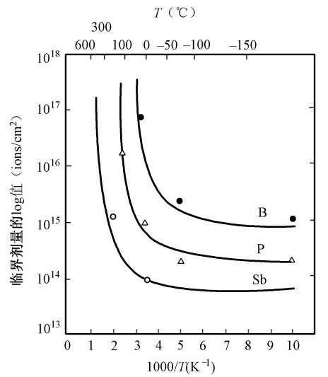
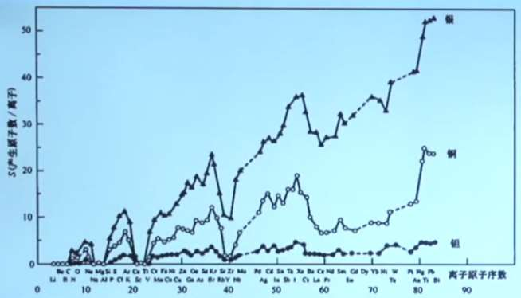
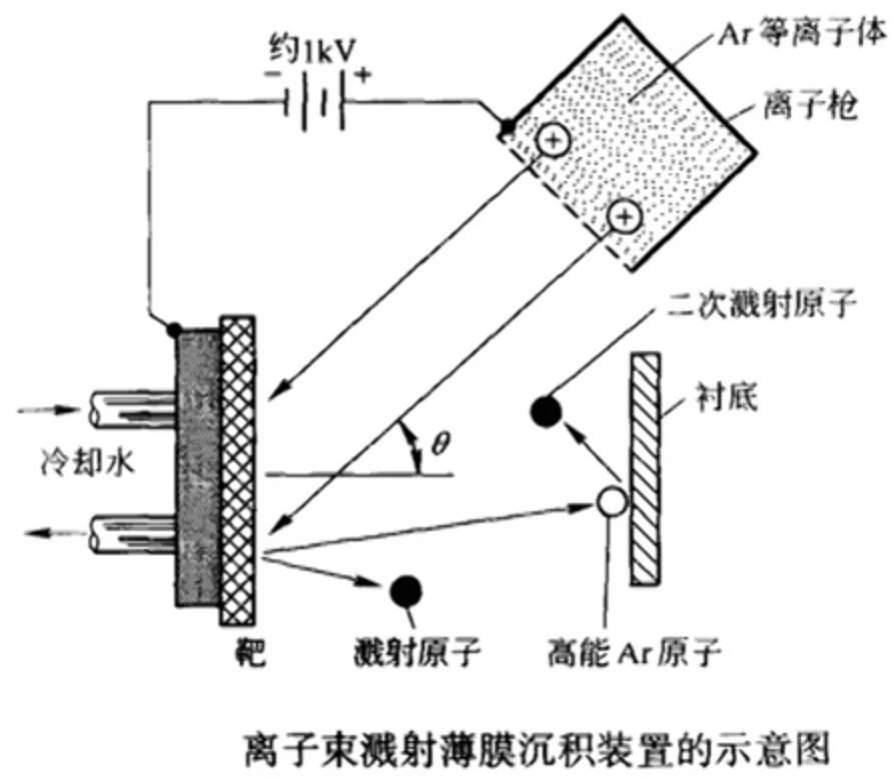
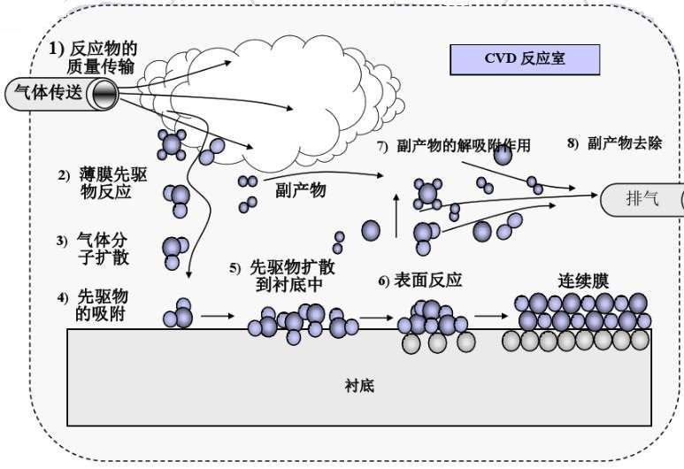
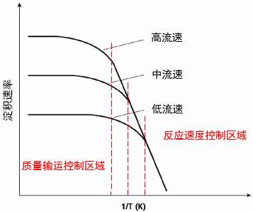

# 绪论

**课程内容**：硅片制备（晶柱、晶圆），薄膜制备（沉积）、光刻、刻蚀、掺杂（离子注入）等

---

# 硅衬底

> 元素半导体（硅、锗）、化合物半导体（砷化镓、磷化铟、氮化镓、碳化硅）和绝缘体等均可作为衬底材料。目前主流材料为单晶硅基片。（多晶硅导电，单晶硅不导电）

## 单晶硅的优势
**可获得性**、 **工艺优势**、**制备成本低**

多晶、非晶有大量缺陷，导致器件性能差，即输出电流低、结漏电流大、重复性差等问题。而单晶硅晶格完整，电子运动更顺畅，器件性能最好。

晶片的制备需要由原材料（硅，二氧化硅等）经过蒸馏和还原制备多晶硅，然后通过晶体生长出单晶硅，再经过研磨、切割、抛光等工序制备晶片。

## 多晶硅的制备
> 制备流程：冶炼、酸洗、精馏、还原
>  石英砂 ——> 粗硅 ——> 提纯 ——> 多晶硅

### 冶炼
$$
\mathrm{SiO_2} + 2\mathrm{C} \rightarrow \mathrm{Si(粗)} + 2\mathrm{CO} \uparrow
$$

粗硅中主要含有Fe、Al、Ca、B、P等杂质，硅纯度约为98%-99%

### 酸洗（化学提纯）

去除粗硅中的铁、铝等金属杂质
$$
\mathrm{Si} + 3\mathrm{HCl} \xrightarrow{280-300℃} \mathrm{SiHCl_3} + \mathrm{H_2} \uparrow
$$

### 精馏（物理提纯）
利用各氯化物的沸点不同进行分离提纯。

### 还原

目的是将酸洗后的含硅化合物还原成多晶硅。

$$
\mathrm{SiHCl_3} + 2\mathrm{H_2} \xrightarrow{900℃} \mathrm{Si(多晶)} + 3\mathrm{HCl} \uparrow
$$

## 单晶硅的生长
> 生长流程：多晶硅 ——> 熔体硅 ——> 单晶硅

**方法**： **有坩埚**：直拉法（CZ法）、磁控直拉法（MCZ法）；**无坩埚**：悬浮区熔法（FZ法）

### 直拉法（CZ法）

1. 工艺流程： 准备 ——> 开炉 ——> 生长 ——> 停炉
2. 生长：引晶 ——> 缩颈 ——> 放肩 ——> 等颈生长 ——> 收尾

**原理**：将多晶硅原料加热融化，籽晶与熔体接触并缓慢提拉旋转，使熔体的硅在籽晶上沿特定晶向凝固，逐步生长成单晶硅锭。

**优点**：工艺成熟，设备可靠，晶体直径可观，生长速度较快。

**缺点**：晶体直接与坩埚接触，同时处于有氧环境，易引入含氧杂质和金属杂质。

> 控制生长速率、直径的主要因素：提拉器的升速与转速、坩埚内熔体温度

### 磁控直拉法（MCZ法）

**原理**：在CZ生长过程中施加外部磁场，抑制熔体对流，使氧浓度更均匀并减少杂志进行晶体。

**优点**：氧含量显著降低，杂志分布更均匀。

**缺点**：设备复杂，成本较高。

### 悬浮区熔法（FZ法）
**原理**：在无坩埚条件下，用高频感应线圈加热悬浮于多晶硅棒上的小熔区，溶区沿棒移动，在籽晶引导下生长多晶

**优点**：无坩埚污染，氧含量极低，纯度最高

**缺点**：难以生长大直径晶体，生长速度慢

### 晶体掺杂

1. **液相掺杂**：将杂质放入坩埚的多晶中，由熔体掺入杂质。其中，直接掺杂适用于重掺杂，母合金掺杂适用于轻中掺杂。**影响因素**：坩埚污染、杂志分凝、杂志蒸发等
2. **气相掺杂**：在单晶炉内通入的惰性气体中加入一定量的含掺杂元素的气体，在杂质气氛下P、B等溶入熔体，然后掺入单晶体中。**难以制备轻掺杂硅锭**
3. **中子辐照掺杂**：利用核反应进行掺杂。无杂质分凝、杂质蒸发等现象，掺杂均匀性好。

### 硅片加工流程

切断 ——> 外径滚磨 ——> 定晶向（平边或V型槽处理） ——> 切片 ——> 倒角 ——> 研磨 ——> 腐蚀 ——> 抛光 ——> 清洗 ——> 检验 ——> 包装

## 缺陷的种类

**理想晶体**：格点严格按照空间点阵排列

**缺陷**：实际晶体中与理想点阵结构发生偏差的区域

**缺陷类型**：宏观缺陷与微观缺陷

**缺陷几何形态**：点缺陷、线缺陷、面缺陷、体缺陷

## 晶体电学测量

1. 导电类型测量：热探针法
2. 电阻率测量：四探针法
3. 载流子浓度与迁移率测量：霍尔效应法

## 硅衬底圆片的参数
导电特性参数、物理结构参数、晶体结构参数（晶向、晶格常数）、电学与材料常数

# 氧化

### 二氧化硅薄膜的作用
- 掺杂掩蔽膜
- 芯片的钝化与保护膜
- 电隔离膜
- 元器件的组成部分

## 硅的热氧化

设备为**氧化炉**，分为卧式氧化炉和立式氧化炉。

根据**氧化剂的不同**，热氧化可分为

| 氧化方法|原理|优点|缺点|
|---|---|---|---|
|干氧氧化|高温下，干燥纯净的氧气与硅反应生成二氧化硅|结构致密、干燥、均匀性和重复性好、岩壁能力强，与光刻胶粘附力好，也是一种理想的钝化膜|生长速度慢|
|水汽氧化|高温下，高纯水产生的蒸汽与硅反应生成二氧化硅|生长速度较快（水在二氧化硅中的扩散系数和溶解度比氧要大）|致密度较低|
|湿氧氧化|将氧气通入加热到95℃的高纯水，接待一定水蒸气的氧气与硅反应生成二氧化硅|生长速率和薄膜致密度介于甘样和水汽氧化之间，取决于氧气流量和水汽的含量|-|

## 氧化机理

硅常温下暴露在空气的表面就会被氧化

$$
\mathrm{Si}+\mathrm{O_2} \rightarrow \mathrm{SiO_2} \\
\mathrm{Si}+\mathrm{H_2O(O_2)} \rightarrow \mathrm{SiO_2} + \mathrm{H_2O}
$$

表面的氧化膜逐渐增厚到 40 埃左右则停止，但在高温下可进一步增厚

根据相对原子质量可以推出**生长1um厚二氧化硅约消耗0.44um厚的硅**

## Deal - Grove 热氧化模型

D-G模型将热氧化简化为

1. 氧化剂输运

$$
F_1 = h_g(C_g-C_s)
$$

2. 固相扩散

$$
F_2=-D_{\mathrm{SiO_2}}\frac{\partial C}{\partial x_0}=D_{\mathrm{SiO_2}}\frac{C_0-C_1}{x_0}
$$

3. 化学反应

$$
F_3 = k_s C_i
$$

4. 反应副产物离开界面

由于**热氧化是在有氧气氛下进行，氧气流密度不变，因此处于准平衡态稳定生长**：$F_1=F_2=F_3$

### 氧化速率方程

$$
x_{\mathrm{SiO_2}}^2 + Ax_{\mathrm{SiO_2}}=B(t+\tau)
$$

其中，$A=2D_{\mathrm{SiO_2}}\left(\frac{1}{k_s}+\frac{1}{h}\right),B=\frac{2D_{\mathrm{SiO_2}}HP_g}{N_1},\tau=\frac{x_0^2+Ax_0}{B}$

进一步解得
$$
x_{\mathrm{SiO_2}} = \frac{A}{2}\left(\sqrt{1+\frac{4B(t+\tau)}{A^2}}-1\right)  \tag 1
$$

1. 氧化时间很短时($t\rightarrow 0$) 

    $x_{\mathrm{SiO_2}} \approx \frac{B}{A}(t+\tau)$

    为**线性规律**，主要由**化学反应控制**

2. 氧化时间很长时($t\rightarrow \infty$)

    $x_{\mathrm{SiO_2}}^2 \approx B(t+\tau)$

    为**抛物线规律**，主要由**扩散控制**

## 影响氧化速率的各种因素

- **氧化剂种类、温度、氧化剂分压、衬底晶向、掺杂浓度**

### 氧化剂种类

氧化速率比较：$\mathrm{O_2 < O_2(H_2O) < H_2O}$

溶解度比较：$C_{\mathrm{O_2}}^* < < C_{\mathrm{H_2O}}^*$

### 温度

温度对氧化速率的影响很大，温度越高，氧化速率越快,**基本为线性关系**

### 氧化剂分压

提高反应器内氧气或水汽的分压能提高氧化速率，且**对线性氧化速率影响更大**
$B \propto P$

### 硅片晶向

不同晶向的单晶硅由于表面原子密度不同，氧化速率也呈现各向异性。

仅A与晶向有关

(111)晶向速率最快，(100)晶向速率最慢

### 掺杂浓度

氧化速率对存在于掺杂剂中的钠、氯化物、水汽、以及在硅片中的III、IV族杂质敏感

通常氧化剂中**有微量的杂质**存在就会**明显地提高氧化速率**

参杂浓度越高，氧化速率越快，这种现象称为**增强氧化**

## 初始氧化阶段及薄氧化层制备

DG模型对30nm以下的薄氧化规律描述不准

### MOS电路对珊氧化层的要求
- 低缺陷密度
- 好的抗杂质扩散的势垒特性
- 低的界面态密度和固定电荷，高质量的$\mathrm{SiO_2/Si}$界面
- 在热载流子应力和辐射条件下的稳定性好

|工艺方法|工艺条件|
|-|-|
|干氧氧化或掺氯氧化|生长速率必须足够慢|
|减压氧化|氧化前的清洗必须彻底|
|低温高压氧化等|所用水、试剂、气体等必须为超纯材料|

## 热氧化过程中杂质的再分布
再分布情况由四方面因素决定
1. 杂质的分凝现象
2. 杂质从$\mathrm{SiO_2}$表面逸出
3. 杂质在$\mathrm{SiO_2、Si}$中的扩散速率
4. 杂质在$\mathrm{SiO_2/Si}$界面的移动速率

**杂质的分凝效应**:
指杂质在两个紧密接触的不同相中，由于溶解度不同，将在两相之间发生重新分配，直到两相界面两边的化学势相等为止的现象。

**分凝系数**：
是衡量分凝效应强弱的参数$K=\frac{n_\mathrm{Si}}{n_\mathrm{SiO_2}}$。**分凝系数与温度有关，与晶面取向有关**

## 氧化层的质量及检测

- **氧化层厚度检测**：比色法、干涉条纹法、椭偏法、台阶仪
- **成膜质量检测**:表面缺陷、结构缺陷、氧化层中的电荷、热应力

### 表面缺陷

**表面镜检**：有无斑点、裂纹、白雾、发花和针孔等缺陷

**针孔密度测量**：化学腐蚀法、电解镀铜法等

**产生原因**：硅片表面抛光不够好，有严重的位错或表面有玷污

### 结构缺陷

**主要是氧化诱生层错**：界面未氧化的硅进入硅体内的填隙位置，接团形成堆垛层错

**检测方法**：用稀HF泡掉氧化层，然后用sirtl(由HF、CrO3和H2O组成)等腐蚀液腐蚀硅，再用显微镜进行检测

### 氧化层中的电荷

- **可动离子电荷**：Na+、K+、H+等带荷正电的碱金属离子
- **氧化层固定电荷**：位于氧化层距硅界面3nm范围内，荷正电的氧空位
- **界面陷阱电荷**：能量处于硅禁带中，可与价带或导带交换电荷的陷阱能级或电荷状态
- **氧化层陷阱电荷**：由氧化层内的杂质或不饱和键俘获电子或空穴所引起

**测量方法**：通过MOS结构高频C-V特性测量及偏温实验，可得氧化层电荷面密度和可动电荷面密度

### 避免或减低电荷面密度的方法
1. 加强工艺卫生
2. 采用超高纯度的水、气体与试剂等
3. 采用掺氯干氧氧化工艺
4. 热氧化后在高温惰性气体中进行退火

# 扩散

杂质在半导体中的扩散是由杂质浓度梯度或温度梯度引起的一种使杂质浓度趋于均匀的杂质定向运动。

只有当晶体中的**杂质存在浓度梯度**时才会出现净的杂质移动

晶体内的扩散是通过围观粒子-原子的一系列**随机跳跃**来实现的，这些跳跃在三维方向进行。主要有**替位式、间隙式、替位-间隙式**三种方式

**温度**的高低则是决定杂质粒子**跳跃移动快慢**的主要因素

## 扩散基本特点

晶体中原子（或离子）以一定的对称性和周期性排列，其中的杂质原子与晶体原子的相互作用强，**每一步迁移必须从热涨落中获取足够的能量以克服势垒**，这限制了杂质原子迁移的方向和距离。

**温度的高低、晶体的结构与缺陷浓度、杂质原子的大小和运动方式**是决定杂质扩散运动的主要因素。

## 扩散方程

$$
\frac{\partial C(x,t)}{\partial t} = D \frac{\partial^2 C(x,t)}{\partial x^2}
$$

其中，$D$ 为扩散系数，是描述扩散速度的重要物理量，它相当于单位浓度梯度时的扩散通量，D越大扩散越快

扩散系数**除与温度有关外，还与硅片晶向、晶格完整性、本体杂质浓度、以及扩散杂质浓度**等因素有关

## 杂质的扩散掺杂

扩散工艺是要在硅片的**特定位置、掺入所需浓度及分布，有电活性的杂质**

扩散方式主要可分为**恒定表面源扩散、限定表面源扩散**

### 恒定表面源扩散

整个扩散过程中杂质浓度始终不变，硅片一直处于杂质氛围中，表面杂质浓度达到了该扩散温度的固溶度 $N_s$

恒定源扩散杂质浓度$C(x)$服从余误差分布

### 限定表面源扩散

杂质在扩散前积累于硅片表面薄层$\delta$内，单位面积杂质总量$Q$为常量，在硅片外无杂质的环境氛围下进行的扩散。

限定源扩散杂质浓度$C(x)$服从高斯分布

扩散时间和扩散温度的影响是趋近的，扩散时间/扩散温度越长/高，杂质扩散越深，表面浓度越低

### 两步扩散工艺

两步扩散工艺就是将恒定源扩散和限定源扩散结合起来，通过调整扩散温度和时间，实现控制掺入硅中杂质的表面浓度、杂质总量、结深等关键参数

1. **预淀积**：恒定源扩散，目的是在扩散窗口的硅表层扩入总量$Q$一定的杂质
2. **再分布**：是限定源扩散，将预淀积在硅表层的杂质再进一步向片内扩散，目的是控制扩散窗口硅的表面浓度$C_s$和结深$x_j$

两步扩散之后的杂质最终分布形式，将由具体工艺条件决定，是两个扩散过程结果的累加

## 热扩散工艺中影响杂质分布的其他因素

1. **硅中点缺陷的影响**：空位的影响、填隙原子的影响。**填隙机制同空位机制一样能促成替位杂质的扩散运动**
2. **氧化增强扩散**：在热氧化过程中原存在硅内的某些掺杂原子（硼、磷）显现出更高的扩散性，称为氧化增强扩散
3. **氧化阻滞扩散**：锑有氧化阻滞扩散现象
4. **发射区推进效应**：发射区正下方硼的扩散有明显增强
5. **横向扩散效应**：杂质浓度在横向是均匀的，在纵向递减
6. **场助扩散效应**：指施主杂质或受主杂质在硅中的扩散，是以电离后的离子和电子或空穴各自进行的扩散运动。

## 扩散工艺条件和方法

### 硼扩散

$$
\mathrm{2B_2O_3 + 3 Si} \rightarrow \mathrm{4B + 3SiO_2}
$$

采用两步工艺扩散，最终近似为**高斯分布**

**工艺流程**：清洗 ——> 预淀积 ——> 漂硼硅玻璃 ——> 再分布 ——> 测方块电阻

### 磷扩散

$$
\mathrm{2P_2O_5 + 5 Si} \rightarrow \mathrm{4P + 5SiO_2}
$$

采用两步工艺扩散，最终近似**余误差分布**

# 离子注入

离子注入是将原子电离，在强电场作用下离子被加速射入靶材料的表层，以改变这种材料表层的性质的一种工艺技术。

**离子注入工艺**：用离子注入方法，将一定剂量的III、IV族杂质注入到半导体晶片的特定区域，再进行退火，激活杂质，修复晶格损伤，从而获得所需的杂质浓度，形成pn结。

**优点**：

- 杂质浓度分布与总量可控性好
- 是非平衡过程，不受固溶度限制
- 注入杂质纯度高，能量单一，洁净度好
- 室温注入，避免了高温过程对靶片的影响
- 杂质分布的横向效应小，有利于器件尺寸的缩小

**缺点**：
- 离子注入会造成晶格缺陷，甚至非晶化，即使退火也难以完全消除
- 是单片工艺，生产效率低，成本高
- 设备复杂，价格昂贵

## 离子注入能量损失

LSS理论认为注入离子在靶内的**能量损失**分为两个彼此独立的部分
1. 入射离子与原子核的碰撞，即核阻挡的能量损失过程
2. 入射离子与电子的碰撞，即电子阻挡的能量损失过程

## 离子注入分布

### 纵向分布（高斯分布）
入射离子的能量即使相同，但由于注入离子与靶原子核和电子碰撞的随机性，各个离子的射程不会一样，将形成一个停止点的分布——射程分布。射程分布在一级近似条件下，注入离子在无定形靶内的浓度分布可取高斯分布函数

### 横向效应
在离子通过掩蔽窗口注入靶时，由于离子进入靶后不断遭受碰撞而产生了射程的横向分量，而且还会横向扩散。直接影响MOS晶体管的有效沟道长度

### 沟道效应
离子束准确地沿着晶向进入，进入沟道的离子几乎不会受到原子散射，这部分离子能量损失小，将穿过较大距离，会导致注入离子浓度偏离高斯分布

为避免沟道效应，实际离子注入常隔着氧化层进行；或用Si，Ge，As等离子先预注入，使窗口表面形成非晶层，然后再注入杂质离子。

## 注入损伤

### 产生的原因

高能离子注入硅片后与靶原子发生一系列碰撞，可能使靶原子发生位移，位移原子还可把能量依次传给其他原子，结果产生一系列的空位（V）-间隙原子（I）对，以及其他类型晶格无序的分布。这种因为离子注入所引起的简单或复杂的缺陷统称为晶格损伤。

### 简单晶格损伤

- **轻离子入射**：损伤密度小，不重叠，但区域较大，呈锯齿状
- **重离子入射**：损伤密度大，损伤密度大，呈团块状

### 非晶层的形成

**晶格损伤**：点缺陷、损伤复合体、非晶层

- 晶格损伤主要与注入离子剂量、质量、能量、剂量率以及靶材温度有关
- 注入剂量越大，晶格损伤越严重，在**临界剂量**开始形成连续非晶层

**临界剂量**
- 注入离子原子量越小，临界剂量越大
- 靶温升高，临界剂量上升
- 注入离子能量升高，临界剂量降低
- 注入剂量率升高，临界剂量降低
- 沿某一晶向注入，临界剂量高于随机入射

## 退火

### 作用

离子注入后必须进行退火，就是将硅片在某一高温下保持一段时间，使杂质通过扩散进入替位，有电活性；并修复晶格，使损伤区域“外延生长”为晶体，恢复或部分恢复硅的迁移率，少子寿命

### 二次缺陷

高温退火会引起杂质再分布导致二次缺陷，**热退火过程中的扩散是增强扩散**

二次缺陷就是退火留下的复杂损伤

二次缺陷随离子注入剂量及退火温度而变化。可以影响载流子迁移率、少子寿命等，因而直接影响半导体器件的特性

离子注入后进行热氧化时，还会产生更大的层错和位错环，称为三次缺陷，三次缺陷可使二极管的反向漏电流增大，晶体管的增益降低。

### 快速热处理

**快速退火**：在瞬间将硅片的某个区域加热到高温，一般在100s内就完成退火，因此，避免了杂质再分布，降低了二次损伤

**快速热处理技术**：将晶片快速加热到设定温度，进行短时间快速热处理的方法，热处理时间在$10^{-3}-10^2$之间

## 离子注入与热扩散技术比较

||热扩散|离子注入|
|-|-|-|
|动力|高温，杂质的浓度梯度，平衡过程|动能，5-500KeV，非平衡过程|
|杂质浓度|受固溶度限制，掺杂浓度过高、过低都无法实现|浓度不受限|
|结深|结深控制不精确，适合深结|结深控制精确，适合浅结|
|横向扩散|严重，约是其纵向扩散线度的0.75-0.87倍|较小，在快速退火时几乎可以忽略|
|均匀性|电阻率波动约5%以上|电阻率波动约1%|
|温度|高温工艺，约在950~1170℃|常温注入，热退火温度约在600~950℃|
|掩膜|二氧化硅|光刻胶、二氧化硅或金属薄膜|
|工艺卫生|易玷污|高真空，常温注入，清洁|
|晶格损伤|小|损伤大，退火也难以完全消除|
|设备|设备简单低廉|复杂，费用高|
|应用|深层掺杂，如大功率器件|浅结的超大规模电路|

# 薄膜制备

**淀积定义**：淀积是指通过将源材料转化为气相并传输到衬底表面直接凝结或经过反应后凝结成目标成分的薄膜制备工艺

**薄膜的表征方法**：
- **成分**：纯度、配比
- **性能**：电学（电阻、介电常数、击穿电压）光学（折射率、反射率）
- **膜均匀性/致密性**：台阶覆盖、孔隙填充、表面粗糙度、密度
- **应力控制**：残余应力

## 物理气相沉积（PVD）

**PVD定义**：以固态材料为源，采用物理方法将源变为气态，输送到衬底表面沉积（或与活性气体反应形成反应产物），形成一定化学计量比的固相薄膜。

根据**固体源气化方式**的不同，可以把物理气相沉积技术分为**蒸发**和**溅射**两种最基本的方法

通常用于芯片制造后期**金属、金属氧化物**或其他固态**金属化合物**的沉积

### 蒸发镀膜

在**高真空**环境中**加热**固相蒸发源，使其原子或分子从蒸发源表面逸出，形成蒸汽流并入射到衬底表面，凝结形成固态薄膜。因此也称**热蒸发**。

**核心要素：高真空，热源，坩埚**

**蒸发镀膜过程**：
- **蒸发过程**：加热蒸发
- **气相输运过程**：气化原子或分子在蒸发源与衬底之间的输运
- **成膜过程**：蒸发的原子或分子在衬底表面的淀积

|优点|缺点|
|-|-|
|设备简单、操作简便|淀积薄膜与衬底附着力较小|
|淀积薄膜纯度较高、厚度控制比较精确|共形台阶覆盖能力较差|
|成膜速度快以及生长机理简单|不适合进行多元合金成分薄膜材料的成分|

**平衡蒸汽压**：**蒸发镀膜的淀积速率与平衡蒸气压呈正比**，而任何物质的平衡蒸气压都是温度的函数，**随温度升高而快速增大，不同元素的蒸气压差别很大**。

### 常用真空蒸发镀膜系统

根据蒸发源**加热方式**的不同，常用真空蒸发镀膜系统可分为**电阻式蒸发、电子束蒸发、电感式蒸发、激光蒸发**。

#### 1.电阻式蒸发

**定义**：使用在低压大电流下难熔化的金属丝、薄片制成的加热器，或者直接加热石墨、氮化硼坩埚，使放在其上的蒸发源气化而蒸发到衬底表面

**应用**：适合于铝、金、铬等易熔化、气化材料

**优点**：设备简单、成本低、无电离辐射

**缺点**：加热器污染（尤其是钨加热器是Na、K污染源），加热器寿命短

**自坩埚效应**：高能电子束轰击蒸发材料，由于蒸发材料局部迅速被加热熔融，在内部形成一个熔池凹坑，使得蒸发材料本身就像一个临时坩埚。这个熔池被其他让位熔化的固体材料包围，从而避免于坩埚接触

#### 2.电子束蒸发

**定义**：由热阴极发射出的电子束，经高电压加速并聚焦后轰击蒸发源表面使之熔化，蒸发到衬底表面

**应用**： 适合于难熔金属和氧化物材料

**优点**：
- 屏蔽了坩埚和加热材料的污染，纯度高
- 使用电子束扫描可实现均匀淀积
- 衬底可离蒸发源较远，使用行星式装载系统，大载量源，投片量大
- 真空室内可放置多个蒸发源进行连续蒸发

**缺点**：产生软X射线，衬底有辐射损伤；结构复杂价格昂贵

#### 3.电感式蒸发

**定义**：利用高频感应线圈的感应加热原理，加热盛放在石墨或陶瓷坩埚内的蒸发源，直至气化蒸发

**优点**：相对电子束蒸发无电离辐射，蒸发速率高，蒸发源温度均匀、温度，操作简便，温度控制精度高

**缺点**：仍存在坩埚和加热器污染

#### 4.激光蒸发

**定义**：利用高功率的连续或脉冲激光束对蒸发源进行加热，使之熔化并蒸发

**应用**： 适于蒸发成分比较复杂的合金或化合物材料

**优点**：适用于高熔点材料；淀积薄膜的纯度高；淀积含有不同熔点材料的化合物薄膜可保证成分的比例

### 溅射镀膜

**惰性气体**在高压下辉光放电产生**等离子体**，其中的**带正电离子被电场加速**具有较高的动能，**撞击位于阴极的靶电极**，使得靶表面的原子在碰撞过程中**溅射出来射向衬底**，从而实现在衬底上的薄膜淀积。

**溅射镀膜过程**：等离子体产生；离子轰击靶材；靶原子气相输运；淀积镀膜

具有一定能量的正离子轰击物理表面可能发生四种物理过程：
- **反射**：入射粒子能量很低
- **吸附**：入射粒子能量小于10eV
- **溅射**：入射粒子能量为10eV~10keV。一部分离子能量以热的形式释放；一部分离子造成靶原子溅射
- **离子注入**：入射离子能量大于10keV

**优点**：
- 任何固态物质均可以溅射
- 溅射膜与基板之间的附着性好
- 溅射镀膜膜密度高，真空少，且膜层的纯度较高
- 膜厚可控性和重复性好

**缺点**：
- 共形台阶覆盖性不好
- 溅射设备复杂，需要高压装置
- 溅射淀积的成膜速度低
- 基板温升较高和易受杂质气体影响

**共形台阶覆盖性改善方法**：
- 加热衬底
- 晶圆片上加偏压（离子轰击再淀积）
- 准直溅射
- 离化溅射
- 采用先进的填充技术

---
将溅射出的金属靶材原子经过离化得到带电离子和电子，然后在硅衬底上加上负偏压，可以在电场作用下对离子垂直进行加速，使得金属离子近似以垂直路径达到衬底表面

---

#### 溅射特征参数

**溅射阈值**：每种靶材存在一个能量阈值（低于此值不会发生溅射反应），一般在10~30eV之间。溅射阈值主要取决于靶材本身特性

**溅射率/溅射产额**
$$
\mathrm{S=\frac{溅射出的靶原子数}{轰击靶阴极的离子数}}
$$

即，平均每个正离子所能溅射出的靶原子数

**溅射产额的影响因素**
- **入射离子质量**：正比
- **入射离子能量**：在一定范围内正比，过大后发生离子注入现象，导致S降低
- **靶材种类**
- **入射角**：70~80°

- 溅射率成周期性变化，总趋势随原子序数增大而增大
- 在同一周期中，惰性元素的溅射率最高，而中部元素溅射率最小

> 之所以一般使用氩气，是因为其溅射产额高，不与靶材衬底材料反应，具备经济性

>气压对溅射速率的影响体现在溅射功率上

#### 直流溅射

直流溅射中，靶作为阴极板，需要中和正离子，因此需其具备导电能力

---
对于绝缘靶材，其表面积累的正电荷无法通过导电通路释放，结果使靶材表面电位不断升高，正负电压差随之减小，最终低于辉光放电所需的最低电压，此时等离子体无法继续维持，放电熄灭，靶材也不再收到Ar的轰击，无法实现溅射

---

#### 射频溅射

接上高频电场（13.6MHz），接通负电压时**靶材上堆积的正电荷在正电压周期被电子中和**，从而保证了正负压差满足持续辉光放电所需

#### 磁控溅射
在溅射过程中，要维持等离子体的稳定存在，必须保持足够数量的高能电子不断与Ar原子碰撞电离，常规放电中大量电子会在非电离碰撞中损失或被阳极吸收，使离化率偏低，为提高电离效率，溅射系统通常在靶后施加磁场，将电子束缚在靶前表面附近，使其在局部区域内长时间回旋，从而显著增加与Ar的碰撞次数，提高离化率并提高等离子体密度

**缺点**：靶的不均匀刻蚀；强磁性材料困难

#### 离子束溅射
将离子的产生区和靶的溅射区分开，引入离子枪的气体粒子照射阴极靶材实现溅射。

**特点**：
- 气体杂质污染小，容易提高薄膜纯度
- 无等离子体轰击导致衬底温度上升，电子和离子轰击损伤等一系列问题
- 精确控制离子束的大小与束流的方向。溅射出的原子可以不经过碰撞过程直接沉积为薄膜

#### 反应溅射

在溅射镀膜时，引入某些活性反应气体，来获得不同于靶材的新物质薄膜的方法，是除射频溅射外，另一种制备介质薄膜的方法

- 化合物在沉积的过程中，由溅射原子与活性气体在基体表面发生化学反应而形成
- 采用了金属靶材，可以大大降低靶材的制造成本，还可以有效改善靶材和薄膜的纯度
- 控制反应溅射过程中活性气体的压力，得到的沉积产物具有不同化学成分

## 化学气相沉积（CVD）

**CVD定义**：将含有构成薄膜元素的一种或几种气态或液态反应剂的蒸汽，以合理流速引入反应室，最终淀积在衬底表面并在衬底表面发生化学反应生成薄膜

CVD反应必须满足**三个挥发性标准**
- 在淀积温度下，反应剂必须具备足够高蒸汽压，**易挥发**
- 除淀积物质外，**反应副产物**必须是**挥发性**的，且不能进入薄膜中
- **淀积物本身**须具有足够低蒸气压即**不易挥发**

>淀积温度尽量低，避免影响前序工艺，淀积时间尽量短

**CVD制备薄膜过程**：
1. 反应气体向反应腔室内传输
2. 反应气体向衬底表面扩散
3. 反应气体吸附于衬底表面
4. 反应剂在衬底表面扩散并发生化学反应，固态主产物成核，凝聚长大并连续成膜
5. 未反应的反应剂和气相副产物解吸，被排出系统

### 生长速率

$$
R = \frac{J}{N} = \frac{k_sh_g}{k_s+h_g} \cdot \frac{C_g}{N} = \frac{k_sh_g}{k_s+h_g} \cdot \frac{C_T}{N}\codt Y
$$

淀积速率与主气流中的反应剂浓度$C_G$和气相中反应剂的摩尔百分比$Y$成正比

当$C_g$或$Y$为常数是，薄膜淀积速率将由**表面反应速率常数**$k_s$和**气相传输系数**$h_g$中较小的那个决定

#### 反应控制类型

- **表面反应速度控制型**：$k_s << h_g$，淀积速率主要受**表面化学反应速率**控制，$R \approx k_s \cdot \frac{C_g}{N}$，对**温度**的变化非常敏感

- **气相质量传输控制型**：$h_g << k_s$，淀积速率主要受**气相质量传输控制**，$R \approx h_g \cdot \frac{C_g}{N}$，对**气流速率**的变化非常敏感

#### 反应剂源

- **气态源**：反应剂浓度和气压容易控制；易爆易泄露，安全性略差
- **液态源**：需要通过冒泡法、加热液态源或直接注入法实现，工艺较为复杂，反应剂浓度不易控制。安全性高

#### 反应室
- **热壁**：反应室墙壁与硅片及其支撑架同时加热；电阻丝加热
- **冷壁**：仅加热硅片及其支撑架；辐照加热和射频加热

#### CVD工艺分类

- **按反应方式**
  1. 气相与衬底反应
  2. 单一气源分解生成薄膜组分
  3. 多种气源气体反应生成薄膜
- **按反应腔内气压**
  1. 常压CVD(APCVD)
  2. 低压CVD(LPCVD)
  3. 等离子体增强CVD(PECVD)
- **按反应特点**
  1. 等离子体增强
  2. 激光诱导
  3. 微波等离子体
  4. 金属有机化学气相沉积

#### APCVD

**特点**：**气相质量输运控制、冷壁**$\mathrm{SiO_2}$

**优点**：设备和操作简单，对温度控制要求不是很高

**缺点**：
- 薄膜均匀性差；常压下气体分子的平均自由程小，扩散率低$h_g<<k_s$
- 低产率，高温淀积时硅片需水平放置，低温淀积时反应速率低

#### LPCVD
**特点**：**表面反应速度控制、低反应温度的介质薄膜**

**优点**：均匀性和台阶覆盖等比APCVD好，且污染较少，垂直放置投片量大，成本低

**缺点**：淀积温度仍偏高（600-900℃），不适用于多层布线的绝缘介质膜及金属化后表面钝化膜的制备

#### PECVD

通过非热能的射频等离子体激活和维持化学反应，增强化学气相淀积

**特点**：**表面反应控制型，需准确控制衬底温度，可应用于去胶和刻蚀**

**等离子体的作用**：
- 将反应物气体分子激活成活性离子基团，降低反应温度
- 加速反应物的扩散和吸附，提高成膜速率
- 对基片和薄膜具有溅射清洗作用，提高了薄膜和基片的附着力
- 相互碰撞促进了表面原子基团的迁移和重排，使形成薄膜的厚度更均匀，即提高共形台阶覆盖性

**优点**：
- 低温成膜，300~350℃
- 低压下形成薄膜，膜厚及成分较均匀、膜层致密
- 薄膜的附着力大于普通CVD

**缺点**：
- 设备昂贵且复杂，参数难以控制
- 衬底易受损伤
- 难沉积高纯度薄膜
- 衬底需水平放置，产率低

|工艺|优点|缺点|应用|
|-|-|-|-|
|APCVD|工艺简单，温度低|台阶覆盖能力差，有颗粒玷污，投片量小|低温二氧化硅|
|LPCVD|高纯度和均匀性，台阶覆盖能力较好，投片量大|需要更多维护，要求真空系统|低温二氧化硅，$\mathrm{Si_3N_4}$，多晶硅|
|PECVD|低温、淀积速度快，台阶覆盖能力好，间隙填充能力好|要求RF（射频）系统，高成本，化学物质和颗粒玷污|高深宽比间隙填充，金属层上低温二氧化硅，双镶嵌结构的铜籽晶层|