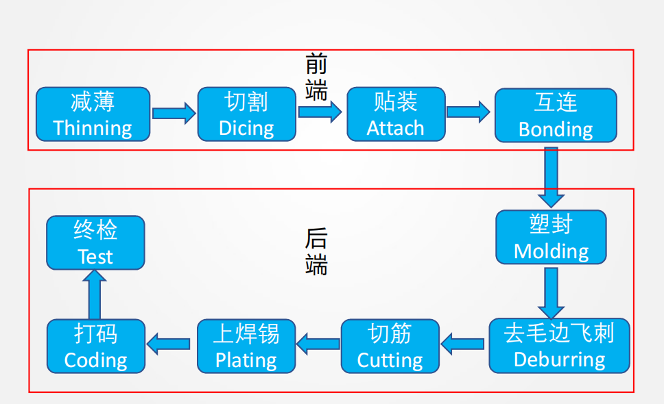
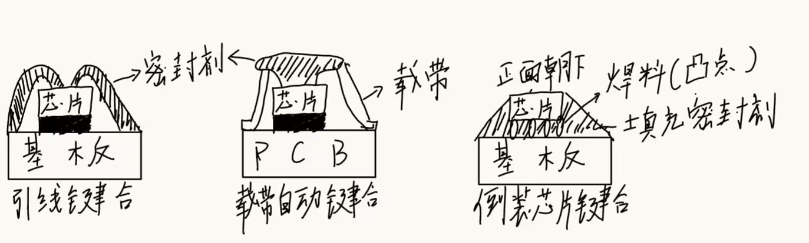

# 集成电路封装概述

集成电路芯片是指经过设计、制造、封装与测试后，将晶体管、二极管等有源器件与电阻电容电感等无源器件，以及传统电路，微缩至微米、纳米量级，集成在一块半导体单晶片上，执行特定电路或系统功能的微结构

芯片的制造实质上是单晶基底经由外延、氧化、掺杂、光刻、镀膜、刻蚀和金属化等基本集成电路制造工艺，按一定顺序反复交替排列进行完成。裸芯片需要进行封装和测试才能成为具有特定功能的独立芯片

## 简述芯片封装的定义和核心功能（作业）

集成电路芯片的封装主要是指利用膜技术及微细加工技术将芯片固定连接到具有支撑作用的基板或引线框架上，引出接线引脚以与外部电气连接和信号传输，再用材料密封包裹起来实现保护，得到独立的芯片结构

核心功能
- 支撑保护：牢固的机械支撑，严密的环境隔离
- 电源分配：电源电压的分配和导通
- 信号传输：芯片和外部电路之间的信号连接传输
- 散热通道：提高良好的散热通道，防止芯片过热受损

## 试述芯片封装技术的主要分类方法及对应的类别（作业）

- 密封材料
  1. 金属封装CU、AL或AL合金。优点：机械强度较高，散热性能好，一定的电磁屏蔽。缺点：受热时氧化膜容易开裂
  2. 陶瓷封装AL2O和ALN制作陶瓷基片。优点：耐湿性好，良好的线膨胀率及热导率，综合性能好。缺点：成本较高，导热系数较低
  3. 塑料封装：占整个封装的90%以上，热固型塑料，环氧树脂。优点：成本低，质量较轻，绝缘性能很好和抗冲击性强。缺点：气密性不好，对湿度敏感。

- 封装引脚
  1. 引脚插入封装：单列直插，双列直插，网格直插
  2. 表面贴装封装：四测无引脚偏平封装QFN，球栅陈列封装BGA，目前，表面贴装式封装已占IC封装的80%以上。

- 封装对象和内容
  1.  一级：指把芯片固定在基板或引脚架上，实现电路连接后进行密封，芯片级封装
  2.  二级：指芯片与其他元器件焊接在印刷电路板，板级封装
  3.  三级：指多个PCB板组装后进行系统的封装，系统级封装
  4.  四级：指多个系统组装进行最终产品的封装，产品级封装

## 简述芯片封装的主要工艺流程（作业）

1. 划片：先对晶圆进行减薄处理以降低厚度，然后使用切割设备将整片晶圆沿着划片道切割成一个个独立的芯片
2. 贴片：将切割后的芯片通过导电胶或焊料固定到封装基板或引线框架上，为后续电连接和散热提供基础
3. 互连键合：通过金线、铜线或焊球等方式，将芯片上的焊盘与封装基板或引线框架连接，实现芯片与外部电路的电器连接
4. 封装：使用塑料封装材料或其他封装结构对芯片进行保护，形成完整的封装结构，提高机械强度并保护芯片免受外界环境影响
5. 最终封装与测试：对封装后的芯片进行最终电性能测试和可靠性测试，筛选出合格产品并进行分级，然后进入出货阶段

## 简述芯片封装技术的发展方向和新的技术要求（作业）

集成电路芯片的发展方向式高密度、复杂化、高性能，实现途径一是缩小单个元器件的尺寸，二是增大单个集成电路芯片的面积

集成电路芯片封装向着高集成度、大尺寸、高散热、高频、多引脚、薄型化的技术方向发展

- 封装结构小型化与薄型化要求：缩小封装面积，提高封装效率
- 高散热性要求：封装结构和材料应具有更高的散热效率
- 适应大尺寸芯片的要求：改进封装材料，调控应力，防止芯片变形
- 适应多引脚：引脚要短以减少延迟，间距能避免相互干扰

# 封装工艺流程

## 列举芯片封装流程的前后端工艺环节，并解释前端各环节的定义和目的（作业）

- 前端
  1. 减薄：芯片封装初始，通过化学或机械方法将晶圆的厚度降低至数十微米减薄。目的：原始晶圆较厚，减薄是为了方便切割，更有利于散热以及封装对轻薄化的需求
  2. 切割：将减薄后的硅片背面固定好，利用划片机将芯片阵列切割成为一个个独立的芯片。目的：将整片晶圆上的重复芯片单元分离，实现芯片单体化，避免芯片边缘出现崩边、裂纹等缺陷，保障芯片边缘完整性
  3. 贴装：将芯片粘结固定在封装载板或引线框架上的芯片焊盘区域的过程。目的：为裸芯片提供稳定的机械支撑，保证封装结构稳定性，为芯片提供低阻散热路径，将工作热量传导至封装体外
  4. 互连：指芯片的焊区与封装壳体的IO引线或引线框架焊区之间的互联过程。目的：实现芯片与外电路的电气连接和信号传输，稳定可靠的互连工艺可提升封装长期可靠

- 后端：塑封-去毛边飞刺-切筋-上焊锅-打码-终检

常见的切割方式有刀片切割和激光切割
- 刀片切割以刀片磨削的方式，将切割槽里的摩擦击碎成粉末，切割质量取决于磨粒。特点是设备便宜，精度不高，易崩边，不适合太薄晶圆，100um以上
- 激光切割是利用聚焦的高能激光束将被照射区域迅速加热至气化蒸发，切割质量取决于激光光束的功率和束斑直径，特点是应力损伤小，精度极高，价格昂贵，碎屑难以清理

## 阐述晶圆原始厚度较厚和需要减薄的原因，列举四种减薄工艺并解释原理（作业）

晶圆在前道芯片制造过程中，需要进行许多加工工序，必须具备足够的机械强度与刚性，避免加工、搬运过程中发生翘曲、变形，保障前道制造的良率与稳定性。之所以需要减薄，是因为原始晶圆厚度大，切割时，加工深度大，极易出现崩边，裂片等缺陷，厚硅衬底热阻高，芯片工作产生的热量难以通过背面快速传导至封装散热结构，会导致芯片结温升高，原始晶圆厚度过厚，不利于封装薄化

- 四种减薄工艺
  1. 机械研磨原理：研磨盘与硅片之间的相对摩擦运动，即研磨料的摩擦作用共同完成硅片背面材料的去除
  2. 干法腐蚀：在氩气环节下，利用磁力控制常压等离子体副使气体CF4，输送至与硅片表面材料发生化学反应生成SiF4，去除碎片表面材料
  3. 湿法腐蚀：利用化学溶液的腐蚀作用去除硅片表面材料，通常将酸性化学溶液均匀地喷洒在旋转的硅片表面上，硅片表面材料在混合酸液HF+NHO3的作用下被连续地腐蚀掉
  4. 化学机械抛光：硅片表面与抛光液包含的特定化学溶液反应转化成一层较软的化学反应膜，然后在磨粒的机械磨擦作用下被去除，并被流动的抛光液带走，本质上是化学成膜过程和机械去膜过程的交替

贴装是指将芯片粘结固定在封装载板或引线框架上的芯片焊盘区域的过程。目的：牢固的机械连接，良好的散热。

引线框架：提供电路连接和Die的支撑固定；主要材料为铜，局部区域镀银，NiPdAu等材料

载板是IC封装最大的成本端，基材包括铜箔、树脂基板等。所需铜箔为电解同步、超薄均匀性铜箔，1.5um，一般2-18um

## 简述四种芯片贴装工艺的原理，常用材料体系及对应工艺温度（作业）

1. 共晶贴装原理：利用共晶成分的合金，在共晶温度时通过共晶熔合反应在芯片和其对应焊盘之间形成共晶体，从而实现贴装。常用材料体系：Au-S，Au-Ge，Au-Sn等
2. 焊接贴装原理：利用焊料的低熔点特性，融化润湿键合界面，与此同时与连接界面的金属元素之间的冶金反应，生成金属间化合物进行芯片贴装
3. 黏合剂贴装原理：利用高分子胶粘剂的胶粘作用，物理粘结芯片与基座。常用材料：聚酰亚胺和环氧树脂。可填充Ag粉和Ag颗粒（75%-80%）导电，填充Al2O3颗粒绝缘，固化温度150~180℃
4. 玻璃胶贴装原理：低熔点玻璃粉浆料加热熔融，冷却厚玻璃固化实现芯片粘结固定，多用于陶瓷封装。常用材料：低熔点玻璃粉与有机树脂溶剂混合制成玻璃浆料，根据导电性和导热性需求，可掺填金属粉（80%银粉）分阶段加热：75℃保温15min，除掉溶剂，375℃以上完全烧除有机物。

## 解释引线键合的原理，并简述热超声引线键合工艺流程及对应键合点类型

- 原理：利用外部能量破坏焊区表面的氧化层和污染物，然后使引线与焊区金属产生塑性变形实现紧密接触（原子间引力范围2nm）并促进界面原子相互扩散，形成键合点。引线键合的键合接点形状分别为楔形和球形

- 工艺流程
  1. 劈刀下降，焊球被锁定在端部中央
  2. 在压力、超声、温度的作用下形成连接
  3. 劈刀上升到弧形最高度
  4. 劈刀高速运动到第二键合电，形成弧形
  5. 在压力、超声温度作用下形成第二点连接
  6. 劈刀上升至一定位置，送出尾丝
  7. 夹住引线，拉断尾丝
  8. 引燃电弧，形成焊球，进入下一键合循环

- 键合点类型：第一类键合点是球形键合；第二类键合点是鱼尾型键合

**热压键合**

- 原理：通过加热和加压力（50-150g/点），破坏金属焊区表面的氧化层，同时使焊区金属发生塑性形变，使压焊的金属丝于焊区金属紧密接触（达到原子引力范围），伴随着相互扩散，实现键合。热压键合本质属于高温键合过程，因而多采用的使相对耐氧化的Au丝
- 特点：操作温度高，键合时间场，易氧化，易损坏芯片

**超声键合**
- 原理：利用超声波发生器产生的能力，使楔形劈刀产生弹性振动，带动金属丝在焊区表面迅速磨擦，超声同时在劈刀上施加一定竖直压力，使金属丝和焊盘发生塑性变形，实现紧密接触并扩散，从而形成牢固键合

## 绘图展示三种互连结构，并分析倒装互联封装的主要工艺特点（作业）

- 优点
  1. 小尺寸：倒装互连的基板面积小，接近实际1：1的封装效率
  2. 性能增加：短的凸点互连距离，减小互连延迟，降低了引线之间的耦合电容和电感，提高了IO封装密度
  3. 工艺简单：安装，互连同时完成，简化了工艺
  4. 高散热性：芯片背面没有塑封，可进行有效地散热

- 缺点
1. 裸芯片很难测试，维护困难或不可能
2. 凸点芯片适应优先，成本较高
3. 各材料间的应力匹配问题，和SMT工艺相容性较差

## 解释转移塑封成型的原理和工艺流程（作业）

- 原理：利用热固型塑料的性质变化，即固化前加热至较低温度，即可熔融为液态实现流动填充，但是将其加热到一定温度厚内部会发生聚合交联反应，形成网状的刚性固体，继续加热也不会再次熔化流动。

- 工艺流程：
  1. 将已贴装芯片并完成互连键合的基板或框架整个置于设有浇道系统的模具中
  2. 将热固型塑料的预成型块填充入预热炉内，加热至90~95℃，使其熔化成液态进入转移罐
  3. 在转移罐内的活塞压力下液态的热固性塑料被挤压经由浇道进入模腔（温度先保持在90-95℃）
  4. 进入磨枪的热固型塑料迅速固化（温度加热保持在170-175℃），经过短时的保压后，经由顶杆顶出

# 微连接材料与厚膜技术

## 简述锡膏的主要成分与各自对应功能，并列举锡膏的主要性能参数（作业）

锡膏的主要成分包括锡焊料粉，助焊剂和溶剂。其中，锡焊料粉为焊接后的留存物，决定焊接强度和导电等性质。助焊剂可净化焊盘和焊粉表面，提高润湿性，通常二者重量比为9：1，体积比为1：1

锡膏的主要性能参数包括合金组成，颗粒度和黏度，其中，合金组成决定了熔点，决定锡膏工作温度

- 颗粒度：焊区间距较大时，选择目数较小的锡膏，反之选择目数较大的锡膏，颗粒度约为丝网网眼尺寸的1/5以内，要求锡粉颗粒形状规则，粒度适中
- 黏度：良好的黏度决定了印刷质量，实现印刷好的锡膏在回流之前不变形，已贴装的芯片不移位，通常印刷用锡膏的黏度相对略高，点注式黏度相对较低

## 简述导电胶的主要组成及其各自对应功能（作业）

导电胶的成分与胶粘剂相同，以粘料基体为主剂，并添加有固化剂，填料助剂

- 粘料：胶粘剂的基体或主剂，对粘接性能起决定性作用，粘料须具有良好的粘附性和润湿性等，常用粘剂包括：环氧树脂，有机硅，丙烯树脂，聚氨酯，酚醛，聚酰亚胺等
- 固化剂：直接参与粘料基体的交联反应，生成体型网格结构的高分子，是促使胶粘剂发生固化的重要成分
- 填料：主要成分为导电颗粒，用于改善胶粘剂的导热性，导电性，CTE，强度及其他物理性能的非粘性无机固体

## 解释无铅焊料保留Sn的原因和Pn代替元素的添加原则，指出目前无铅焊料存在的问题并列举两种最主要的无铅焊料体系及对应的优缺点

无铅焊料保留Sn因为其具有较低的熔点，良好的延展性以及优异的综合性能，其熔点适中，能满足电子封装对低温焊接的工艺需求，同时，Sn具有良好的塑性变形能力，有助于缓解热应力，提高焊点的可靠性

Pb替代元素的添加原则应能够与Sn形成稳定合金，以保证材料结构的稳定性，应具备降低焊料熔点的能力，从而满足电子封装对低温加工的要求，应能够改善焊料的润湿性，提高焊接质量和界面综合能力

存在的问题包括，替代元素入Ag、In等价格较高，导致材料成本上升，大多数无铅焊料的熔点普遍高于传统Sn-Pb焊料，增加了工艺温度和热应力，其润湿性能较差，在较低温度下难以获得理想的焊接质量

主要的无铅焊料体系包括
- Sn-Ag系焊料，具有优异的机械性能和热疲劳性能，可靠性较高，但其熔点较高，成本较高，且润湿性相对较差
- Sn-Zn系焊料熔点接近Sn-Pb焊料，成本较低，且力学性能较好，但Zn元素易氧化，导致润湿性差，工艺稳定性较弱

## 简述锡膏丝网印刷的工艺过程（作业）

1. 固定基板：定位，真空吸附或者机械夹具进行固定
2. 安装并调整钢网：保证丝网孔板与基板平行，设置间隙或贴合
3. 调整刮板参数：控制压力、速度及平行度
4. 调整回刮板：回刮板需要与网板平行，并保持一定的间隙，具有一定的速度
5. 试印：合格后进行印刷，以一定的压力和角度让刮刀推动锡膏，锡膏过网孔漏到焊盘，锡膏牢牢吸附在焊盘上，丝网被抬起
6. 手机浆料：清洗网板，并检查无浆料残渣或异物

# 气密性封装

## 解释需要陶瓷金属化的原因和覆Cu直接金属化的原理（作业）

多数金属与陶瓷的CTE存在较大的热失配，加热时连接界面处易产生热应力导致裂纹，削弱连接强度，陶瓷具有温度的电子配位和化学键，惰性强；和金属的润湿性、亲和力差，难以直接与多数金属连接

覆Cu直接金属化的原理：直接热压覆Cu箔在陶瓷基板表面，氮气下加热至共晶温度，CuO和Al2O3共晶融合后形成Cu-Al-O的冶金键合层厚再还原金属表面，实现金属化

## 列举陶瓷和金属气密封装的四个关键工艺环节（每个环节列举一个工艺方案及对应所需材料）（作业）
1. 陶瓷气密性封装
   - 芯片的贴装：首先进行陶瓷金属化，然后进行共晶贴装，所需材料：Au-2%Si，Au-20Sn
   - 引脚与陶瓷基底的组成连接：工艺方案，覆Cu，直接金属化厚焊接；所需材料：覆Cu箔陶瓷基板，Sn焊料
   - 引脚与芯片的键合互连：工艺方案：引线键合；所需材料：Au、Al、Cu
   - 陶瓷封盖与基底的连接：工艺方案：金属化后焊接；所需材料：Au-20Sn焊料，陶瓷封盖
2. 金属气密性封装
   - 芯片贴装：工艺方案：黏合剂贴装；所需材料：导电银胶
   - 引脚固定在基座钻孔内并进行密封：工艺方案：玻璃胶密封；所需材料：7502硼酸盐玻璃，镀金引脚
   - 芯片焊盘与引脚互连：工艺方案：引线键合；所需材料：Cu键合丝
   - 金属封盖与基座的密封焊接：工艺方案：焊接密封；所需材料：Au-20Sn焊片，可代合金封盖

# 典型封装技术

## 简述基于引线键合互连的PBGA封装的工艺流程（作业）
1. 晶圆减薄
2. 圆片切割
3. 芯片粘结：采用充银环氧树脂粘接剂将IC芯片粘结在镀Ni-Au薄层的基板上
4. 清洗
5. 引线键合：粘接固化后用进四球焊机将IC芯片上的焊区与基板上的镀Ni-Au的焊区以金线相接
6. 再次清洗
7. 横塑封装：采用填石英粉的环氧树脂模塑料进行模塑包封，以保护芯片、焊接线及焊盘
8. 装配焊料球：回流焊，装配低熔点的63Sn37Pb焊球（直径0.4~1mm，间距范围1.27~2.54mm）从N2气重完成回流焊制作引脚
9. 打标
10. 分离
11. 检查及测试
12. 包装

# 先进封装技术

## 解释倒装芯片中凸点下金属化层的目的、性能需求和对应结构组成（作业）

凸点下金属化的目的是使凸点与芯片焊盘稳定可靠结合，提高倒装互连可靠性

性能需求

1. 与Al/Cu焊盘形成良好的黏附结合和欧姆接触
2. 保护凸点或焊料不与焊盘产生互扩散
3. 与焊料凸点间产生良好的润湿

凸点下金属化由黏附层-扩散阻挡层-浸润层等多层金属膜构成，有时表面还会镀Au作为防氧化层，黏附层约0.05~0.2um，阻挡层约0.05~0.1um，浸润层约1~5um，氧化阻挡层约0.05~0.1um

# 阐述倒装芯片封装的三个关键工艺（每环节各举一种方案包括对应工艺方法）（作业）

1. 凸点制备：电镀焊料凸点方案。在晶圆焊盘上形成UBM后，涂覆厚光刻胶并开口，电镀形成焊料凸点，随后去胶，刻蚀多余UBM，并进行回流整形。材料体系：Cr/Cr-Cu/Cu结构，高铅Pb/Sn合金焊料凸点
2. 倒装键合：在载板焊盘或凸点表面涂覆助焊剂，将芯片翻转后与载板焊盘对准接触，整体送入回流焊炉完成焊料融熔键合，之后清洗助焊剂残留并测试。材料体系：Sn焊料凸点或Sn封帽凸点，适用于C4或E3/C2工艺
3. 底部填充：芯片键合后填充方案。工艺方法：将倒装芯片与基板加热到70-100℃，利用装有填料的L型注射器沿芯片边缘双向注射填料，芯片边缘设置阻挡物防止溢流，填充完成后在烘箱中分段升温到约130℃后保持3-4h完全固化。材料体系：热固性塑封料掺陶瓷填料以提高导热率

# 绘图展示扇入型和扇出型封装结构，并简述重新布线层的制作工艺流程（作业）

工艺流程：
1. 对晶圆进行清洗，采用PECVD沉积SiO2/SiN4或涂布聚酰亚胺作为绝缘钝化层
2. 溅射Ti/Cu种子层
3. 涂光刻胶、曝光、显影定义布线图形
4. 电镀Cu形成金属线路
5. 去胶、刻蚀去除多余种子层
6. 多层RDL重复上述步骤
7. 涂布绝缘保护层，光刻开出凸点制备所需的引出孔，在引出孔位置制备凸点

# 解释三维封装的关键工艺环节，并对应列举一种工艺方案（作业）

三维封装是多个芯片在垂直方向堆叠后再进行互连键合的封装结构

关键工艺环节
1. 硅孔制作：工艺方案，采用DRIE干法刻蚀，使用SF6对Si进行快速各向同性刻蚀，使用C4F8沉积聚合物保护侧壁，循环进行直到达到目标孔深
2. 绝缘层：阻挡层和种子层沉积。工艺方案：采用PECVD沉积体系，SiO2作为绝缘层，TiN作为阻挡层，Cu作为种子层
3. 硅孔导电物质填充与镀铜技术。工艺方案：采用via-last电镀Cu填充，适合批量制造并可实现深孔填充
4. 晶圆减薄技术，工艺方案：采用机械研磨，湿法抛光并结合CMP使晶圆减薄到约20~50um
5. 键合技术：采用Cu凸点热超声键合，实现垂直堆叠芯片之间的电气互连

# 元器件的装配与连接

## 简述波峰焊工艺流程的四个阶段及各自的主要功能，并阐述双峰波峰焊的原理（作业）

- 第一阶段：焊剂发泡喷雾区，主要功能：在PCB焊接面均匀涂覆一层薄薄的助焊剂
- 第二阶段：预热区，主要功能：使统计挥发活性剂分解并活性化使印制板和元器件充分预热
- 第三阶段：波峰区：主要功能：使熔融焊料充分润湿并渗透插装孔，引脚和焊盘，完成焊接
- 第四阶段：冷却区，主要功能：使焊点凝固，保证形成合格焊点

普通单波峰焊接容易产生漏焊与桥接，因此采用两个波峰配合完成焊接，第一个波峰为湍流，也叫扰流波，波峰较窄，冲击力强，作用是保证充分润湿，爬锡和填孔，第二个波峰为平滑波，波形平坦而缓慢，作用是通过剪切去除多余焊料，保留必要的润湿焊锡，从而清除桥连等不良环象

## 分析回流焊的温度曲线和各温区的主要作用（作业）
1. 升温阶段：升温速度不能太快，否则容易出现锡边，主要作用是使锡膏中的溶剂逐步挥发；控制升温速度避免锡边、焊料孔洞等缺陷
2. 预热/活化区：温度约120-170℃，时间约60-90s，主要作用是挥发锡膏溶剂，火花助焊剂，去除焊盘和引脚表面氧化物
3. 回流区：焊料熔点以上45-60s，峰值温度220~240℃，主要作用：是焊料熔化，液态锡膏对PCB焊盘元器件端头和引脚润湿、扩散、漫流或回流混合，形成焊锡接点
4. 冷却区：主要作用：使焊点冷却凝固，形成可靠的机械电气连接

## 简述双面混合组装PCB板的装配工艺流程（作业）

1. B面涂粘结剂：在B面对应贴装位置点涂粘结剂，用于固定B面SMD，防止后面翻板、波峰焊时掉落
2. B面贴装SMD：将B面表面贴装器件贴放在涂有粘结剂的位置
3. 粘结剂固化：通过加热等方式使粘结剂固化，将B面SMD固定在PCB上
4. 翻板：再次翻转PCB，使需要进行波峰焊的一面处于合适方向
5. A面印刷锡膏：在A面焊盘位置通过模板印刷锡膏，为后续表面贴装元器件的焊接提高焊料
6. 贴装SMIC：将A面的贴装芯片或表面贴装器件放置到已印刷锡膏的焊盘上，锡膏在此阶段起临时固定作用，也作为后续回流焊的焊接材料
7. 回流焊：通过加热使A面锡膏熔化并冷却凝固，完成A面SMT器件焊接
8. 插装THC：引脚打弯，将通孔插装元器件在后续波峰焊过程中保持位置温度
9. 波峰焊：PCB以一定倾角和浸入深度通过熔融焊料波峰，熔融焊料浸润插装孔，引脚和焊盘，完成通孔插装元器件引脚的焊接
10. 清洗：去除焊接过程中残留的助焊剂以及其他污染物
